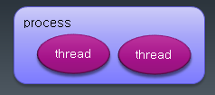
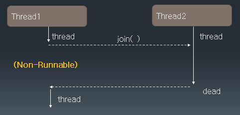

## 스레드(Thread)

- 프로그램이 실행되면 OS로 부터 메모리를 할당받아 프로세스 상태가 됨
- 하나의 프로세스는 하나 이상의 thread를 가지게 되고, 실제 작업을 수행하는 단위는 thread임



## multi-threading

- 여러 thread가 동시에 수행되는 프로그래밍, 여러 작업이 동시에 실행되는 효과

- thread는 각각 자신만의 작업 공간을 가짐 ( context )

- 각 thread 사이에서 공유하는 자원이 있을 수 있음 shared memory (자바에서는 static instance)

- 여러 thread가 자원을 공유하여 작업이 수행되는 경우 서로 자원을 차지하려는 race condition이 발생할 수 있음

- 이렇게 여러 thread가 공유하는 자원중 경쟁이 발생하는 부분을 critical section 이라고 함

- critical section에 대한 동기화( 일종의 순차적 수행)를 구현하지 않으면 오류가 발생할 수 있음

## 자바 Thread 만들기

### 1️⃣ Thread클래스를 상속받아 만들기

```java
class MyThread extends Thread{
	public void run() {
		int i;
		for(i=1; i<=200; i++) {
			System.out.print(i+"\t");
		}
	}
}
```

> Thread클래스를 상속받아 thread를 생성할 수 있다. 만든 thread를 실행해보자

```java
public class ThreadTest {

	public static void main(String[] args) {
System.out.println(Thread.currentThread()+"start");
		MyThread th1 = new MyThread();
		MyThread th2 = new MyThread();

		th1.start();
		th2.start();
		System.out.println(Thread.currentThread()+"end");
	}
}
```

<br/>


> Thread[main,5,main]<br/>
>
> - 첫 번째 main은 thread를 호출한 메서드
> - 두 번째 숫자는 thread의 우선순위
> - 세 번째 main은 thread가 속해있는 그룹

출력 결과를 보면 thread가 번갈아가면서 실행되고 있음을 알 수 있다.

### 2️⃣ Runnable 인터페이스를 구현해서 만들기

- 자바는 다중 상속을 할 수 없으므로 클래스가 이미 다른 클래스를 상속했다면, Runnable 인터페이스를 구현하는 방법이 있다.
- Thread에는 Runnable 객체를 넣는 생성자가 있기 때문에 이를 활용하면 된다.

```java
class MyThread implements Runnable{

    @Override
    public void run(){
        int i;
        for(int i = 1; i<=200; i++){
            System.out.print(i="\t");
        }
    }
}

public class ThreadTest {

	public static void main(String[] args) {
	MyThread runnable = new MyThread();
    Thread th = new Thread(runnable);
}
```

## Thread Status


#### Not Runnable 상태로 보내는 메서드

- sleep(time)
- wait() : 스레드 t1이 어떤 공유 자원 s를 사용해야하는데 다른 스레드가 s를 이미 사용하고 있을 경우 wait()를 실행시킨다. 다른 스레드가 s를 다 사용하면 notify()로 다시 Runnable되게 만든다.
- join : 해당 스레드를 실행하는데 다른 스레드의 결과값등이 필요할 경우 다른 스레드가 종료될 때까지 기다린다.

## Thread 우선순위

> 우선순위가 높다고 반드시 먼저 실행되는건 아니다. 실행될 확률이 높을 뿐임

- Thread.MIN_PRIORITY(=1) ~ Thread.MAX_PRIORITY(=10)

- 디폴트 우선순위 : Thread.NORMAL_PRIORITY(=5)

- setPriority()/getPriority()

## 두 개의 스레드가 협력해야 할 경우

- 1부터 100까지의 수를 더 하고 싶은데 이걸 두 개의 스레드가 나눠서 일을 한다고 생각해보자.
- 스레드 t1은 run()에서 1부터 50까지 더한 수를 저장하고,
- 스레드 t2는 run()에서 51부터 100까지 더한 수를 저장한다.
- 두 스레드를 run() 한 후, 결과값을 더해 1부터 100까지 수를 더한 값을 알아내는 코드를 작성해보자.

```java
class JoinThread extends Thread{

	int start;
	int end;
	int total;

	JoinThread(int start, int end){
		this.start = start;
		this.end = end;
	}
	public void run() {
		for(int i = start; i<= end; i++) {
			total += i;
		}
	}


}

public class JoinTest {

	public static void main(String[] args) {
		JoinThread t1 = new JoinThread(1, 50);
		JoinThread t2 = new JoinThread(51, 100);
		t1.start();
		t2.start();
		int lastTotal = t1.total + t2.total;
		System.out.println("t1.total = " + t1.total);
		System.out.println("t2.total = " + t2.total);
		System.out.println("lastTotal = " + lastTotal);

	}

}
```

예상 출력값은

> t1.total = 1275<br/>
>
> t1.total = 3775<br/>
>
> lastTotal = 5050

이지만 실제 출력값은 아래와 같았다.

> t1.total = 1275<br/>
>
> t1.total = 3775<br/>
>
> lastTotal = 0

<br/>

### 😮 왜... 이런일이?

기대 출력값과 달랐던 이유는 코드를 순차적으로 작성한 것과 실제 os에서 스레드를 종료시키는 시점이 같지 않기 때문이다.<br/>

이전 스레드 실행 예시를 보면, 스레드가 실행되는 시점은 코드가 정해도, 스레드마다 번갈아가며 cpu를 배분받기 때문에 종료 시점은 정확히 알 수 없다.<br/>

그렇기에 위 출력의 경우 lastTotal의 값을 할당받는 시점에서 두 스레드 t1과 t2가 start되긴 했지만 t1의 run()과 t2의 run()메서드는 종료되기 전이었기에 원하는 값이 나오지 않았던 것이다. 각각의 total값이 아직 0이었기 때문에 lastTotal에 0이 들어갔다.<br/>

스레드마다 우선순위를 부여한다고 해도 스레드 종료 시점은 정확히 예측할 수 없기때문에 원하는 값이 나온다고 장담할 수 없다.

> 위 출력결과외에 아래와 같은 경우도 당연히 일어날 수 있다. <br/>
>
> t1.total = 0<br/>
> t2.total = 0<br/>
> lastTotal = 0<br/><br/>
>
> t1.total = 1275<br/>
> t2.total = 0<br/>
> lastTotal = 1<br/><br/>
>
> t1.total = 0<br/>
> t2.total = 3775<br/>
> lastTotal = 0

### 📌 join()

이처럼 어떤 스레드를 실행하기 위해 다른 스레드의 결과값이 필요한 경우라면 join()을 사용해 해결할 수 있다.

- 동시에 두 개 이상의 Thread가 실행 될 때 다른 Thread의 결과를 참조 하여 실행해야 하는 경우 join() 함수를 사용

- join() 함수를 호출한 Thread가 not-runnable 상태가 감

- 다른 Thread의 수행이 끝나면 runnable 상태로 돌아옴



```java
public class JoinTest {

	public static void main(String[] args) {
		JoinThread t1 = new JoinThread(1, 50);
		JoinThread t2 = new JoinThread(51, 100);
		t1.start();
		t2.start();

        try {
			t1.join();
			t2.join();
		} catch (InterruptedException e) {
			// TODO Auto-generated catch block
			e.printStackTrace();
		}

		int lastTotal = t1.total + t2.total;
		System.out.println("t1.total = " + t1.total);
		System.out.println("t2.total = " + t2.total);
		System.out.println("lastTotal = " + lastTotal);

	}

}
```

> 위처럼 t1과 t2의 join()을 실행시키면 t1과 t2의 스레드 수행이 끝날 때까지 main thread를 Non-Runnable하게 만들게됐다는 의미이다. join()은 해당 스레드의 수행이 끝날 때까지 호출한 스레드가 기다리지만 interrupt를 날려줄 경우에는 강제로 기다리는걸 멈추게 할 수도 있다. 그러므로interrupt에 대한 예외처리도 반드시 해줘야한다.<br/>
>
> [Interrupt 메카니즘](https://blog.hongo.app/interrupts-mechanism/)

join()을 사용하면 우리가 원하던 대로 출력이 잘 되는 것을 볼 수 있다.

### 📌 interrupt()

- 다른 Thread에 예외를 발생시키는 interrupt를 보낸다.
- Thread가 join(), sleep(), wait() 함수에의해 not-runnable 상태일 때 interrupt() 메서드를 호출하면 다시 runnable 상태가 될 수 있음

## Thread 종료하기

- flag변수를 사용한다.

Thread 종료 예제

> ```
>   세 개의 thread를 만든다.
>   각각 무한 루프를 수행하게 한다.
>   작업 내용 this.sleep(100);
>
>   ‘A’ 를 입력 받으면 첫 번째 thread를
>   ‘B’ 를 입력 받으면 두 번째 thread를
>   ‘C’ 를 입력 받으면 세 번째 thread를
>   ‘M’을 입력 받으면 모든 thread와 main() 함수를 종료한다
> ```

<br/>

```java
public class TerminateThread extends Thread{

	private boolean flag = false;
	int i;

	public TerminateThread(String name){
		super(name);
	}

	public void run(){


		while(!flag){
			try {
				sleep(100);
			} catch (InterruptedException e) {
				// TODO Auto-generated catch block
				e.printStackTrace();
			}
		}

		System.out.println( getName() + " end" );

	}

	public void setFlag(boolean flag){
		this.flag = flag;
	}


	public static void main(String[] args) throws IOException {

		TerminateThread threadA = new TerminateThread("A");
		TerminateThread threadB = new TerminateThread("B");
		TerminateThread threadC = new TerminateThread("C");

		threadA.start();
		threadB.start();
		threadC.start();

		int in;
		while(true){
			in = System.in.read();
			if ( in == 'A'){
				threadA.setFlag(true);
			}else if(in == 'B'){
				threadB.setFlag(true);
			}else if( in == 'C'){
				threadC.setFlag(true);
			}else if( in == 'M'){
				threadA.setFlag(true);
				threadB.setFlag(true);
				threadC.setFlag(true);
				break;
			}else{
				System.out.println("type again");
			}
		}

		System.out.println("main end");

	}
}

```

> Thread 생성자안에 String을 넣으면 해당 Thread의 이름이 된다.
