## 스크립트의 이해

> MOD는 스크립트 에디터를 사용해서 크리에이터가 원하는 컴포넌트나 로직을 만들 수 있다.
>
> 스크립트의 문법은 Lua Script를 사용하면 다양한 MOD API를 지원한다


### 스크립트 컴포넌트 추가방법

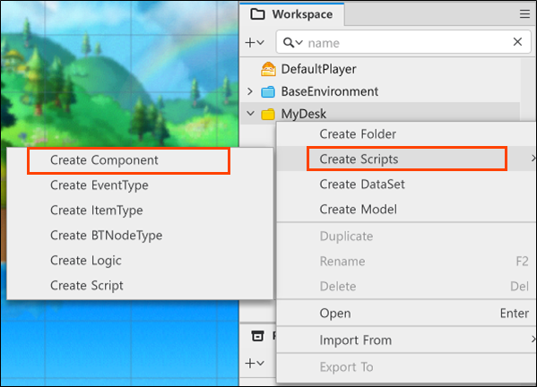

Workspace의 MyDest에서 `Create Scripts` -> `Create Component`를 통해 스크립트 컴포넌트를 생성할 수 있다

* Logic이나 Script등 다양한 형태의 스크립트를 생성할 수 있지만 스크립트 컴포넌트가 가장 많이 사용된다
* 스크립트 로직의 경우 맵에서 단 하나 존재하며 디버깅등에서 사용된다


### 스크립트 작성

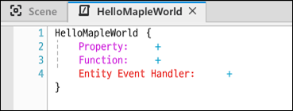

예시로 `HelloMapleWorld`라는 이름을 가진 스크립트 컴포넌트를 생성해보자

컴포넌트안에는 프로퍼티와 메소드, 이벤트 핸들러를 등록할 수 있다.

<br/>

이번에는 간단하게 콘솔에 "Hello Maple World"를 찍어내는 로그를 생성해보도록 한다

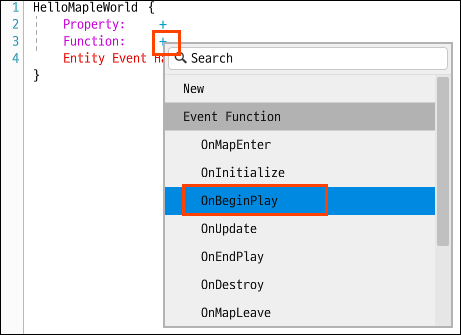

`Function`옆의 `+` 버튼을 클릭하면 함수 리스트가 보인다

이번에는 `OnBeginPlay` 함수를 등록한다. `OnBeginPlay` 함수는 스크립트 컴포넌트가 실행될 때 처음 한 번 실행된다.

<br/>

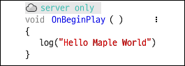

생성한 `OnBeginPlay`함수 안에 로그를 작성해준다


### 작성한 스크립트를 엔티티에 등록

스크립트 컴포넌트를 작성했다면 엔티티에 추가해줘야한다

위에서 작성한 `HelloMapleWorld` 컴포넌트를 `DefaultPlayer` 엔티티에 추가해보자

<br/>

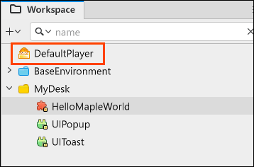

`Workspace`에서 `DefaultPlayer`를 눌러 `DefaultPlayer`의 `Property`를 확인할 수 있다.

<br/>

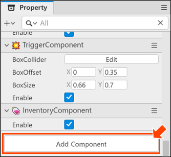

하단의 `Add Component` 버튼을 눌러 앞서 생성한 `HelloMapleWorld` 컴포넌트를 추가해보자!

<br/>

엔티티에 컴포넌트를 등록하는 것 까지 마쳤으니 실제로 등록한 컴포넌트가 잘 실행되는지 확인해보자.

<br/>


상단의 플레이버튼을 누르면 작성한대로 "Hello Maple World"라는 로그가 콘솔에 뜨는 것을 볼 수 있다.

<br/>

<br/>

### 스크립트 컴포넌트 예시

스크립트 예시를 하나 더 보자!

<br/>

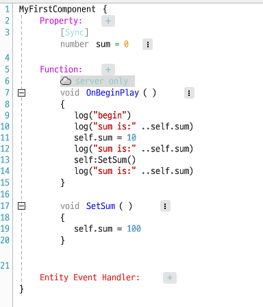

위는 예시로 생성한 `MyFirstComponent` 이다.

* 컴포넌트내 프로퍼티와 메소드는 `self`를 통해서 호출할 수 있다.

  ```lua
  -- 프로퍼티는 .을 사용해서 호출한다
  self.sum = 10
  
  -- 메소드는 :를 사용해서 호출한다
  self:SetSum()
  ```

<br/>

위 컴포넌트를 엔티티에 등록한 후 콘솔을 확인한 결과는 다음과 같다.

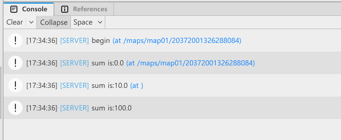


## 네트워크의 이해

> 멀티 플레이를 제공하는 게임의 경우 각 게임의 특성에 따라 사용되는 통신 모델들이 다양하다
>
> MOD는 다양한 통신 모델중 서버 - 클라이언트 모델을 사용하고 있다


### 서버와 클라이언트

#### 📌 클라이언트

클라이언트는 유저들의 모바일이나 PC, 또는 해당 기기에서 개별적으로 돌아가는 프로그램을 의미한다. 주로 유저의 입력을 처리하거나 서버가 보내온 정보를 내부적으로 처리하여 유저에게 가시적으로 출력하는 역할을 수행한다.

#### 📌 서버

서버는 다수의 클라이언트가 연결된 단일 컴퓨터, 또는 해당 컴퓨터에서 돌아가는 프로그램을 의미한다. 일반적으로 각 클라이언트에서 보내온 요청에 대한 응답을 주기도 하지만, 게임 진행에 대한 주요 기능과 시스템을 서버에 구축함으로써 모든 클라이언트가 동일한 진행 상황이 될 수 있도록 할 수 있다.

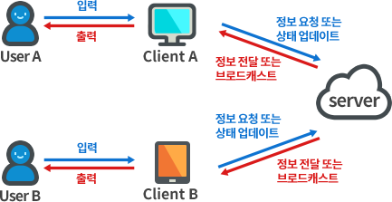

> 클라이언트의 경우 유저가 해킹할 위험이 있다.
>
> 그렇기에 게임의 전반적인 로직과 시스템은 서버에서 구현하고 클라이언트는 유저의 입력을 받아 서버로 전달하거나, 게임 진행 상황을 내려받아 유저에게 전달하는 역할로 구조를 가져가는 것이 좋다

<br/>

\# **클라이언트에서 주요 로직을 처리하는 구조 (비추천)** 

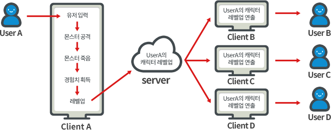


\# **서버에서 주요 로직을 처리하는 구조 (추천)**

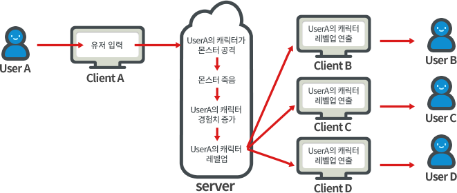


### 서버, 클라이언트에서의 프로퍼티와 함수

그럼 MOD 메이커에서 작성한 프로그램은 서버와 클라이언트에서 어떻게 작동할까?

* 스크립트에서 선언한 프로퍼티와 함수는 별도의 설정을 하지 않는 한 서버와 클라이언트 두 개의 공간에 각각 독립적으로 생성된다
* 이름은 같지만 서로 다른 공간에 존재하기 때문에 별도의 프로퍼티와 함수라고 보는 것이 좋다

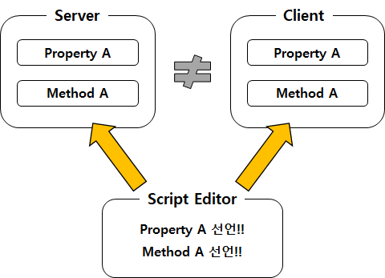


<br/>

기본적으로 함수의 호출과 프로퍼티의 값 참조 및 할당은 같은 공간 내에서만 이루어진다

예시를 봐보자!

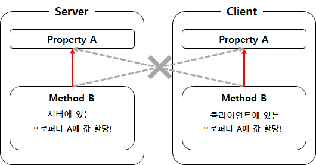

`Method B`가 `Property A`에 값을 할당한다고 하자.

* 서버에 있는 `Method B`는 서버의 `Property A`에만 값을 할당하고 클라이언트의 `Property A`에는 값을 할당하지 않는다.

* 반대로 클라이언트의 `Method B`는 클라이언트의 `Property A`에만 값을 할당하고 서버의 `Property A`에는 값을 할당하지 않는다

<br/>

함수간 호출도 비슷하게 작동한다

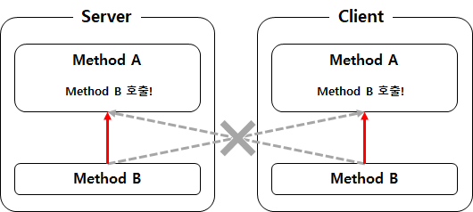


### 동기화와 실행제어

> 그렇다면 서버 - 클라이언트간 상호작용은 어떻게 할 수 있을까?
>
> MOD에서는 데이터 또는 상태를 전달하는 방식인 동기화와 특정 상황에 발생해야 할 행위, 행동들을 전달하는 방식인 실행제어를 제공하고 있다.


#### 📌 동기화

MOD에서의 동기화는 서버와 클라이언트 별도 공간에 있는 프로퍼티 값의 동기화를 의미한다. 예를 들어, 어느 한쪽의 프로퍼티 값이 변경되면, 자동으로 다른 한쪽의 프로퍼티 값도 동일하게 변경된다.

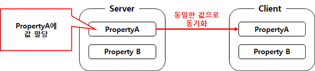

<br/>

그렇다고 모든 프로퍼티가 동기화되는 것은 아니다.

예를 들어, 주로 클라이언트에서만 작동하는 컴포넌트가 있다면 해당 컴포넌트는 서버로 데이터를 보낼 일이 없으니 서버로의 동기화가 일어나지 않는다.

일반적으로 동기화는 서버에서 클라이언트 단방향으로 진행된다. 서버와 클라이언트의 관계가 일 대 다 관계이기 때문이다 .

<br/>

\# **서버에서 클라이언트로 동기화**

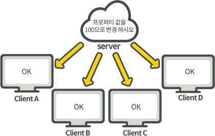

<br/>

<br/>

\# **클라이언트에서 서버로 동기화**

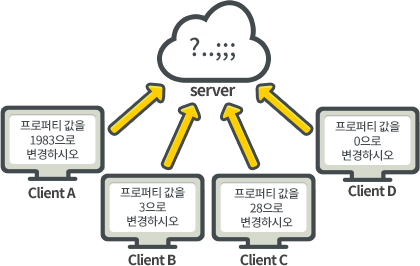


#### 📌 실행제어

서버와 클라이언트 간 통신에는 데이터의 전달, 즉 동기화 외에도 공간에 정의된 "액션"을 요청하고 수행하는 과정도 필요하다.

> 위의 레벨업 처리 과정을 예시로 들면, 클라이언트가 유저의 입력을 받으면, 서버에게 "몬스터 공격"이라는 "액션"을 요청하게 되고, 서버는 클라이언트의 요청에 따라 "몬스터 공격"이라는 "액션"을 수행하게 된다.
>
> 이렇듯 각 공간에 정의된 액션을 서로 요청하여 수행케 하는 것을 실행제어라고 한다.

<br/>

"액션"은 스크립트의 "함수"로 정의할 수 있다. 스크립트에서 각 함수의 설정을 어떻게 하느냐에 따라 클라이언트에서 서버로 수행을 요청할 수도 있고, 반대로 서버에서 클라이언트로 수행을 요청할 수도 있다.

<br/>

예시를 봐보자!

\# **Method B의 실행 공간을 클라이어트, Method C의 실행 공간을 서버로 설정했을 때의 요청과 수행**

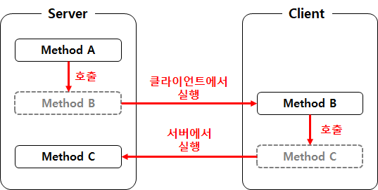

<br/>

위 상황을 예로 들면, 서버에서 선언된 함수 B의 실행 공간을 클라이언트로 설정하면, 함수 B는 서버 내 다른 함수에서 호출이 가능하지만, 클라이언트에서 실행되기 때문에 서버에서 호출할 수 있는 클라이언트 함수처럼 사용이 가능하다.

<br/>

실행제어의 종류는 다음과 같이 6개가 존재한다.

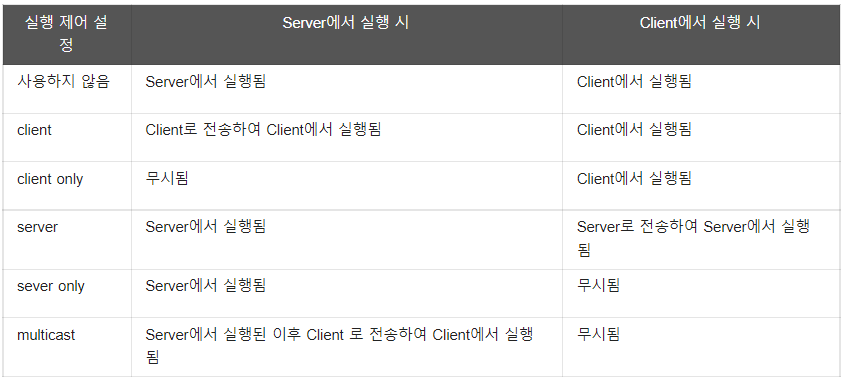

<br/>

이처럼 동기화와 실행제어를 통해 서버와 클라이언트가 소통하게 할 수 있다!


### 동기화와 실행제어 예시

#### 📌 동기화 설정

컴포넌트의 프로퍼티는 동기화 여부를 결정할 수 있다.

아래 사진을 예시로 보면,

프로퍼티 `sum`위에 `[Sync]`라고 되어있는데 이는 `sum`이 동기화되어있다는 의미이다.

\# **[Sync]**

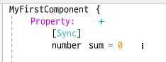

<br/>

`[Sync]` 부분을 클릭하면 `[None]`로 바뀌는데 이는 동기화되지 않음을 의미한다.

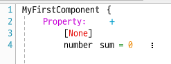


#### 📌 실행제어 설정


\# **서버에서 실행된 server 실행 제어 함수**

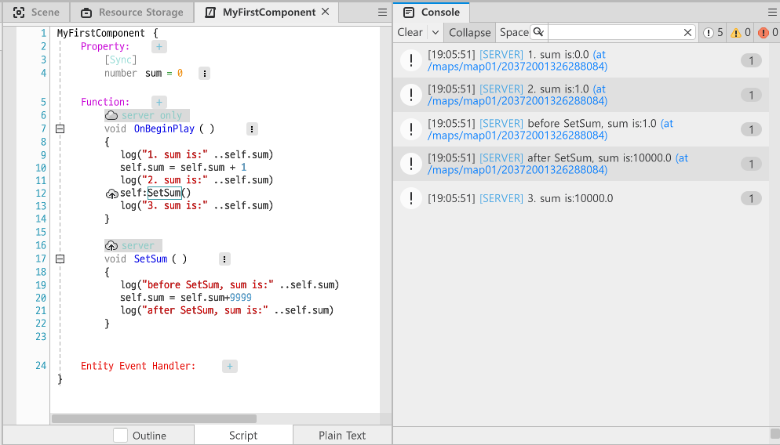

함수 `SetSum`이`server`함수이므로 `server`에서 바로 실행되는걸 볼 수 있다.

`client`에서 실행된 `client` 함수도 이와 비슷하게 동작한다. (server에서 client로 바뀔 뿐)

<br/>

<br/>

\# **서버에서 실행된 client 함수**

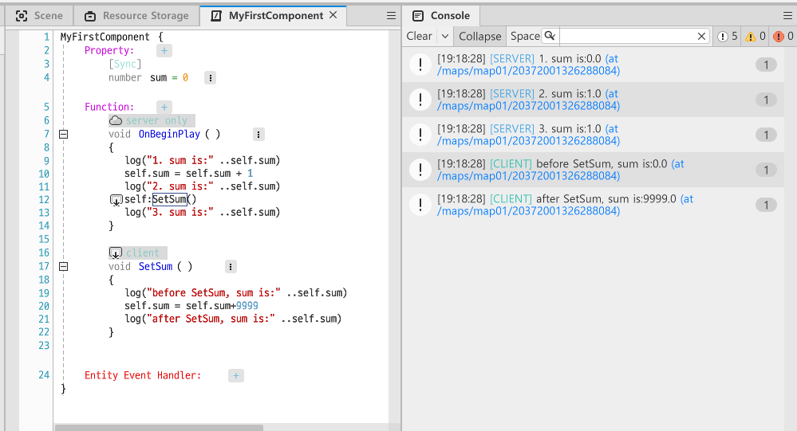

위 예시와 달리 `server only` 인 `OnBeginPlay`함수 내부의 코드가 전부 실행된 후, `SetSum`함수가 실행된 것을 볼 수 있다.

즉, `SetSum`함수 자체는 `server`에서 호출되었으나  `client`로 넘어가 `client`에서 `SetSum` 함수가 실행되는 것이다.

<br/>

\# **클라이언트에서 실행된 서버 함수**

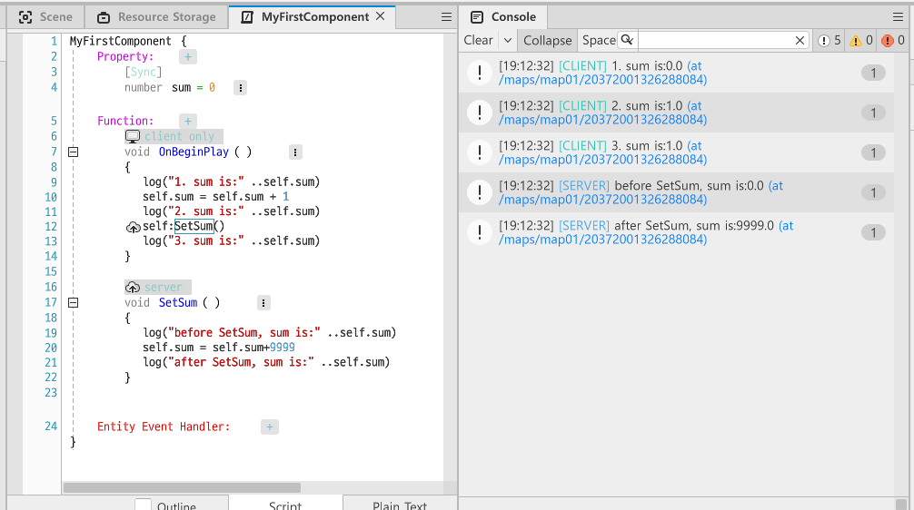

앞의 예시와 비슷하게 이번에는  `Client`에서 `Server`함수인 `SetSum`이 호출되었기에 `Server`로 넘어가 `SetSum`이 실행되는 것을 볼 수 있다.

<br/>

<br/>


\# **multicast**

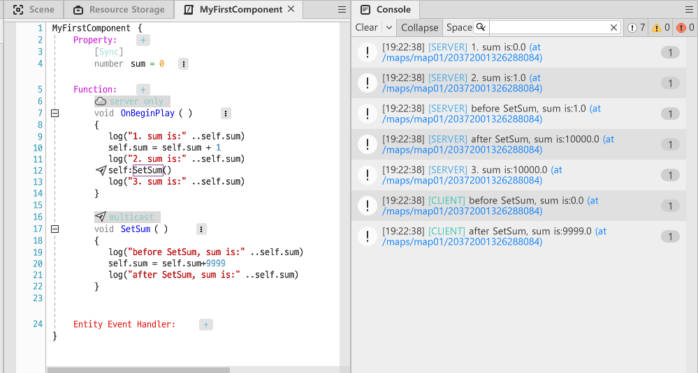

`multicast` 함수일 경우 `server`에서 호출되면 `server`에서 실행하고 이후 `client`에서도 실행하는 것을 볼 수 있다

<br/>

<br/>

\# **Function setting을 사용하지 않을 때**

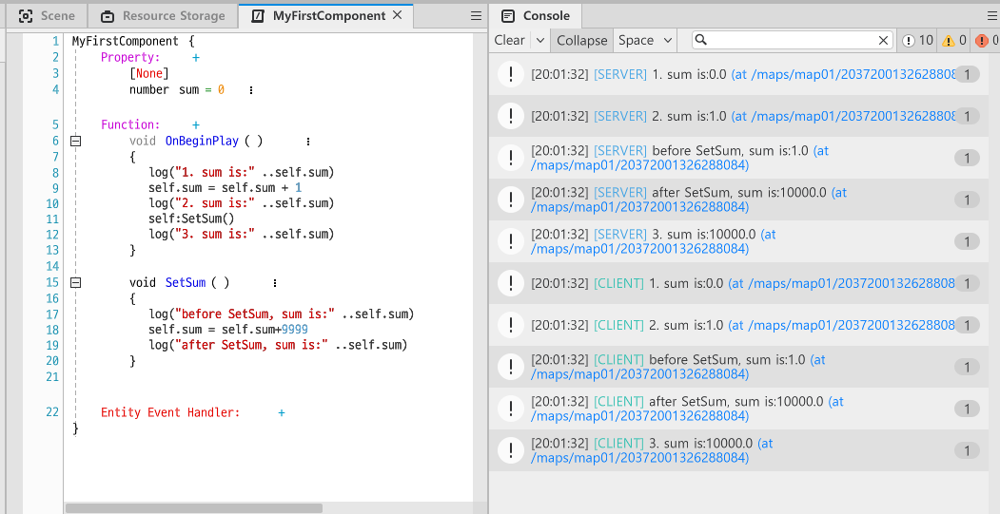

`OnBeginPlay`함수는 Function setting을 설정하지 않았으므로 server와 client 두 곳에서 실행된다. `SetSum`함수도 Funtion setting을 하지않아 `OnBeginPlay`함수가 호출할 때 바로 실행된다.

<br/>

\# **Function setting을 사용하지않는 함수에서 server함수 호출**

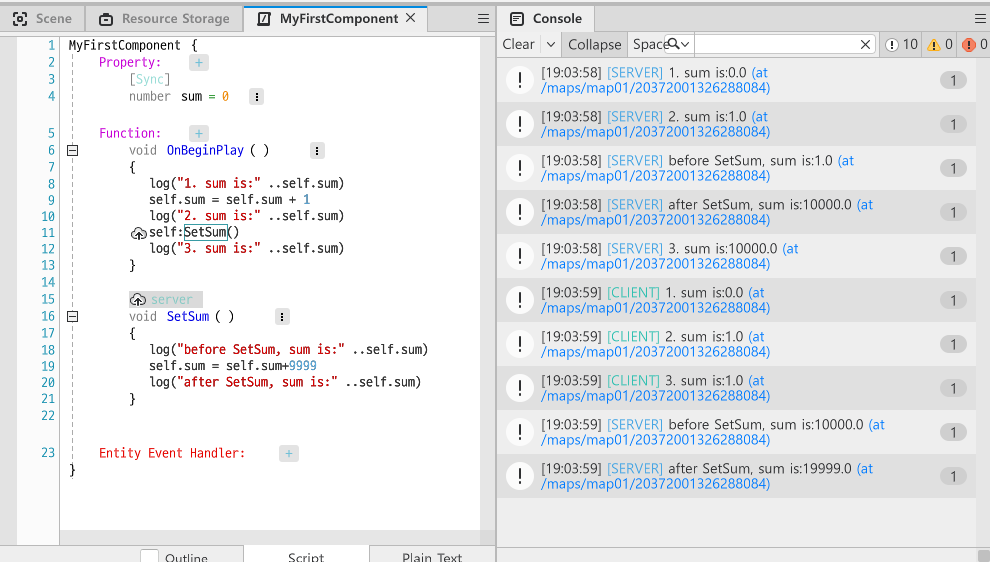

`OnBeginPlay` 함수는 Function setting을 하지않아 서버와 클라이언트 두 곳에서 실행된다. 그러나 `SetSum`함수는 `server`로 세팅되어있기 때문에

* `OnBeginPlay`가 서버에서 실행될 때는 바로 서버에서 같이 실행되고
* `OnBeginPlay`가 클라이언트에서 실행될 때는 나중에 클라이언트에서 실행되는 것을 볼 수 있다.


