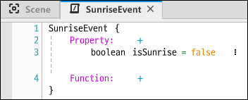

## Event

- Event는 "행동을 실행해야 할 주체"에서 무엇을 할 것인지 결정한다.

> 일반 로직의 경우 "행위가 일어난 주체"에서 일을 처리한다.
>
> 그러나 이벤트는 "행동을 실행해야 할 주체"에서 일을 처리한다. 행위가 일어난 주체에서는 행위가 일어났을 때 행동에 필요한 정보와 타이밍만 알려주고 뭘 해야 할지는 각각 행동을 실행해야 할 주체에서 결정한다.
>
> 즉, 행동을 실행할 주체들은 행위가 일어날 시점을 "구독"하고 이벤트 상황 자체만 공유한다. 그 상황들을 Event로 만들어서 전송하게 되면 Event는 하나의 데이터 셋이라고 보면 된다.
>
> 각각의 주체는 해당 이벤트를 받을 때 내부적으로 정해진 행동을 수행한다.

### Event System의 구성

- Event : 로직 상에서 어떤 사건의 발생을 의미함. Event의 종류의 식별 정보 및 추가 정보 등을 들고 있는 자료형.
- Handler : 해당 Event를 받았을 때 처리하는 행동의 주체. 특정 이벤트가 불렸을 때 실행되는 함수라고 생각하시면 편하다.
- Sender : 이벤트를 발송하는 객체.

### Event를 쓰는 이유는?

- 설계나 구조적인 측면에서 이득
- native 컴포넌트와 제작한 스크립트 컴포넌트가 분리되어있음. native 코드는 수정할 수 없음. 분리가 되어있는 환경에서 통신을 할 수 있게 해주는게 Event.

### Entity Event System

> MOD에서는 이벤트 시스템을 쉽게 활용할 수 있도록 제공되는 API가 존재한다.
>
> Entity Event System을 통해 Event를 핸들링할 수 있다.

- 각각의 컴포넌트는 엔티티를 통해 Handler를 동록한다.

  

  <br/>

- Sender 역시 엔티티를 통해서 이벤트를 발생할 수 있다.

  

<br/>

- 기본적으로 자기 자신의 엔티티에 연결하는 경우가 대부분이지만, 상황에 따라 다른 엔티티로 연결하는 것도 가능하다. (특히 Map Entity와 World Entity는 서로 간에 이벤트를 주고 받는 겨우가 많다.)


<br/>

### 이벤트 생성

- MyDesk에서 이벤트 타입의 스크립트를 생성한다.


<br/>

> 예시로 SunriseEvent를 받으면 Vampier와 Hunter 엔티티의 상태가 변하는 이벤트를 생성해보자!
>
> Sunrise 상태이면 Hunter는 Hp를 회복하고 Vampire는 Hp가 감소하는 동작을 한다고 해보자

<br/>

- 이벤트 작성



- 이벤트를 만들었다면, 이벤트를 처리할 컴포넌트와 엔티티를 생성한다.


- 엔티티에 컴포넌트를 등록해준다.


- 컴포넌트의 `Entity Event Handler`에 앞서 생성한 이벤트를 등록한다.


> Sunrise Event는 map에 의해 발생되므로 중계 엔티티를 self에서 map01로 변경한다.


<br/>

- 핸들러를 추가했다면 이제 SunriseEvent를 받을 수 있다!
- 이제 각자 받은 SunriseEvent를 처리하는 로직을 각 컴포넌트에 추가해준다.

\# Hunter Component

```lua
Property :
    [Sync]
    boolean isSunrise = false
    [Sync]
    number Hp = 0

Method :
    [server Only]
    void OnUpdate (number delta)
    {
        if self.isSunrise == true then --해가 떴는지 체크합니다.
            self.Hp = self.Hp + delta --해가 떠 있을 동안 Hp가 증가합니다.
            log("Hunter Hp : "..self.Hp) --현재 체력을 Console 창에 표시합니다.
            if self.Hp >= 200 then self.Hp = 200 end --Hp가 200까지 증가했다면 증가를 멈춥니다.
        end
    }

Entity Event Handler :
    entity map01 (/maps/map01)
    HandlerSunriseEvent(SunriseEvent event)
    {
        -- Parameters
        local isSunrise = event.isSunrise
        self.isSunrise = isSunrise
    }
```

<br/>

\# Vampire Component

```lua
Property :
    [Sync]
    boolean isSunrise = false
    [Sync]
    number Hp = 0

Method :
    [server Only]
    void OnUpdate (number delta)
    {
        if self.isSunrise == true then --해가 떴는지 체크합니다.
            self.Hp = self.Hp - delta --해가 떠 있을 동안 Hp가 감소합니다.
            log("Vampire Hp : "..self.Hp) --현재 Hp를 Console 창에 표시합니다.
            if self.Hp < 0 then self.Hp = 0 end --Hp가 0까지 감소했다면 감소를 멈춥니다.
        end
    }

Entity Event Handler :
    Entity map01 (/maps/map01)
    HandlerSunriseEvent(SunriseEvent event)
    {
        -- Parameters
        local isSunrise = event.isSunrise
        self.isSunrise = isSunrise
    }
```

## 컴포넌트 확장

상속처럼 기존 컴포넌트를 확장해서 쓸 수 있다

- 메소드 오버라이드 가능

참고 문서

https://mod-developers.nexon.com/docs/?postId=176
