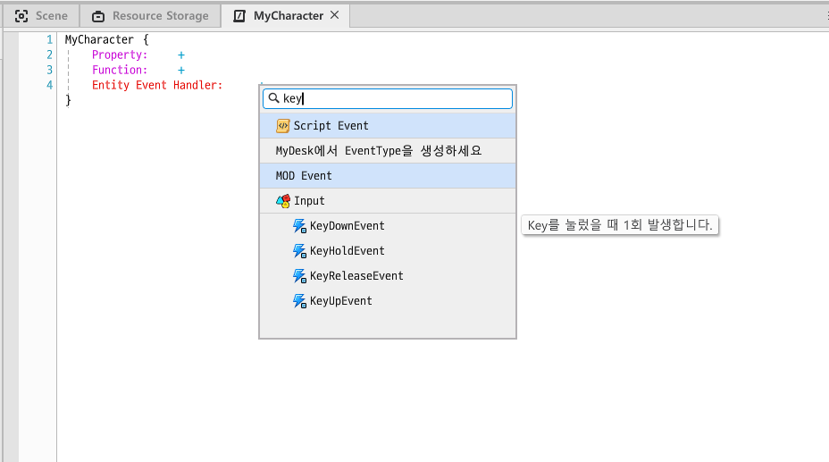
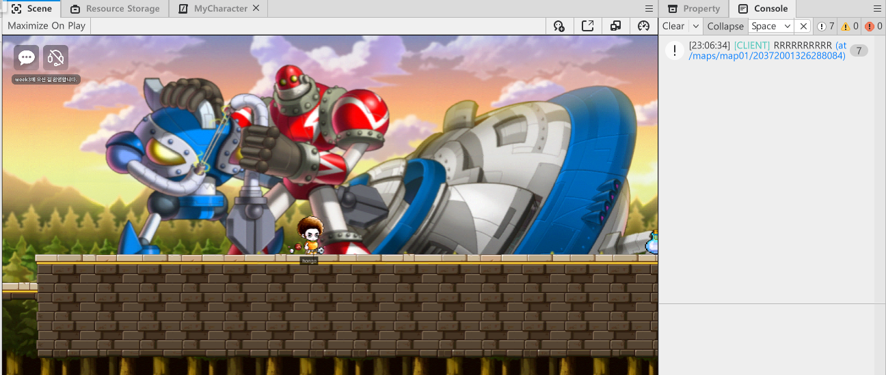
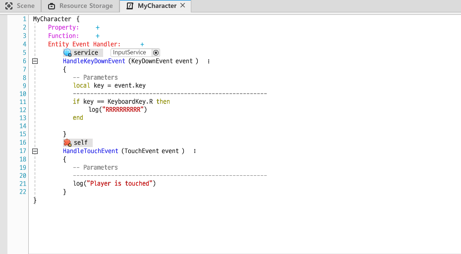
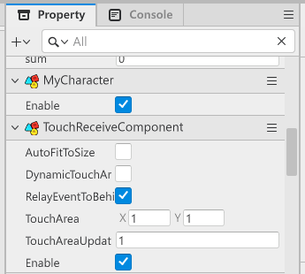
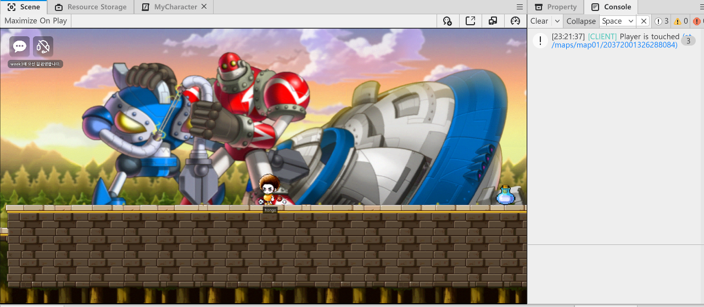
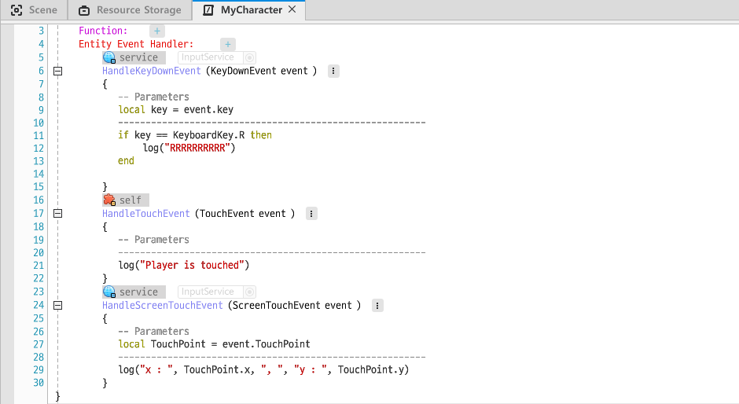
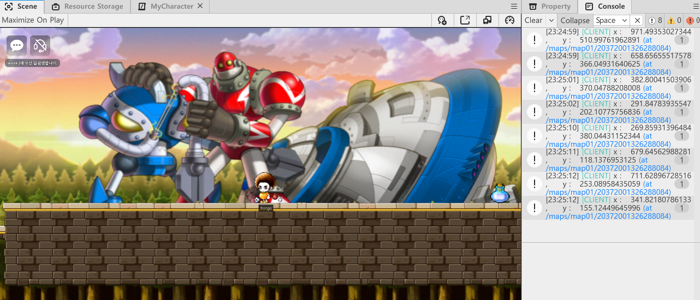

## 자주쓰이는 Component

* MovementComponent
  * 점프력과 이동속도를 결정

<br/>

* RigidbodyComponent
  * 과감속에 따른 움직임을 디테일하게 설정할 수 있다.(중력 등 물리와 관련된)
  * 엔티티의 block 여부도 결정할 수 있음. (block이 활성화되면 해당 Entity를 캐릭터가 통과할 수 없음)
  * 쿼터뷰 설정도 가능

<br/>

* TriggerComponent
  * 충돌 트리거 발생

<br/>

* WebSpriteComponent
  * 웹 디스플레이 설정
  * 애니메이션도 가능

<br/>

* YoutubePlayerComponent
  * 유투브 영상을 디스플레이


### Trigger & Movement 예시 - 먹으면 이동속도가 증가하는 아이템

캐릭터가 먹으면 속도가 증가하고 점프력이 높아지는 아이템을 만들어보자!

> 해당 기능을 위해선 캐릭터가 아이템을 먹는걸 감지하는 `Trigger Componet`와 트리거가 발생하면 어떻게 처리할 것인지를 결정하는 추가 컴포넌트 `ItemComponent` 가 필요하다.

<br/>

* `Workspace`의 `Mydesk`에서 `ItemComponent`를 생성하고 아래와 같이 내용을 작성한다.


> 이벤트 핸들러를 추가하고, <br/>
>
> TriggerBodyEntity의 Movement 정보를 가져와 캐릭터의 속도(InputSpeed)와 점프력(JumpForce)를 상승시킨다.<br/>
>
> * movement가 없는 Entity가 충돌 될 수도 있으므로 예외처리를 해준다.
>
> Enable을 false로 만들어 아이템을 먹으면 아이템이 사라지게 만든다.

<br/>

* Item Entity에  `TriggerComponent`와 방금 만든 `ItemComponent`를 추가한다.


<br/>

<br/>

여기까지하면 구현이 끝났다! 결과를 확인해보자

* 아이템 먹기 전 점프력


<br/>

* 아이템 먹은 후 점프력


<br/>


## Input Service

유저가 특정 입력을 누르면 해당 입력에 대한 피드백을 전달한다. <br/>

입력같은 이벤트들은 서비스에 직접 접근을 못해서 이벤트를 받아 처리한다.<br/>

> **예시**
>
> 유저가 키보드 `I`를 누르면 인벤토리창을 보여준다<br/>
>
> 키보드 `A`를 누르면 대응하는 스킬을 사용한다<br/>
>
> 마우스로 특정 아이템을 클릭하면 해당 아이템을 습득한다<br/>


### 키 입력 이벤트

유저가 `R` 키를 누르면 로그를 찍게 만들어보자!

* 이벤트를 등록할 Component를 생성하고, `KeyDownEvent`를 등록한다.



<br/>

* 컴포넌트에 코드를 작성한다.

```lua
local key = event.key
if key == KeyboardKey.R then
    -- 누른 키가 R이라면 아래 로그를 출력한다.
	log("RRRRRRRRRR")
end
```

<br/>


* 생성한 컴포넌트를 `DefaultPlayer`에 적용하고 실행하면, R키를 누를 때 마다 로그가 잘 찍히는 것을 볼 수 있다.




### 키 입력 예시 - 


### 터치 이벤트

플레이어를 터치하면 로그가 출력되게 해보자!

* 컴포넌트에서 `TouchEvent` 이벤트를 등록하고 로그를 출력하는 코드를 작성한다.



<br/>

* 해당 컴포넌트를 `DefaultPlayer`에 등록한다.
* **TouchEvent를 받기 위해선 Entity에 TouchReceiveComponent를 등록해야한다.**
* `DefaultPlayer`에 `TouchReceiveComponent`를 등록한다.



<br/>

* 플레이어를 클릭하면 로그가 잘찍히는 것을 볼 수 있다.




### 터치 예시 - 건드리면 싫어하는


### 스크린 터치 이벤트

게임 화면의 어떤 부분을 터치하면 좌표를 출력하게 해보자!

* 컴포넌트에 아래 코드를 작성한다.



<br/>

* `DefaultPlayer`에 컴포넌트를 등록하고 실행하면 로그가 잘 찍히는 것을 볼 수 있다.




---

게임에 여러가지 퍼포먼스, 기능을 추가하기 위해선 컴포넌트를 얼마나 활용할 줄 아느냐가 중점일 것 같다. 재밌는 MOD 게임을 만들기 위해 개발자 문서를 보며 여러 컴포넌트들을 학습하고 적용하는 연습을 많이 해야할 것 같다.
