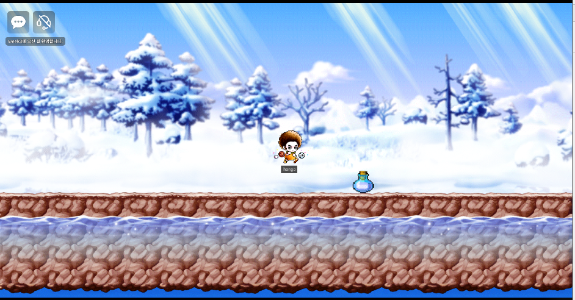

## Component의 활용

* MovementComponent
  * 점프력과 이동속도를 결정

 

* RigidbodyComponent
  * 과감속에 따른 움직임을 디테일하게 설정할 수 있다.(중력 등 물리와 관련된)
  * 엔티티의 block 여부도 결정할 수 있음. (block이 활성화되면 해당 Entity를 캐릭터가 통과할 수 없음)
  * 쿼터뷰 설정도 가능

 

* TriggerComponent
  * 충돌 트리거 발생

 

* WebSpriteComponent
  * 웹 디스플레이 설정
  * 애니메이션도 가능

 

* YoutubePlayerComponent
  * 유투브 영상을 디스플레이

## 예시

캐릭터가 먹으면 속도와 점프력이 빨라지는 아이템을 만들어보자!

> 해당 기능을 위해선 캐릭터가 아이템을 먹는걸 감지하는 `Trigger Componet`와 트리거가 발생하면 어떻게 처리할 것인지를 결정하는 추가 컴포넌트 `ItemComponent` 가 필요하다.

 

* `Workspace`의 `Mydesk`에서 `ItemComponent`를 생성하고 아래와 같이 내용을 작성한다.

> 이벤트 핸들러를 추가하고,  
>
> TriggerBodyEntity의 Movement 정보를 가져와 캐릭터의 속도(InputSpeed)와 점프력(JumpForce)를 상승시킨다. 
>
> * movement가 없는 Entity가 충돌 될 수도 있으므로 예외처리를 해준다.
>
> Enable을 false로 만들어 아이템을 먹으면 아이템이 사라지게 만든다.

 

* Item Entity에  `TriggerComponent`와 방금 만든 `ItemComponent`를 추가한다.

 

 

여기까지하면 구현이 끝났다! 결과를 확인해보자

* 아이템 먹기 전 점프력

 

* 아이템 먹은 후 점프력

 

---

게임에 여러가지 퍼포먼스, 기능을 추가하기 위해선 컴포넌트를 얼마나 활용할 줄 아느냐가 중점일 것 같다. 재밌는 MOD 게임을 만들기 위해 개발자 문서를 보며 여러 컴포넌트들을 학습하고 적용하는 연습을 많이 해야할 것 같다.
