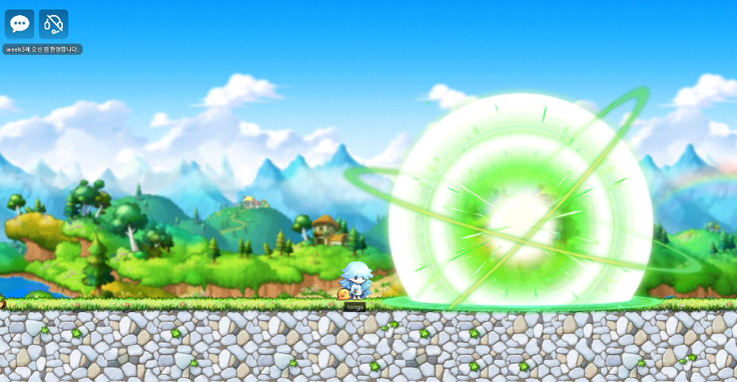
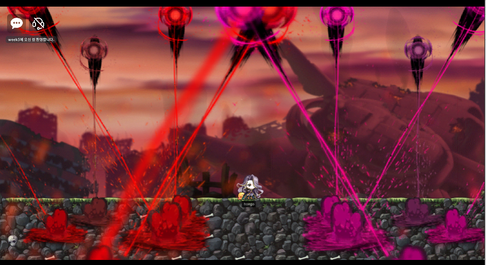
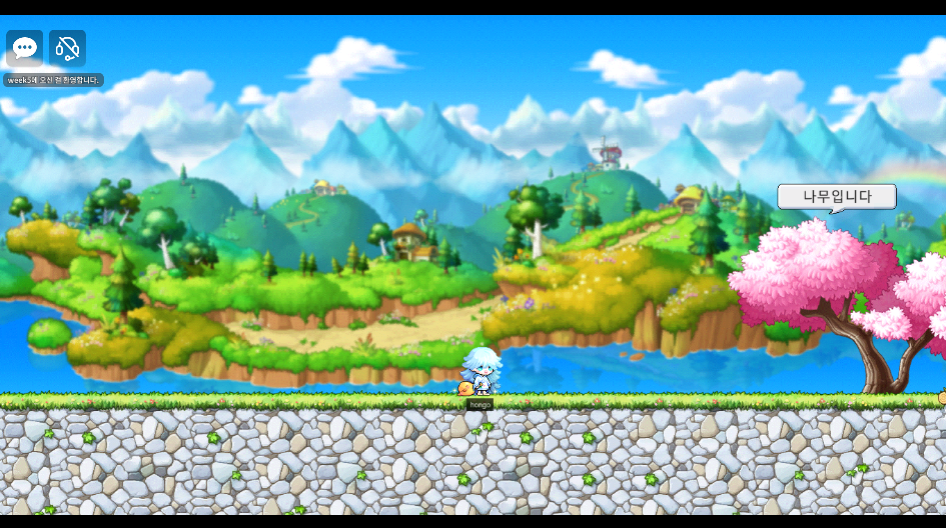
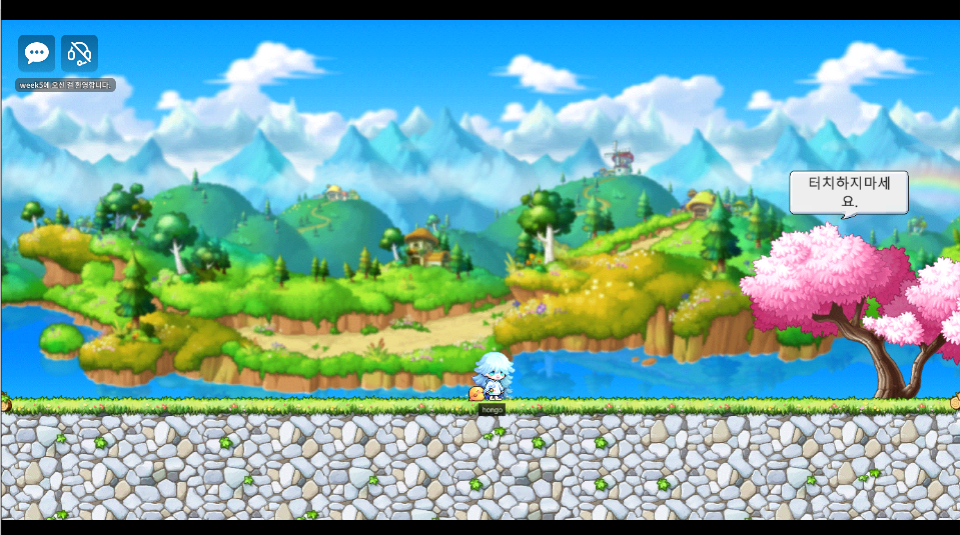
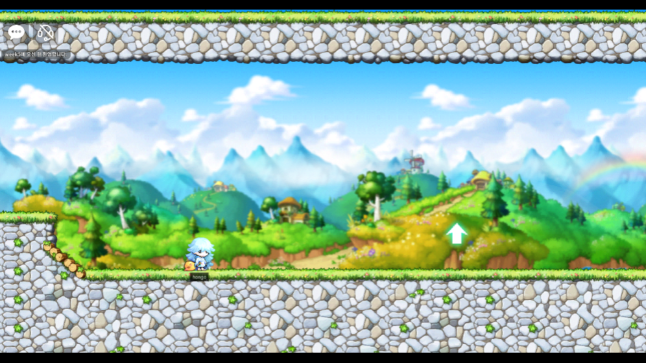
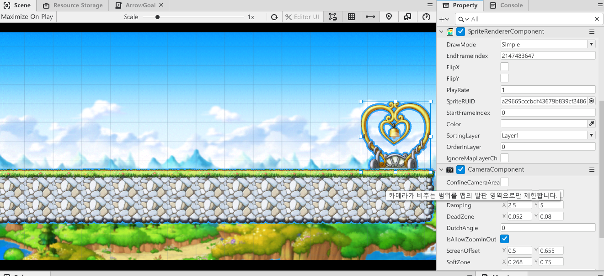
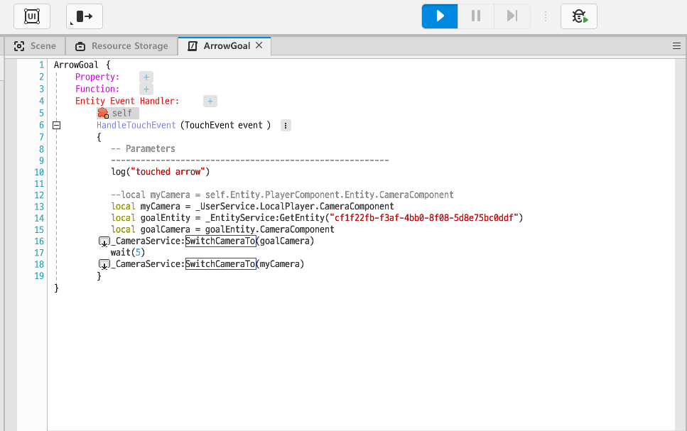

## 자주쓰이는 Component

* MovementComponent
  * 점프력과 이동속도를 결정

<br/>

* RigidbodyComponent
  * 과감속에 따른 움직임을 디테일하게 설정할 수 있다.(중력 등 물리와 관련된)
  * 엔티티의 block 여부도 결정할 수 있음. (block이 활성화되면 해당 Entity를 캐릭터가 통과할 수 없음)
  * 쿼터뷰 설정도 가능

<br/>

* TriggerComponent
  * 충돌 트리거 발생

<br/>

* WebSpriteComponent
  * 웹 디스플레이 설정
  * 애니메이션도 가능

<br/>

* YoutubePlayerComponent
  * 유투브 영상을 디스플레이


### Trigger & Movement 예시 - 먹으면 이동속도가 증가하는 아이템

캐릭터가 먹으면 속도가 증가하고 점프력이 높아지는 아이템을 만들어보자!

> 해당 기능을 위해선 캐릭터가 아이템을 먹는걸 감지하는 `Trigger Componet`와 트리거가 발생하면 어떻게 처리할 것인지를 결정하는 추가 컴포넌트 `ItemComponent` 가 필요하다.

<br/>

* `Workspace`의 `Mydesk`에서 `ItemComponent`를 생성하고 아래와 같이 내용을 작성한다.


> 이벤트 핸들러를 추가하고, <br/>
>
> TriggerBodyEntity의 Movement 정보를 가져와 캐릭터의 속도(InputSpeed)와 점프력(JumpForce)를 상승시킨다.<br/>
>
> * movement가 없는 Entity가 충돌 될 수도 있으므로 예외처리를 해준다.
>
> Enable을 false로 만들어 아이템을 먹으면 아이템이 사라지게 만든다.

<br/>

* Item Entity에  `TriggerComponent`와 방금 만든 `ItemComponent`를 추가한다.


<br/>

<br/>

여기까지하면 구현이 끝났다! 결과를 확인해보자

* 아이템 먹기 전 점프력


<br/>

* 아이템 먹은 후 점프력


<br/>


## Input Service

유저가 특정 입력을 누르면 해당 입력에 대한 피드백을 전달한다. <br/>

입력같은 이벤트들은 서비스에 직접 접근을 못해서 이벤트를 받아 처리한다.<br/>

> **예시**
>
> 유저가 키보드 `I`를 누르면 인벤토리창을 보여준다<br/>
>
> 키보드 `A`를 누르면 대응하는 스킬을 사용한다<br/>
>
> 마우스로 특정 아이템을 클릭하면 해당 아이템을 습득한다<br/>


## 키 입력 이벤트란?

> 유저가 특정 키를 입력하면 그에 대한 피드백을 보내줄 수 있다!

유저가 `R` 키를 누르면 로그를 찍게 만들어보자!

* 이벤트를 등록할 Component를 생성하고, `KeyDownEvent`를 등록한다.


<br/>

* 컴포넌트에 코드를 작성한다.

```lua
local key = event.key
if key == KeyboardKey.R then
    -- 누른 키가 R이라면 아래 로그를 출력한다.
	log("RRRRRRRRRR")
end
```

<br/>


* 생성한 컴포넌트를 `DefaultPlayer`에 적용하고 실행하면, R키를 누를 때 마다 로그가 잘 찍히는 것을 볼 수 있다.


### 키 입력 예시 - R키를 누르면 스킬 이펙트

* 컴포넌트를 생성하고 아래와 같이 코드를 작성합니다.

```lua
local key = event.key
if key == KeyboardKey.R then
	--_EffectService:PlayEffect("00613b24f0c045deab14ba24cdb90187", self.Entity, self.Entity.TransformComponent.Position,0, Vector3(1,1,1))
	_EffectService:PlayEffectAttached("00613b24f0c045deab14ba24cdb90187", self.Entity, Vector3(0,0,0), 0, Vector3(1,1,1))
en
```

> `PlayEffect`는 월드의 position을 기반으로 이펙트를 띄워준다. <br/>
>
> 예시 스킬의 경우 플레이어에 계속 붙어있는 스킬이 적합하므로 `PlayEffectAttached`를 사용한다.
>
> `PlayEffect`의 인자는 차례대로 
>
> (Effect RUID, Entity, 이펙트를 띄울 위치, 회전도, 이펙트의 크기)이다.

<br/>

* 컴포넌트를 플레이어에 적용하고 실행하면 R키를 누를때마다 스킬이펙트가 잘 실행되는 것을 볼 수 있습니다.


<br/>

캐릭터가 보는 방향 앞에 스킬 이펙트를 띄워주려면 다음과 같이 하면 된다.

```lua
local direction = self.Entity.PlayerControllerComponent.LookDirectionX
local displayPosition = self.Entity.TransformComponent.Position:Clone()
displayPosition = displayPosition + Vector3(3*direction, 0,0)

if key == KeyboardKey.E then
	_EffectService:PlayEffect("00e23d2d229b49d6895288ab7cf5b8ab", self.Entity, displayPosition,0,Vector3(1,1,1))
end
```



<br/>


이처럼 여러 스킬들의 RUID를 적용해 다양한 스킬 이펙트를 띄워줄 수 있다!




## 터치 이벤트란?

> 유저가 어떤 Entity를 터치하면 그에 대한 피드백을 보내준다

플레이어를 터치하면 로그가 출력되게 해보자!

* 컴포넌트에서 `TouchEvent` 이벤트를 등록하고 로그를 출력하는 코드를 작성한다.


<br/>

* 해당 컴포넌트를 `DefaultPlayer`에 등록한다.
* **TouchEvent를 받기 위해선 Entity에 TouchReceiveComponent를 등록해야한다.**
* `DefaultPlayer`에 `TouchReceiveComponent`를 등록한다.


<br/>

* 플레이어를 클릭하면 로그가 잘찍히는 것을 볼 수 있다.


### 터치 예시 - 터치하면 싫어하는 나무

터치하면 "터치하지 마세요."라고 말하는 나무 Object를 만들어보자!

* 나무 Object에 `TouchReceiveComponent`를 추가한다.
* `ChatBalloonComponent`를 추가한다.


> `ChatBalloonComponent`의 `Message`를 사용해 나무 Object가 "나무입니다" 라고 말하게한다.
>
> * `AutoShowEnable` 활성화해야 말풍선이 보인다.
> * `HideDuration`을 0으로 해서 말풍선이 계속 보이게 한다.

<br/>

* 터치 이벤트에 피드백을 보내줄 컴포넌트를 생성하고 오브젝트에 등록한다. (DontTouch)

* 컴포넌트에 다음과 같이 코드를 작성한다.


> TouchEvent 핸들러를 등록하고, 이벤트를 받으면 말풍선의 메시지를 "터치하지마세요" 로 바꾼다.
>
> 2초뒤에 원래 메시지였던 "나무입니다"로 돌아간다.

<br/>

* 게임을 실행시키고 나무를 클릭하면 말풍선이 잘 변경되는 것을 볼 수 있다.

<br/>

* 나무 누르기 전



<br/>

* 나무 누른 후




## 스크린 터치 이벤트란?

> 유저가 스크린을 터치하면 그에 대한 피드백을 보내준다

게임 화면의 어떤 부분을 터치하면 좌표를 출력하게 해보자!

* 컴포넌트에 아래 코드를 작성한다.


<br/>

* `DefaultPlayer`에 컴포넌트를 등록하고 실행하면 로그가 잘 찍히는 것을 볼 수 있다.


## Sound Component

Object에서 Sound를 플레이 시킬 수도 있다.<br/>

상자 Object에서 쿵쿵거리는 소리가 나오게 해보자!<br/>

### 소리나는 상자

맵에는 소리가 나는 상자가 있다.<br/>

플레이어가 상자에 가까이 갈수록 쿵쿵거리는 소리가 커지게 해보자!<br/>

* 우선 Object에 `SoundComponent`를 추가하고, 원하는 Sound를 설정한다.

  

> AudioClipRUID옆에 동그란 버튼을 클릭하면 Sound Resource들을 볼 수 있다.<br/>
>
> monster, skill등 종류별로 확인할 수 있고, 루디브리엄등 특정 키워드를 검색할수도있다.

<br/>

* Object에 Sound 등록이 완료되었다면, 플레이어에 등록된 컴포넌트안의 코드를 수정한다.

  

  * 유저마다 상자와의 거리가 상이하므로 함수는 `client only`로 설정한다.

  * 상자Object의 아이디를 가지고 Entity를 가져온다.

    > 아이디는 `Scene Maker`에서 해당 Object를 우클릭하고 `Copy Entity ID`를 클릭하면된다.

  <br/>

  * 상자의 `SoundComponent`도 가져온 뒤,

  * `SetListenerEntity` 함수를 가지고 상자와의 거리에 따라서 소리가 커지고 작아지게 설정한다.

    >  self.Entity는 플레이어를 의미하며, 상자 소리와 플레이어간의 거리를 고려하겠다는 의미이다.

  <br/>

  * `SetListenerEntity` 함수를 부르고 `Play`함수를 가지고 사운드를 다시 플레이한다.

    > 이미 실행되고 있는 Sound는 `SetListenerEntity`함수를 설정해도 적용되지않는다.<br/>
    >
    >  다시 `Play`를 해줘서 `SetListenerEntity`가 반영되게한다.


## Camera Component

플레이어가 움직이면 화면이 그에 맞춰 따라간다. 이는 `CameraComponent`가 플레이어에 설정되어있어 계속 플레이어를 카메라로 비추기 때문이다. <br/>

`Camera Component`를 사용해서 화살표를 누르면 플레이어중심인 화면에서 멀리 떨어진 골 지점을 가리키고오게 하자!<br/>


### 골 지점을 보여주기


짜잔~ 위는 현재 맵의 구성도이다! <br/>

우측 상단의 종이 달린 하트모양 오브젝트를 플레이어가 도달할 골지점이라고 하자<br/>

> 좌측 하단의 투명한 캐릭터 모양은 `SpawnLocation` Entity로, 플레이어가 스폰될 위치를 의미한다.
>
> `SpawnLocation` Model은 `MoDelList`란의 왼쪽 아래 별모양 아이콘인  `SpecialModel`을 누르면 볼 수 있다.


<br/>



게임을 실행하면 플레이어에게 카메라 초점이 맞춰지므로 위에 있는 골 지점까지는 보이지않는다.<br/>

골 지점이 어디있는지 미리 보여주기위해, 화살표를 클릭하면 위의 골 지점이 있는 곳까지 올라가 보여주기로 하자!<br/>

크게 다음과 같이 진행된다.<br/>

1. goal Object에 `CameraComponent`등록
2. arrow Object에 `TouchReceivedComponent` 등록
3. arrow Object에 터치 이벤트 핸들러를 정의할 새 컴포넌트 등록

<br/><br/>

#### 📌 goal Object에 `CameraComponent`등록



goal Object에 `CameraComponent`를 등록한다.<br/>

`ConfineCameraArea`속성을 꺼둔다.

* `ConfineCameraArea` 속성을 키면 위 Scene처럼 goal Object가 화면의 중앙에 있지않고 가장자리에 있는 것을 보여준다. 이는 카메라가 비치는 영역이 맵의 발판 영역으로 제한되기 때문이다.  (goal Object는 맵 발판의 끝에 있기때문에 발판이 있는 곳 까지만 보여줘서 가장자리에 보인다.)
* `ConfineCameraArea`이 켜져있어도 카메라 offset이나 `UseCustomBound`를 켜 좌표를 조정하면 goal Object를 화면 정중앙에서 보여줄 수 있으나... 그냥 끄는게 더 쉽고 빠른 방법인 것 같다.


<br/><br/>

#### 📌 arrow Object에 `TouchReceivedComponent` 등록 & 터치 이벤트 핸들러를 정의할 새 컴포넌트 등록

arrow Object에 `TouchReceivedComponent`를 등록했다면, 터치 이벤트 핸들러를 정의할 새 컴포넌트를 생성해야한다. 새 컴포넌트의 내용은 다음과 같다.<br/>



* 우선 플레이어의 카메라 컴포넌트와 골 오브젝트의 카메라 컴포넌트를 가져온다.
  * **유저의 컴포넌트는 `_UserService.LocalPlayer`에서 가져올 수 있다.**
  * 골은 id를 가지고 entity를 불러온다음 entity의 카메라 컴포넌트를 저장한다.
* 함수 `_CameraService:SwtichCameraTo`를 사용해 게임 화면을 보여주는 카메라를 변경할 수 있다.
* arrow Object가 터치되면 goalCamera를 보여주고 5초뒤에 다시 플레이어의 Camera로 돌아가게 해준다.


#### 📌 완성!

게임을 실행하고 화살표를 누르면 카메라가 goal Object를 비춰줬다가 다시 플레이어 카메라로 돌아오는 것을 볼 수 있다.<br/>

*화살표를 눌렀을 때 아래와 같이 골 지점을 보여주고 다시 돌아감*


<br/><br/>

---

이번 포스트에는 유저의 Input data와 상호작용 할 수 있는 컴포넌트들과 Sound Component를 학습했다.<br/>

게임에 여러가지 퍼포먼스, 기능을 추가하기 위해선 컴포넌트를 얼마나 활용할 줄 아느냐가 중점일 것 같다. 재밌는 MOD 게임을 만들기 위해 개발자 문서를 보며 여러 컴포넌트들을 학습하고 적용하는 연습을 많이 해야할 것 같다.
