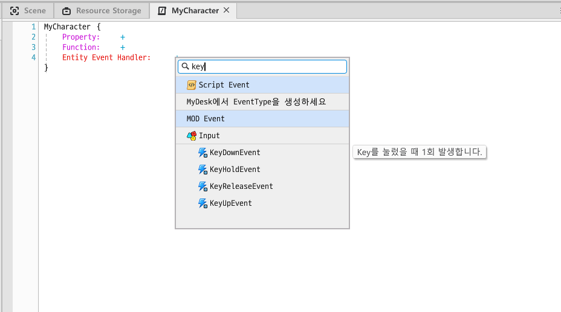
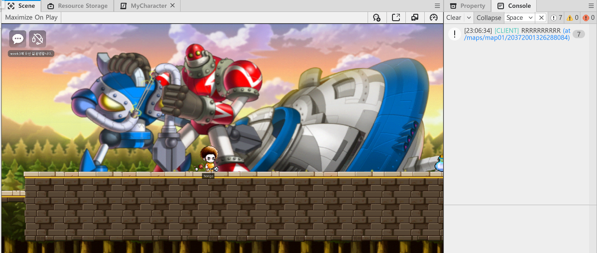
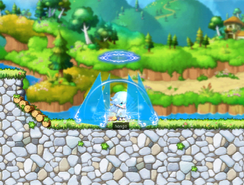
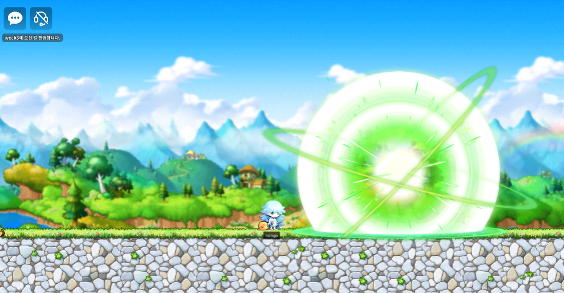
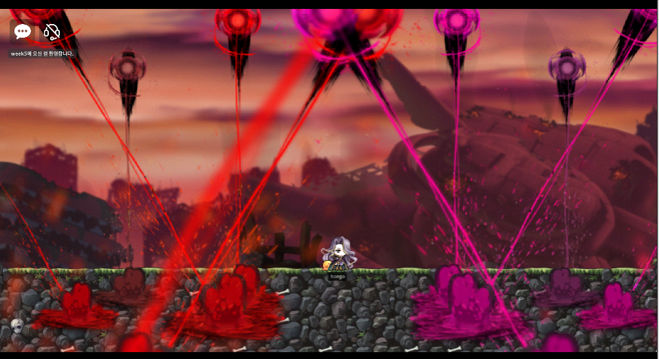

오랜만에 돌아온 mod 회고록입니다 > < <br/>

주차별로 하나씩 포스팅하고 있었는데, mod 서포터즈를 모집후 월~금마다 하나씩 쓰는 것으로 규칙이 바뀌어서 앞으로는 `n주차 m요일 회고 ` 라는 형식으로 주에 5개씩 포스팅할 예정이다.ㅎㅎ<br/><br/><br/>

그럼 다시 힘차게 학습 내용을 포스팅해보자...!ㅎㅎ

## Input Service

유저가 특정 입력을 누르면 해당 입력에 대한 피드백을 전달한다. <br/>

입력같은 이벤트들은 서비스에 직접 접근을 못해서 이벤트를 받아 처리한다.<br/>

> **예시**
>
> 유저가 키보드 `I`를 누르면 인벤토리창을 보여준다<br/>
>
> 키보드 `A`를 누르면 대응하는 스킬을 사용한다<br/>
>
> 마우스로 특정 아이템을 클릭하면 해당 아이템을 습득한다<br/>

## 키 입력 이벤트란?

> 유저가 특정 키를 입력하면 그에 대한 피드백을 보내줄 수 있다!

유저가 `R` 키를 누르면 로그를 찍게 만들어보자!

- 이벤트를 등록할 Component를 생성하고, `KeyDownEvent`를 등록한다.



<br/>

- 컴포넌트에 코드를 작성한다.

```lua
local key = event.key
if key == KeyboardKey.R then
    -- 누른 키가 R이라면 아래 로그를 출력한다.
	log("RRRRRRRRRR")
end
```

<br/>

- 생성한 컴포넌트를 `DefaultPlayer`에 적용하고 실행하면, R키를 누를 때 마다 로그가 잘 찍히는 것을 볼 수 있다.



### 키 입력 예시 - R키를 누르면 스킬 이펙트

- 컴포넌트를 생성하고 아래와 같이 코드를 작성합니다.

```lua
local key = event.key
if key == KeyboardKey.R then
	--_EffectService:PlayEffect("00613b24f0c045deab14ba24cdb90187", self.Entity, self.Entity.TransformComponent.Position,0, Vector3(1,1,1))
	_EffectService:PlayEffectAttached("00613b24f0c045deab14ba24cdb90187", self.Entity, Vector3(0,0,0), 0, Vector3(1,1,1))
en
```

> `PlayEffect`는 월드의 position을 기반으로 이펙트를 띄워준다. <br/>
>
> 예시 스킬의 경우 플레이어에 계속 붙어있는 스킬이 적합하므로 `PlayEffectAttached`를 사용한다.
>
> `PlayEffect`의 인자는 차례대로
>
> (Effect RUID, Entity, 이펙트를 띄울 위치, 회전도, 이펙트의 크기)이다.

<br/>

- 컴포넌트를 플레이어에 적용하고 실행하면 R키를 누를때마다 스킬이펙트가 잘 실행되는 것을 볼 수 있습니다.



<br/>

캐릭터가 보는 방향 앞에 스킬 이펙트를 띄워주려면 다음과 같이 하면 된다.

```lua
local direction = self.Entity.PlayerControllerComponent.LookDirectionX
local displayPosition = self.Entity.TransformComponent.Position:Clone()
displayPosition = displayPosition + Vector3(3*direction, 0,0)

if key == KeyboardKey.E then
	_EffectService:PlayEffect("00e23d2d229b49d6895288ab7cf5b8ab", self.Entity, displayPosition,0,Vector3(1,1,1))
end
```



<br/>

이처럼 여러 스킬들의 RUID를 적용해 다양한 스킬 이펙트를 띄워줄 수 있다!


