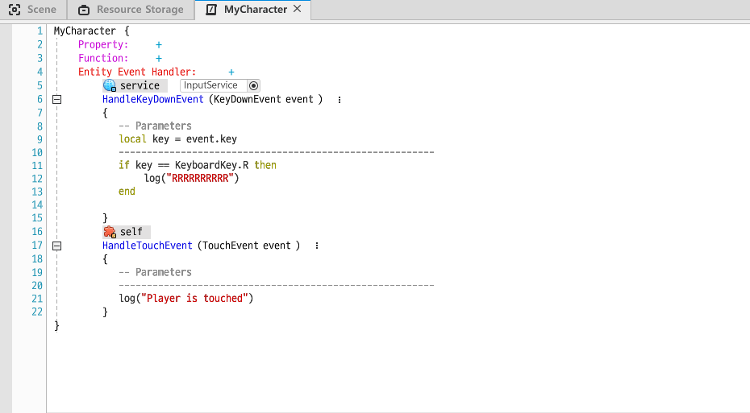

## 터치 이벤트란?

> 유저가 어떤 Entity를 터치하면 그에 대한 피드백을 보내준다

플레이어를 터치하면 로그가 출력되게 해보자!

* 컴포넌트에서 `TouchEvent` 이벤트를 등록하고 로그를 출력하는 코드를 작성한다.

 

* 해당 컴포넌트를 `DefaultPlayer`에 등록한다.
* **TouchEvent를 받기 위해선 Entity에 TouchReceiveComponent를 등록해야한다.**
* `DefaultPlayer`에 `TouchReceiveComponent`를 등록한다.

 

* 플레이어를 클릭하면 로그가 잘찍히는 것을 볼 수 있다.

### 터치 예시 - 터치하면 싫어하는 나무

터치하면 "터치하지 마세요."라고 말하는 나무 Object를 만들어보자!

* 나무 Object에 `TouchReceiveComponent`를 추가한다.
* `ChatBalloonComponent`를 추가한다.

> `ChatBalloonComponent`의 `Message`를 사용해 나무 Object가 "나무입니다" 라고 말하게한다.
>
> * `AutoShowEnable` 활성화해야 말풍선이 보인다.
> * `HideDuration`을 0으로 해서 말풍선이 계속 보이게 한다.

 

* 터치 이벤트에 피드백을 보내줄 컴포넌트를 생성하고 오브젝트에 등록한다. (DontTouch)

* 컴포넌트에 다음과 같이 코드를 작성한다.

> TouchEvent 핸들러를 등록하고, 이벤트를 받으면 말풍선의 메시지를 "터치하지마세요" 로 바꾼다.
>
> 2초뒤에 원래 메시지였던 "나무입니다"로 돌아간다.

 

* 게임을 실행시키고 나무를 클릭하면 말풍선이 잘 변경되는 것을 볼 수 있다.

 

* 나무 누르기 전

 

* 나무 누른 후

