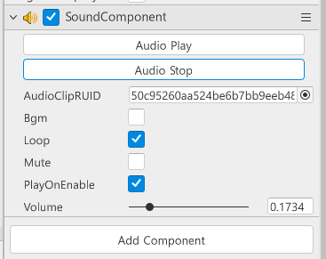
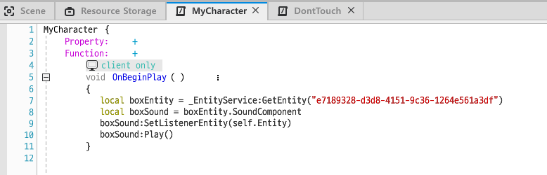

## Sound Component

Object에서 Sound를 플레이 시킬 수도 있다. 

상자 Object에서 쿵쿵거리는 소리가 나오게 해보자! 

### 소리나는 상자

맵에는 소리가 나는 상자가 있다. 

플레이어가 상자에 가까이 갈수록 쿵쿵거리는 소리가 커지게 해보자! 

* 우선 Object에 `SoundComponent`를 추가하고, 원하는 Sound를 설정한다.

  

> AudioClipRUID옆에 동그란 버튼을 클릭하면 Sound Resource들을 볼 수 있다. 
>
> monster, skill등 종류별로 확인할 수 있고, 루디브리엄등 특정 키워드를 검색할수도있다.

 

* Object에 Sound 등록이 완료되었다면, 플레이어에 등록된 컴포넌트안의 코드를 수정한다.

  

  * 유저마다 상자와의 거리가 상이하므로 함수는 `client only`로 설정한다.

  * 상자Object의 아이디를 가지고 Entity를 가져온다.

    > 아이디는 `Scene Maker`에서 해당 Object를 우클릭하고 `Copy Entity ID`를 클릭하면된다.

   

  * 상자의 `SoundComponent`도 가져온 뒤,

  * `SetListenerEntity` 함수를 가지고 상자와의 거리에 따라서 소리가 커지고 작아지게 설정한다.

    >  self.Entity는 플레이어를 의미하며, 상자 소리와 플레이어간의 거리를 고려하겠다는 의미이다.

   

  * `SetListenerEntity` 함수를 부르고 `Play`함수를 가지고 사운드를 다시 플레이한다.

    > 이미 실행되고 있는 Sound는 `SetListenerEntity`함수를 설정해도 적용되지않는다. 
    >
    >  다시 `Play`를 해줘서 `SetListenerEntity`가 반영되게한다.

