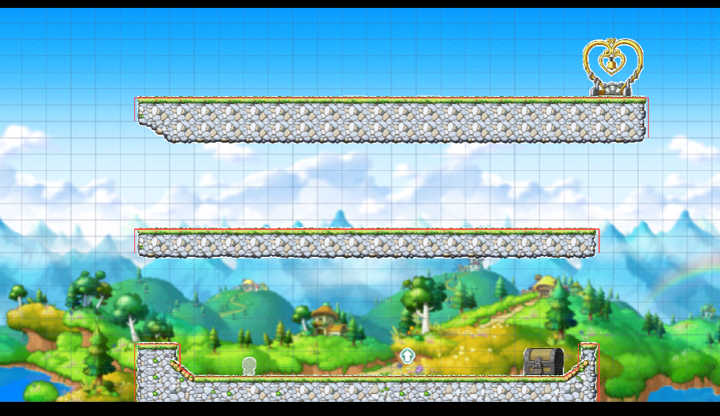
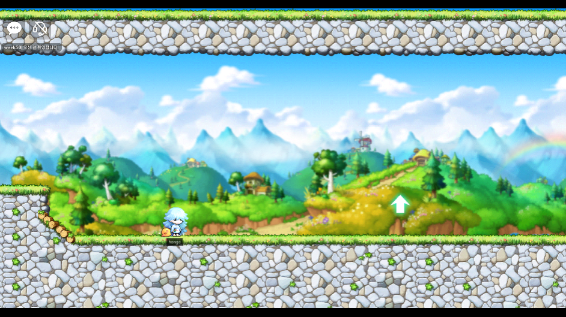
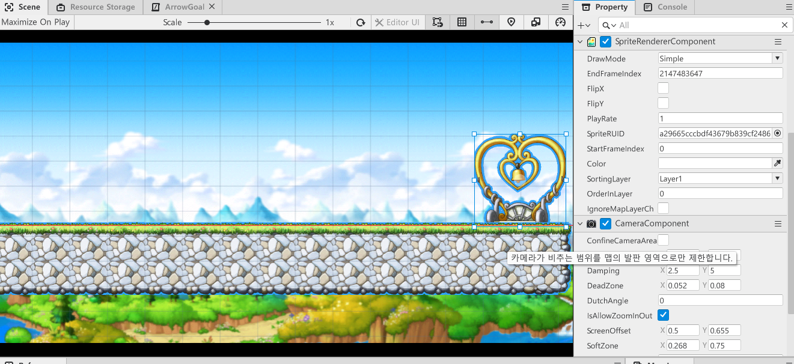
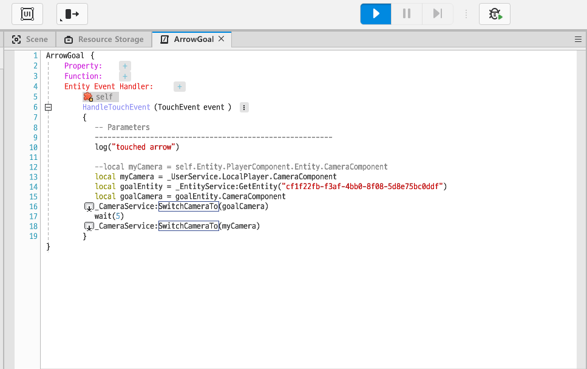
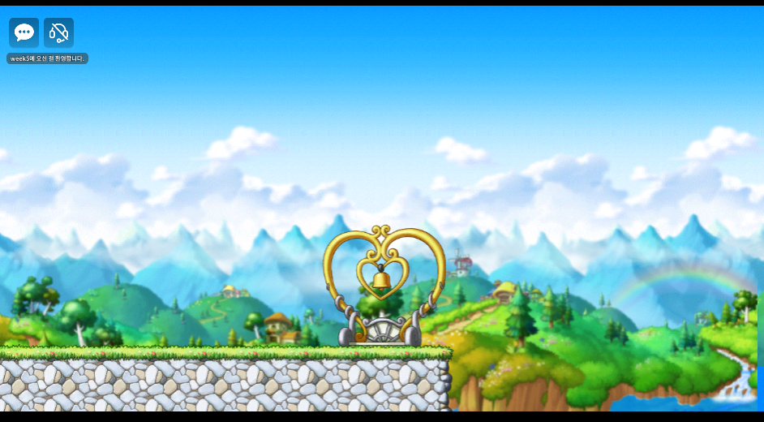

## Camera Component

플레이어가 움직이면 화면이 그에 맞춰 따라간다. 이는 `CameraComponent`가 플레이어에 설정되어있어 계속 플레이어를 카메라로 비추기 때문이다.  

`Camera Component`를 사용해서 화살표를 누르면 플레이어중심인 화면에서 멀리 떨어진 골 지점을 가리키고오게 하자! 

### 골 지점을 보여주기

짜잔~ 위는 현재 맵의 구성도이다!  

우측 상단의 종이 달린 하트모양 오브젝트를 플레이어가 도달할 골지점이라고 하자 

> 좌측 하단의 투명한 캐릭터 모양은 `SpawnLocation` Entity로, 플레이어가 스폰될 위치를 의미한다.
>
> `SpawnLocation` Model은 `MoDelList`란의 왼쪽 아래 별모양 아이콘인  `SpecialModel`을 누르면 볼 수 있다.

 

게임을 실행하면 플레이어에게 카메라 초점이 맞춰지므로 위에 있는 골 지점까지는 보이지않는다. 

골 지점이 어디있는지 미리 보여주기위해, 화살표를 클릭하면 위의 골 지점이 있는 곳까지 올라가 보여주기로 하자! 

크게 다음과 같이 진행된다. 

1. goal Object에 `CameraComponent`등록
2. arrow Object에 `TouchReceivedComponent` 등록
3. arrow Object에 터치 이벤트 핸들러를 정의할 새 컴포넌트 등록

  

#### 📌 goal Object에 `CameraComponent`등록

goal Object에 `CameraComponent`를 등록한다. 

`ConfineCameraArea`속성을 꺼둔다.

* `ConfineCameraArea` 속성을 키면 위 Scene처럼 goal Object가 화면의 중앙에 있지않고 가장자리에 있는 것을 보여준다. 이는 카메라가 비치는 영역이 맵의 발판 영역으로 제한되기 때문이다.  (goal Object는 맵 발판의 끝에 있기때문에 발판이 있는 곳 까지만 보여줘서 가장자리에 보인다.)
* `ConfineCameraArea`이 켜져있어도 카메라 offset이나 `UseCustomBound`를 켜 좌표를 조정하면 goal Object를 화면 정중앙에서 보여줄 수 있으나... 그냥 끄는게 더 쉽고 빠른 방법인 것 같다.

  

#### 📌 arrow Object에 `TouchReceivedComponent` 등록 & 터치 이벤트 핸들러를 정의할 새 컴포넌트 등록

arrow Object에 `TouchReceivedComponent`를 등록했다면, 터치 이벤트 핸들러를 정의할 새 컴포넌트를 생성해야한다. 새 컴포넌트의 내용은 다음과 같다. 

* 우선 플레이어의 카메라 컴포넌트와 골 오브젝트의 카메라 컴포넌트를 가져온다.
  * **유저의 컴포넌트는 `_UserService.LocalPlayer`에서 가져올 수 있다.**
  * 골은 id를 가지고 entity를 불러온다음 entity의 카메라 컴포넌트를 저장한다.
* 함수 `_CameraService:SwtichCameraTo`를 사용해 게임 화면을 보여주는 카메라를 변경할 수 있다.
* arrow Object가 터치되면 goalCamera를 보여주고 5초뒤에 다시 플레이어의 Camera로 돌아가게 해준다.

#### 📌 완성!

게임을 실행하고 화살표를 누르면 카메라가 goal Object를 비춰줬다가 다시 플레이어 카메라로 돌아오는 것을 볼 수 있다. 

*화살표를 눌렀을 때 아래와 같이 골 지점을 보여주고 다시 돌아감*

  

---

이번 포스트에는 유저의 Input data와 상호작용 할 수 있는 컴포넌트들과 Sound Component를 학습했다. 

게임에 여러가지 퍼포먼스, 기능을 추가하기 위해선 컴포넌트를 얼마나 활용할 줄 아느냐가 중점일 것 같다. 재밌는 MOD 게임을 만들기 위해 개발자 문서를 보며 여러 컴포넌트들을 학습하고 적용하는 연습을 많이 해야할 것 같다.
