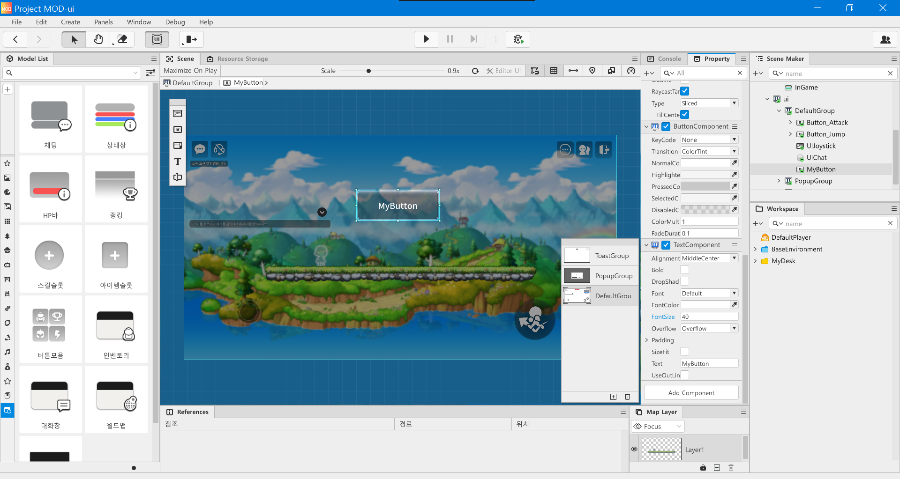
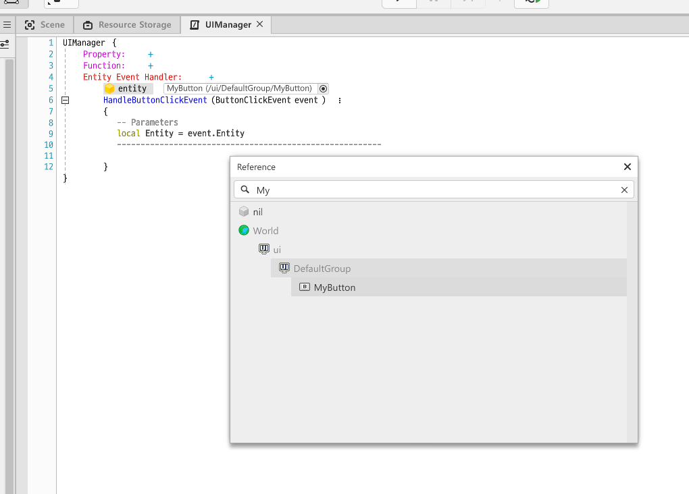
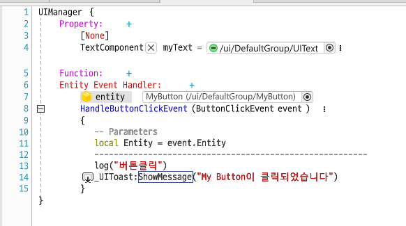
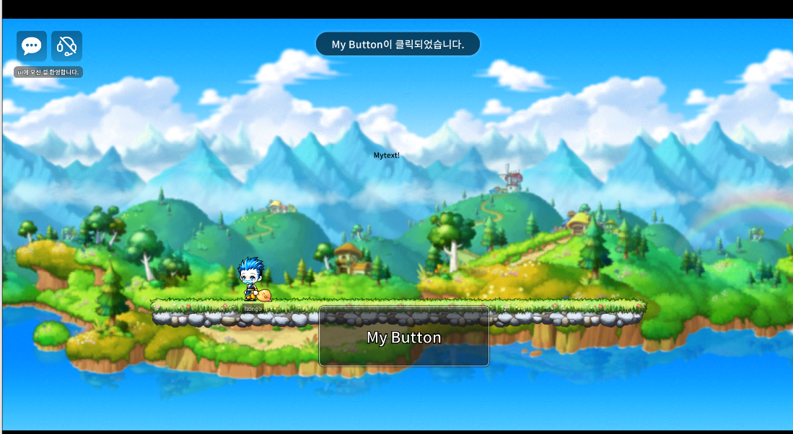
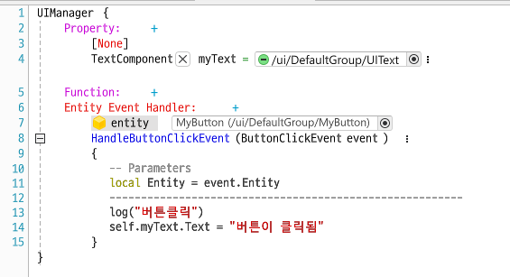
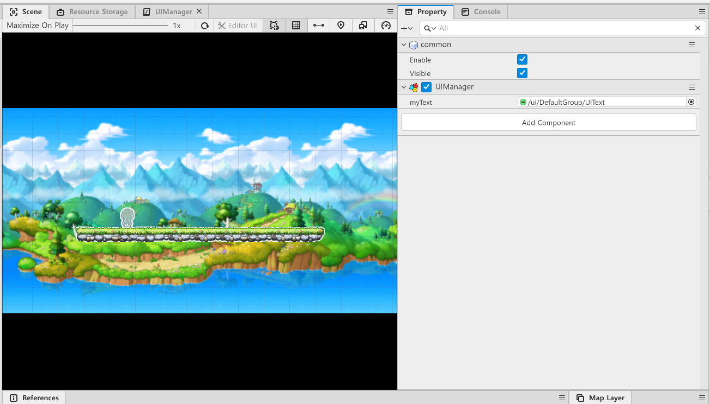
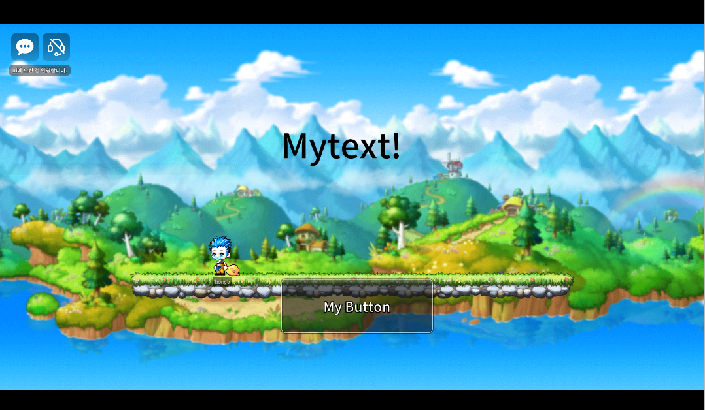
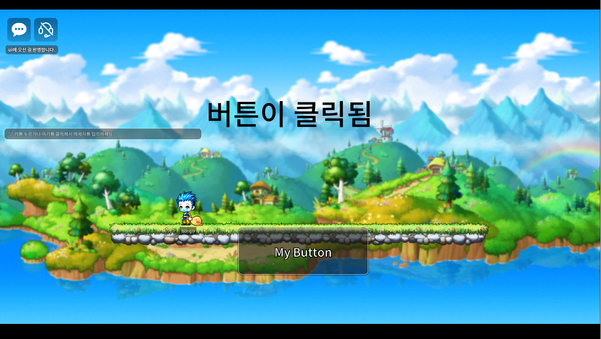

## UI를 야무지게 활용하는 법

UI를 야무지게 활용하는 법... 어렵지 않아요~ 두 가지만 기억하면 된답니다.<br/>

1. 정렬
2. 스트레치

<br/><br/>

### 정렬

말그대로 UI 컴포넌트를 정렬한다!<br/>

**왜 UI 컴포넌트는 정렬이 필요할까?🤔**<br/>

> `UITransformComponent`에서 좌표를 설정할 수 있는 x, y, width등의 속성을 보면 원점을 기준으로 좌표와 크기가 정해지는 것을 알 수 있다. <br/>

<br/>

원점을 기준으로 위치를 정하면 기기마다 해상도가 다르기 때문에 UI 컴포넌트가 스크린밖으로 벗어나는 일이 생길 수도 있다. 때문에 정렬 기능을 사용해서 의도한 위치에 놓일 수 있도록 해야한다.<br/>

`UITransformComponent`를 보면 우측 상단에 UI 컴포넌트를 정렬할 수 있는 아이콘이 있다. 해당 아이콘을 눌러서 원하는 위치에 정렬을 해주면 된다.

### 스트레치

UI 컴포넌트의 크기를 x, y로 지정하면 기기마다 화면의 크기가 다르기 때문에 컴포넌트가 화면을 삐져나가는 등 의도한 UI를 연출하지 못할 수도 있다.

`UITransformComponent`의 우측 상단 아이콘(정렬을 설정했던 아이콘과 동일)을 클릭해 스트레치를 적용하면 Left와 Right로 상대적인 크기를 설정할 수 있다. (정렬을 설정했던 아이콘과 동일)

### UI 컴포넌트 활용

UI의 프로퍼티에 `ButtonComponent` 나 `TextComponent` 등을 추가하면, 해당 UI를 버튼으로 이용하거나 텍스트를 넣을수도 있다. UI도 하나의 Entity이니 여러 컴포넌트를 추가적으로 등록할 수 있다는걸 기억하자!

## Group

`SceneMaker`의 `ui`하위를 보면 ` DefaultGroup`등 Group이 있는 것을 볼 수 있다.<br/>

Group은 MapLayer처럼 **UI 전용 Layer**라고 생각하면 편하다.<br/>

만약 돌발 이벤트 상황에 유저에게 팝업창 UI를 보여줘야한다고 치자. 이벤트 상황이 아니라면 유저에게 팝업창을 띄워줄 필요가 없다. UI를 Group으로 나눈다면 특정 상황에 맞게 보여줄 UI를 편리하게 선택할 수 있다.<br/>

> 프로퍼티란 `UISprite`의 `Enable`속성을 통해 UI 활성화 여부를 결정할 수도 있지만, 그렇게 하면 개발중에 UI를 확인하기 이해 Enable을 다시 활성화 시키고 확인 후에 다시 활성화를 끄는 등 번거로움이 존재한다.<br/>
>
> Group을 설정하면 한 번에 UI들을 프리뷰할 수 있다. - 그룹의 프로퍼티란에서 `UIGroup`의 `Enable`속성을 조정

### Group 활성화

Group을 활성화시키려면 `UISprite`의 `Enable`을 True로 하고 `UIGroupComponent`의 `DefaultShow`도 True로 설정해줘야한다. <br/>

둘 중 하나만 하면 활성화가 되지않으므로 주의하자!

## UI는 클라이언트에서만 적용

`Scene Maker`에서 ui 객체들을 보면 초록색 아이콘이 붙어있는 것을 볼 수 있다.<br/>

이는 클라이언트 전용이라는 의미로, 서버에서는 ui가 존재하지않는다.<br/>

즉, UI는 로컬 엔티티이기 때문에(= 클라이언트단에서만 작용) Sync가 불가능하다.

> Sync : 서버에 있는 값과 클라이언트에 있는 값을 동기화

## UI 실습

UI 실습을 위해 버튼 UI를 하나 만들어준다.<br/>

- 상단의 UI 아이콘을 클릭한 뒤, 스크린의 좌측 상단 아이콘들 중 버튼을 생성하는 아이콘을 눌러 만든다.
- 해당 UI의 이름을 `MyButton`이라고 바꿔준다. 알아보기 쉽게 `TextComponent`를 추가해서 MyButton 이라고 크게 적어줬다.



<br/><br/>

- 언제나 그렇듯이 MyDesk에서 `Create Scripts` -> `Create Component`로 새 컴포넌트를 만든다. 컴포넌트 이름은 `UIManager`이다.

- 그 다음 컴포넌트에 `Button Click Event`를 등록하고 이벤트를 받는 대상을 `self`에서 `entity` 로 바꾼 뒤, `MyButton`을 등록해준다.



## 버튼을 누르면 간단한 메시지 출력

### 버튼 눌림 감지

`1` 우선 버튼 UI 를 생성한다.

> 버튼이 포함된 그룹의 `UISprite` - `Enable`을 True로 하고 `UIGroupComponent`의 `DefaultShow`도 True로 설정해야 게임을 실행했을 때 UI가 보인다.

`2` Create Scripts -> Create Component로 새 컴포넌트를 생성한다. 이름은 UIManager로 짓는다.

`3` UIManager를 다음과 같이 작성한다.



> ButtonClick Event함수를 등록하고, 이벤트 sender를 self에서 entity로 변경하고 Mybutton을 등록해준다.

### 간단한 메시지 출력

```lua
_UIToast:ShowMessage()
```

위 함수를 사용해 간단한 메시지를 출력할 수 있다.<br/><br/>


<br/>

- 위는 `MyButton` 이 눌러질 경우, "My Button이 클릭되었습니다"를 출력하는 코드이다.
- 해당 컴포넌트를 작성후 월드내에 등록해줘야 작동한다. 나는 World -> common에 등록해줬다.

<br/>



게임을 실행하고 My Button을 누르면 위와 같이 상단에 Toast Message가 뜨는 것을 볼 수 있다.

<br/>

> ```lua
> _UIToast:ShowMessage(self.myText.Text)
> ```
>
> 위와 같은 방식으로 프로퍼티로 설정한 `TextComponent`의 Text내용을 가져와 띄워줄 수도 있다.

## 버튼을 누르면 Text UI 내용 변경

### Text UI 생성

텍스트 UI가 포함된 그룹의 `UISprite` - `Enable`을 True로 하고 `UIGroupComponent`의 `DefaultShow`도 True로 설정해야 게임을 실행했을 때 UI가 보인다.

### 컴포넌트에 버튼 클릭 이벤트와 코드 작성

`1` 코드는 위와 유사하게 이벤트를 등록하고 이벤트를 보낼 버튼을 등록한다.



<br/>

`2` myText라는 프로퍼티를 추가한다.

- 자료형은 Component이며, Component설정을 해주고 TextComponent를 찾는다.
- UIText를 등록해준다.

<br/>

`3` 컴포넌트를 월드에 적용한다. 나는 World -> common에 등록했으므로 common의 프로퍼티에서 UIManager의 myText값을 UIText로 지정해준다. (컴포넌트에서 등록을 했어도 프로퍼티에서 재등록을 해줘야한다.)



<br/>

`4` 게임을 실행하고, 버튼을 클릭하면 Text내용이 바뀌는 것을 볼 수 있다.

<br/>

_버튼 클릭 전_



<br/>

<br/>

_버튼 클릭 후_



## 회고

이번 포스트에서는 UI 활용을 위한 이론 위주로 정리해봤다.

한 가지 궁금한 점이 생겼는데 왜 `UITransformComponent`의 디폴트 속성이 스트레치를 적용한 `Left`, `Right`가 아니라 X, Y이냐이다. 나중에 팀원들이랑 얘기하면서 다시 생각해봐야겠다 ㅎㅎ.<br/>

다음 포스트에서는 실습을 중심으로 UI를 정리해 볼 예정이다. <br/>
