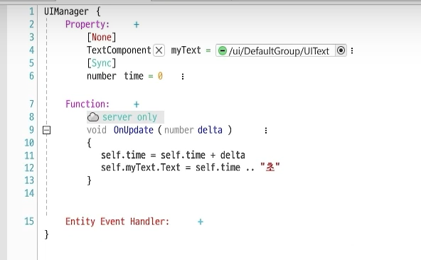
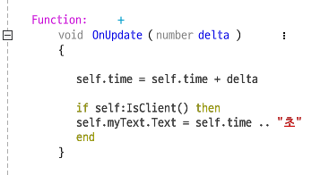
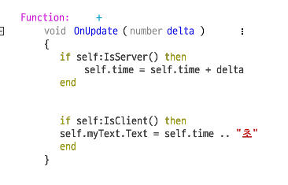
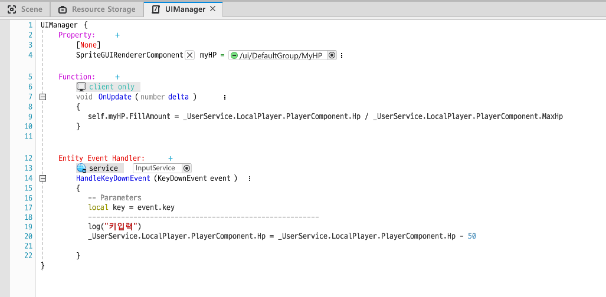
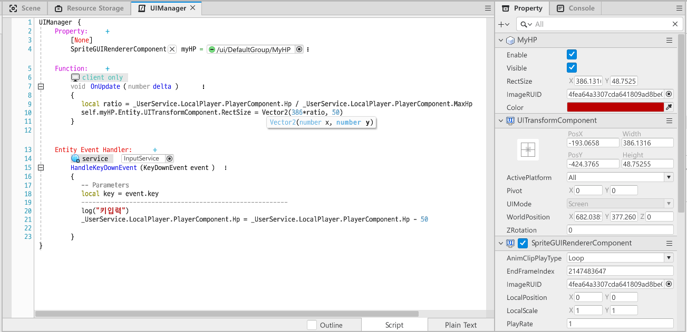

## 서버 시간을 Text UI에 출력

### 첫 번째 시도

- time 프로퍼티를 추가한다. (Sync로 설정해 서버의 값과 클라이언트의 값이 동기화되게한다.)
- onUpdate 함수를 사용해 업데이트 될 때마다 time값을 변경하고 Text에 time이 표시되게한다.

### 결과는?

위 코드를 실행시키면 에러가 난다. 

에러가 나는 이유는 함수가 `server only`이기 때문이다. 

UI는 클라이언트에서만 작동하기때문에 `myText`를 가져올 수 없다. 

즉, 서버에서는 UI 객체를 불러올 수 없기때문에 에러가 난다.

### 두 번째 시도

그럼 server only에서 client only로 바꿔보자!

### 결과는?

시간이 잘 출력되는 것 처럼 보이나 클라이언트의 time을 출력하는 것이므로, 서버의 시간이 아닌 클라이언트의 시간을 출력한다.  

두 명의 클라이언트가 있다면 두 유저에게 다른 시간값이 보여지게 된다.

### 세 번째 시도

함수를 client only에서 none으로 바꿔보자.

### 결과는? 🎉

드디어 성공이다!  

위처럼 코드를 작성하면,

- time이 갱신되는 코드는 해당 컴포넌트가 World -> common에서 실행되므로 서버의 시간으로 갱신된다.
- text에 time이 출력되게 하는 코드는 self:IsClient()를 사용해 분기문으로 처리했으므로 클라이언트에 있는 myText UI를 오류없이 가져올 수 있다.

   

time이 갱신되는 코드를 IsServer()로 분기처리해도 역시 잘된다.

### 그런데 말입니다

현재 UIManager 컴포넌트가 World -> common에 등록되어있는데 이를 삭제하고 UI그룹인 DefaultGroup에 컴포넌트를 등록하면 어떻게 될까?

   

UI인 DefaltGroup은 클라이언트에서만 적용되기 때문에 time의 Sync가 잘 되지않는다. 

마찬 가지로 IsServer() 분기문 안의 코드 또한 실행되지않는다.

  

## UI에 서버의 기능을 적용해야 할 때

서버의 기능이 필요하다면

- maps나 common 등 서버에 존재하는 Entity에서 컴포넌트를 적용해 실행시켜 Sync로 UI 변수를 동기화 받아오거나
- 실행제어(`IsServer()`, `IsClient()`)를 사용해 서버에서 클라이언트로 전송되게 해야한다.

## HP바를 조정하기

`1` HP바 UI Entity 생성

`2` 키를 누르면 HP바가 줄어들게하는 컴포넌트 작성

### HP바 UI Entity

* 이미지 UI를 추가한다.

* `SpriteGUIRenderComponent`의 `type` "Filled"로 바꾼다.

  > Filled로 바꾸면 새로운 변수가 생기는데
  >
  > `FillAmount` 는 전체가 1일때 얼만큼이 채워져있는지를 나타낸다.
  >
  > 만약 `FillAmount`값이 0.5라면 HP바는 반만큼만 채워진다.

* HP바의 뒷 배경을 위해 HP바를 복제하고 색을 검정색으로 바꿔 HP바와 같은 위치에 배치시킨다.

###  HP바가 줄어드는 Key Down Event

* 새 컴포넌트를 생성하고 프로퍼티에 myHP 를 추가한다.
* 업데이트 함수가 실행될 때마다 myHP의 FillAmount를 가져온다.
* 키가 다운되면 유저의 HP가 50씩 줄어든다.

> 컴포넌트를 UI Entity에 적용하면 작동이 되지않는다.

## Type이 Filled가 아닌 HP바

UI Entity에 따라 Filled를 하면 깨지는 UI가 존재한다.  

만약 타입이 "Sliced"라면, UI가 깨지진 않을 수도 있지만 FillAmount 속성이 존재하지않는다. 

그럼 어떻게 HP바를 구현할 수 있을까? 

### Pivot

Pivot은 x나 width등을 정할 때 원점을 의미한다. 

Pivot을 0, 0으로 설정하고 Width를 줄이면, HP바처럼 오른쪽에서부터 줄어드는 것 처럼 보이게 할 수 있다.  

