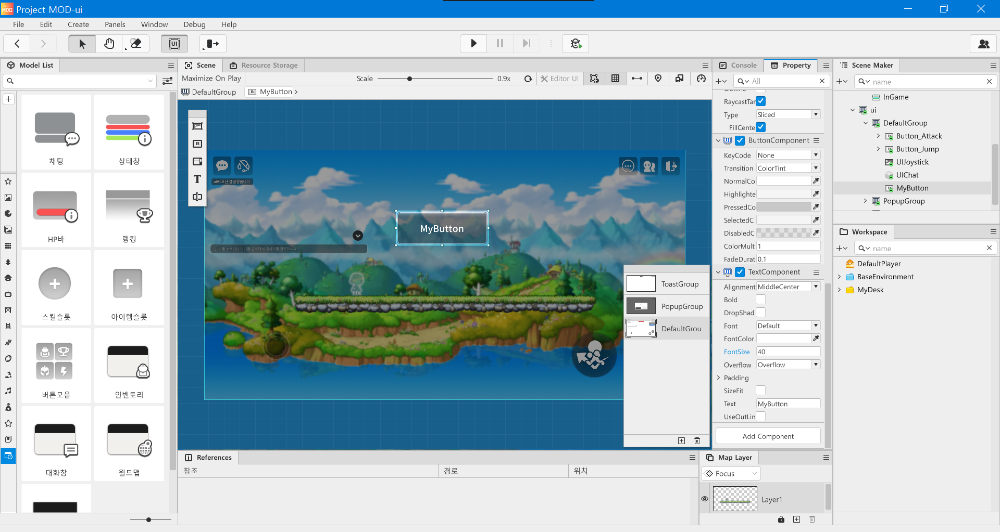
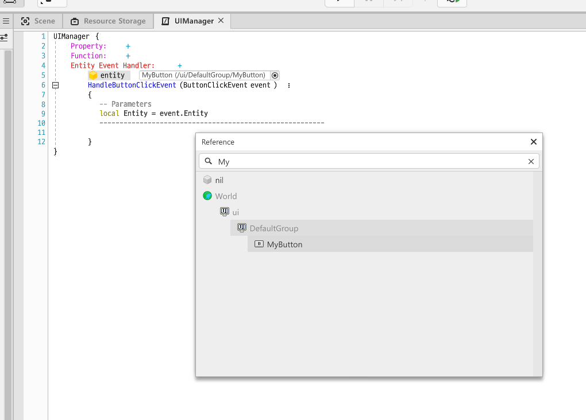

작성중

## UI 실습

UI 실습을 위해 버튼 UI를 하나 만들어준다. 

- 상단의 UI 아이콘을 클릭한 뒤, 스크린의 좌측 상단 아이콘들 중 버튼을 생성하는 아이콘을 눌러 만든다.
- 해당 UI의 이름을 `MyButton`이라고 바꿔준다. 알아보기 쉽게 `TextComponent`를 추가해서 MyButton 이라고 크게 적어줬다.

  

- 언제나 그렇듯이 MyDesk에서 `Create Scripts` -> `Create Component`로 새 컴포넌트를 만든다. 컴포넌트 이름은 `UIManager`이다.

- 그 다음 컴포넌트에 `Button Click Event`를 등록하고 이벤트를 받는 대상을 `self`에서 `entity` 로 바꾼 뒤, `MyButton`을 등록해준다.

