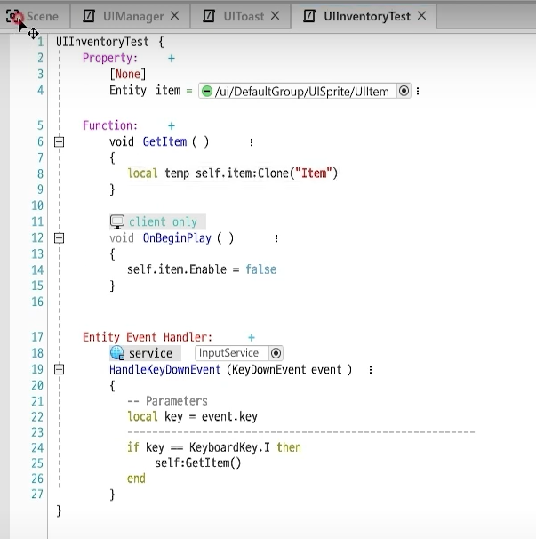
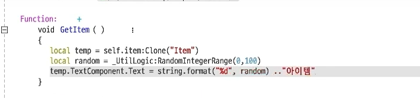
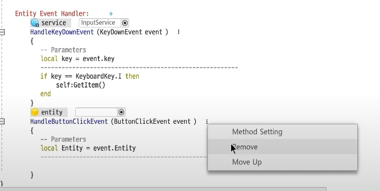
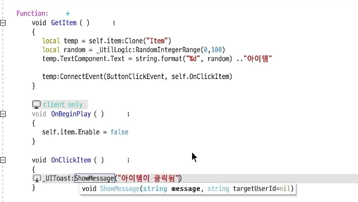

## 인벤토리 구현

UI중 `스크롤뷰 Entity` 를 사용하면 편리하게 구현할 수 있다.

> 스크롤뷰는 큰 박스 안에 여러 개의 컨테이너들을 추가할 수 있고, 컨테이너가 그리드 처럼 일정한 간격으로 추가되게 할 수 있다.

* 인벤토리 구현을 위해 스크롤뷰의 `ScrollLayoutGroupComponent`에서 type을 그리드로 바꿔준다.

## 키를 누르면 인벤토리에 아이템 추가하는 기능

* Component `UIInventoryTest`를 생성한다.

> `UIItem`은 미리 생성한 인벤토리안의 아이템란을 의미한다. (컨테이너) 
>
> 키를 누르면 아이템을 증가시켜야하므로, `UIItem`을 프로퍼티에 추가한다. 
>
> 초기에 아이템은 제로이므로 `OnBeginPlay()`함수에서 아이템의 Enable을 꺼준다. 
>
> * client only로 설정한다.
>
> `GetItem()`으로 아이템을 클론해서 생성한다. (Clone을 하면 자동으로 Enable을 켜지는 듯 하다...) 
>
> 이벤트 핸들러를 통해 키가 눌러지면 GetItem을 한다. 

 

이런 식으로 아이템에 텍스트를 랜덤으로 적어 생성할 수도 있다.

## 동적으로 생성된 엔티티에 이벤트 핸들러를 추가하는 법

우리는 지금까지 위 방식을 통해 이벤트 핸들러를 추가해왔다.  

그러나 아이템처럼 동적으로 생성하는 Entity는 위 방식으로 하면 핸들러 적용이 되지않는다.

### ConnectEvent()

위처럼 ConnectEvent함수를 사용해, 어떤 이벤트 핸들러를 적용할지, 이벤트 발생시 동작하는 함수가 무엇인지 인자로 넣어주면 동적으로 생성되는 엔티티에 핸들러 적용이 가능하다.

