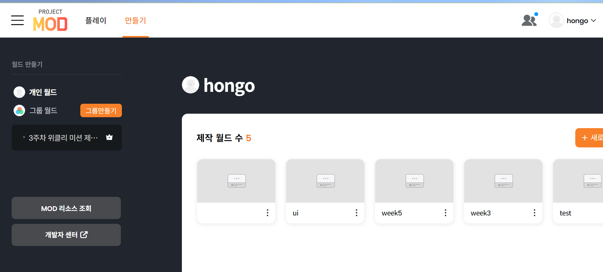

## 그룹원과 공동 월드 제작하기

지금까진 나 혼자서 개발을 한 것만 포스팅했는데 사실 MOD는 공동 개발도 가능하다! 

Github에서 Organization의 일원이 되어서 repositoriy를 만들고 코드를 주고 받으면서 개발을 했던 것처럼, MOD에서는 ‘그룹'의 일원이 되어서 ‘그룹 월드'를 만들어 실시간으로 팀원들과 함께 개발할 수 있다. 

 

지금까지 개인 월드는 `MOD MAKER`에서 생성했는데 그룹 월드는 `MOD MAKER`에서 생성할 수 없고 MOD 웹사이트에서 생성할 수 있다. (아마 나중엔 `MOD MAKER`에서도 그룹 월드를 생성할 수 있는 기능이 생기지않을까싶다.)  

[MOD웹](https://mod.nexon.com/)에서 로그인후 프로필란에 들어간 후, `만들기`버튼을 누른다.

좌측의 `그룹만들기`버튼을 누르면 그룹을 생성할 수 있다. 

그룹을 만들고 멤버추가란에서 멤버의 닉네임이나 코드를 입력해 그룹 월드에 초대할 수 있다. 

 

이후 `MOD MAKER`의 그룹란에서 생성한 그룹 월드를 확인할 수 있다. 

 

그룹 월드는 위와 같이 다른 사람이 작업하고 있는 컴포넌트옆에 사람모양+자물쇠 아이콘이 생긴다. 공유 자원에 대한 접근을 제한하기 위해 누군가가 작업중인 스크립트, 컴포넌트 등은 잠금이 되는 것을 볼 수 있다.

## 주의할 점

룹을 생성한 그룹원이 `MOD MAKER`를 통해 그룹 월드로 들어가 저장을 해줘야 다른 팀원들도 그룹 월드에 들어올 수 있었다. 

그룹을 생성한 사람은 꼭 그룹을 저장해주자!
