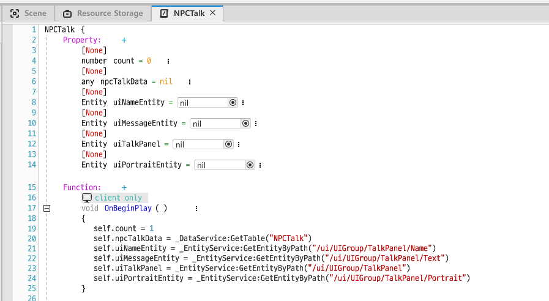
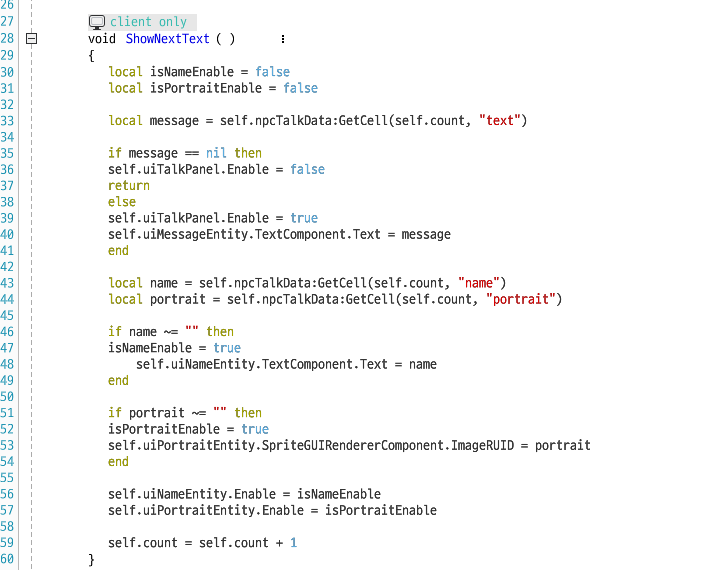
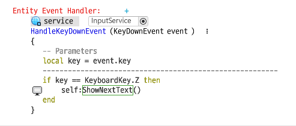

## 대화창 UI 만들기

크게 세 개의 UI를 만든다.

* TalkPanel : 대화창 Text가 쓰여질 공간
* Name : 말하는 인물의 이름
* Portrait : 말하는 인물의 사진

## Dataset

Dataset은 릴레이션 형태의 데이터 집합이다. 

name, text, portrait 세 개의 컬럼을 만들어 대화 순서에 따라 내용을 채운다.

> portrait에는 이미지 Entity의 ruid를 입력한다.

## 코드

> 프로퍼티를 생성하고 값을 초기화

 

> 다음 대화의 값들을 할당

 

> Z키가 눌러질 때마다 대화창 넘김

참고한 포스트 : [NPC 대화창 만들기](https://mod-developers.nexon.com/ko/docs/?postId=74)

## 회고

4주차 위클리 미션을 위해 NPC 대화창을 구현했다. Dataset은 오늘 처음 써봤는데 저렇게 한 번에 Data를 넣을 수 있다는걸 지금 알았다.  

Dataset에 `_UserService.LocalPlayer ~...`과 같이 함수의 반환 결과를 넣고싶었는데 넣는 방법을 아직 찾지 못했다. 다음에 방법을 찾아볼 예정이다.

