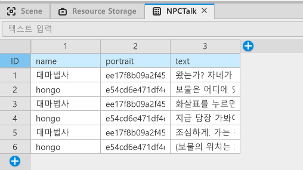

어제 간략하게 NPC 대화창 구현에 대해 알아봤는데 오늘은 NPC 대화창을 구현하면서 생긴 에로사항에 대해 자세히 써보려고한다.

## Dataset

NPC의 대화를 Dataset을 사용해 구현했었다.

* 위 처럼 name, portrait, text란에 대화할 사람의 이름과, 이미지, 텍스트를 넣었다. 

## 원래 계획

NPC와 플레이어가 대화하는 것을 구현하고 싶었기에 NPC, 플레이어의 이름, 이미지, 텍스트를 Dataset에 넣을 생각이었다. 

NPC의 경우 이름은 내가 임의로 넣고, 이미지는 해당 엔티티의 ruid를 넣으면 됐지만, 

플레이어의 이름과 이미지를 불러와 넣는 것은 실패했다... 

 

Dataset의 cell안에 AvatarRendererComponent의 GetBodyEntity() 메소드를 사용하면 아바타가 불러와질까? 했는데 함수로 인식되지않고 글자 그대로 받아들여 인식이 되지않았다. 플레이어의 이름도 마찬가지였다. 

 

그래서 차선책으로 이미 NPC Object로 존재하는 엔젤릭버스터의 ruid를 사용해 대화창 위 이미지를 넣고, 플레이어의 아바타를 엔젤릭 버스터의 코스튬과 최대한 흡사하게 고정시켰다. 

 

나중에 해커톤 개발이 본격적으로 시작되면 플레이어의 대화 기능이 필요할텐데 그 전까지 공식문서를 뒤지면서 방법을 찾아봐야겠다 ㅎㅎ...

