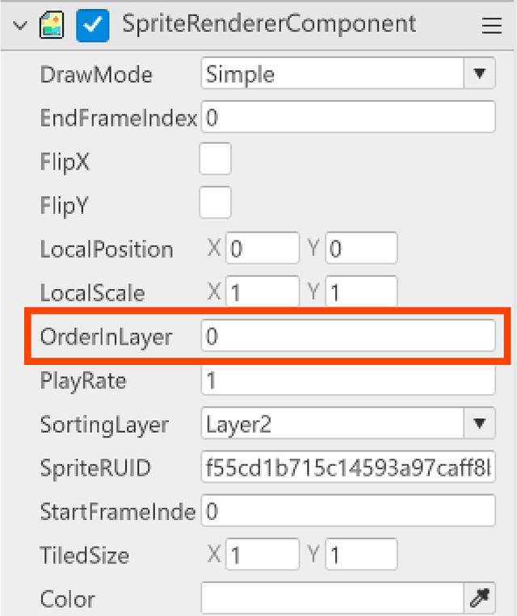
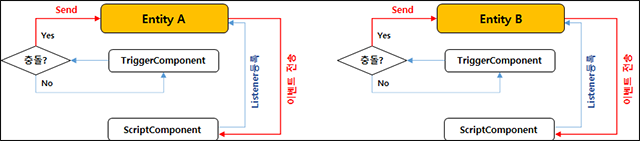
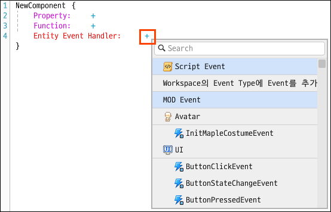
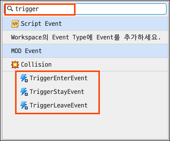
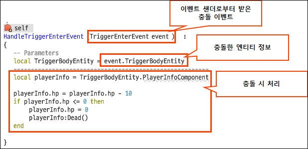

 

멋쟁이 사자처럼 X 넥슨 MOD의 2주차 교육 내용을 정리하는 포스트입니다.

 

## 자주 쓰이는 Component

### TransformComponent

> entity들이 어디에 위치하는가
>
> entity의 위치, 크기, 회전등을 결정할 수 있다

### SpriteRendererComponent

> Sprite : 2D 이미지를 뜻함
>
> entity가 어떻게 그려질지를 정함
>
> entity의 색상, 레이어, 프레임등을 결정할 수 있다

* 스프라이트마다 고유한 RUID 값을 가지고 있다
* RUID 값을 이용해 빈 모델에 스프라이트를 넣거나 변경할 수 있다

### TweenComponet

> entity의 움직임을 결정한다
>
> * TweenLineComponent : 원점에서 목적지까지 선형운동
> * TweenFloatingComponent : 원점을 기준으로 부유운동
> * TweenCircularComponent : 원점을 중심으로 원운동

## 맵 레이어

* 하나의 맵에 최대 10개의 레이어 사용 가능
* 레이어 창 가장 아래에 깔린 레이어가 맵 화면에서 가장 뒤에 위치하게 되고, 맨 위에 있는 레이어가 가장 앞에 배치된다
* 레이어에 배치된 엔티티들은 레이어 순서에 일괄적으로 영향을 받습니다. 가장 아래 있던 레이어를 위로 올리는 순간, 엔티티의 순서가 함께 변경된다

### 레이어 우선순위 

1. Map Layer (SpriteRendererComponent의 SortingLayer)
2. SpriteRenderer Component의 OrderInLayer 프로퍼티
3. Transform Component의 Position Z값

### 모델의 레이어 순서

> 모델은 배치 편의를 위해 유형별로 OrderInLayer 기본값이 존재한다

| OrderInLayer 값 | 모델 유형                                           |
| --------------- | --------------------------------------------------- |
| 0               | 오브젝트                                            |
| 1               | 타일                                                |
| 2               | 몬스터, NPC, 발판, 사다리, 로프, 포탈, 트랩, 아이템 |
| 3               | 타 이용자의 아바타                                  |
| 4               | 나의 아바타                                         |

## 발판 만들기

#### 발판

* 캐릭터가 오를 수 있는, 밟을 수 있는 타일을 표시

* 세팅 -> 만들기 -> 발판

* Foothold가 있는 모델들은 `우클릭` -> `edit foothold` 를 사용해 풋홀드 위치를 변경할 수 있음
* `CustomFootholdComponent`를 사용해 Foothold가 없는 모델에도 발판을 생성할 수 있다

* 마찰력 속도등 풋홀드 속성이 존재한다

## 충돌 감지

* HitComponent : 피격의 범위를 설정
* TriggerComponent : 충돌이 일어나는 범위를 설정

### 충돌 이벤트 생성 방법

* TriggerComponent를 사용해 충돌의 범위를 설정한다
* 핸들러를 만들어서 충돌시 액션을 정의한다
* 액션을 수행할 핸들러를 Entity에 등록한다

> 위 절차를 통해 TriggerComponent를 통해 이벤트가 발생하면 핸들러로 등록한 함수가 호출되 충돌시 액션을 수행한다!

### 핸들러 생성

* 핸들러는 리액터가 되는 스크립트 컴포넌트의 Entity Event Handler를 통해 추가할 수 있다

* 액션을 수행할 스크립트 컴포넌트를 열고, Entity Event Handler의 우측 버튼을 눌러 핸들러 추가 메뉴를 오픈한다

​	 

 

* 충돌 이벤트에 대한 핸들러를 생성하기위해 Trigger관련 Event를 추가한다
* 검색창을 이용해 편리하게 이벤트를 찾을 수 있다

 

| Event             | 발생 시점               |
| ----------------- | ----------------------- |
| TriggerEnterEvent | 충돌이 처음 발생했을 때 |
| TriggerStayEvent  | 충돌이 일어나는 중일 때 |
| TriggerLeaveEvent | 충돌이 끝났을 때        |

*다음은 충돌시 hp가 하락하는 이벤트이다*

상단의 `self`는 sender를 등록할 entity를 설정할 수 있다

리액터 컴포넌트가 추가된 entity의 충돌 이벤트를 받는다면 self를,

다른 외부 entity의 충돌 이벤트를 받는다면 `self`를 눌러`Entity`를 선택한 후 해당 entity로 바꿔주면된다
