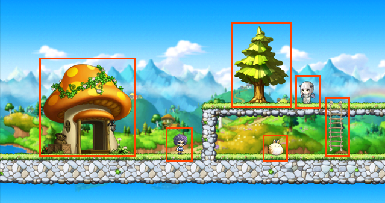
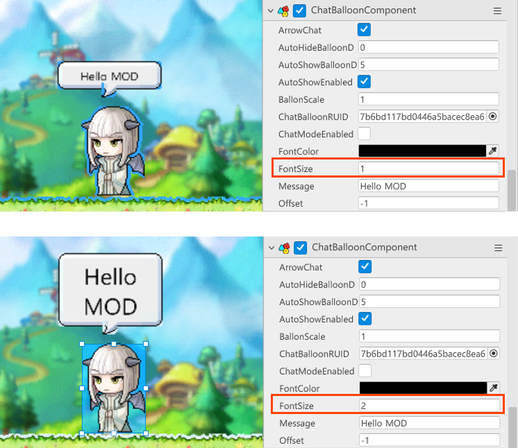
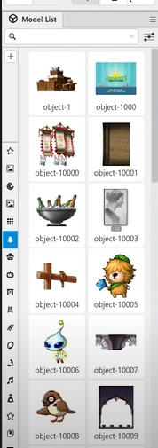

 

멋쟁이 사자처럼 X 넥슨 MOD의 1주차 교육 내용을 정리하는 포스트입니다.

 

## Entity

>  맵을 구성하고있는 요소들
>
> ex) npc, monster, tree object 등

 

*아래 빨간 네모 박스안에 있는 것들이 전부 Entity*

* entity는 여러 개의 component로 구성되어있다

- Scene Maker에서 관리 가능

## Component

**기능의 단위들**

* Entity는 Component들로 구성되어 있다 
* Component들의 집합체를 Entity라고 볼 수 있다
* Component는 각각의 요소를 담당하고 있으며 각각의 기능을 담당한다

ex)

>* TransformComponent : entity의 위치, 회전 각도등을 결정함
>* SpriteRendererComponent : entity를 어떻게 보여줄 것인지를 결정함
>  * entity의 색상
>  * entity가 속한 Layer
>  * 움직이는 애니메이션 객체일 경우 Frame 수, 재생 속도등을 결정

## Property

> 컴포넌트 내에 있는 세부적인 정보, 고유 특성을 정의한다

*아래는 ChatBalloonComponent의 Property들이다*

* 말풍선의 기능을 가진 `ChatBalloonComponent`의 Property `FontSize`를 조정해 말풍선안의 폰트 크기를 높인다

## Model

    

entity를 생성할 수 있는 원본

MOD 메이커를 실행한 뒤 좌측 Model List 패널에서 확인할 수 있다.

Model List에 있는 model object 가져와 entity로 만들어 맵을 꾸밀 수 있다

## Work Space

파일탐색기와 비슷한 기능

모델, 스크립트 파일, 컴포넌트등을 관리

Scene에서 사용된 컴포넌트들의 원본이 저장됨

## Scene Maker

- 씬 메이커는 계층구조로 되어있다

- 부모 오브젝트를 움직이면 자식 오브젝트도 같이 움직인다

- 씬 메이커에서 자식은 부모의 특성을 물려받는다

- 자식의 특성보다 부모의 특성이 우선시 된다

  - ex) 자식은 visible이지만 부모가 invisible이라면 자식또한 invisible한 상태가 된다

- 현재 Scene에서 사용한 모든 오브젝트들을 볼 수 있음

  `Make Original Model` 기능을 통해 원본 오브젝트에서 크기등이 변경된 오브젝트를 변경된 형태로 Workspace에 저장할 수 있음

  -> 만들어진 엔티티를 모델로 생성

Modserivice : 재가공 불가능 Core한 서비스

Modlogic : 재가공 가능. 유저가 생성 가능

## 기본 조작

- 프로젝트 출시

  `File` -> `Publish`

- 프로젝트 버전 기록 및 관리

 `File` -> `Revisions`

- 패널 세팅 초기화

 `Panel` -> `Reset Panels`

- Map 리스트 보기 및 관리

  `Window` -> `Map list`

- 메이플스토리 맵 불러오기

  `Window` -> `MapleStory Map`

- 스크립트 샘플 다운로드

  `Window` -> `Script Manager`

수직으로 생성된 타일은 캐릭터가 올라갈 수 없다

하나의 레이어에서는 하나의 타일만 사용가능하다

여러 개의 타일을 사용하고싶다면 Map Layer를 추가해야함

Map Layer란의 상위 레이어가 Scene의 가장 앞에 배치된다

배치 순서는 Property -> SpriteRendererComponent -> OrderLayer에서 설정가능

- 사용자 정의 오브젝트 그룹 생성

 `Object` -> `새 그룹 추가`

