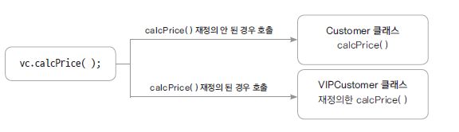

## 클래스 상속

```java
class Child extends Parent{
    ...
}
```

- extends 키워드 뒤에는 하나의 클래스만이 따른다.
- 자바는 단일 상속만을 지원한다.

## 메서드 제정의(오버라이딩)

> 주의점 : 기존 메서드와 반환값, 메서드 이름, 매개변수의 타입과 개수가 똑같아야 함.

**@Override 를 사용해 메서드 오버라이딩을 할 수 있다.**

```java
// Parent
public void talk(String name){
    System.out.print("안녕 나는" +name+ "이야\n");
}
```

<br/>

```java
// Child

@Override
public void talk(String name){
    System.out.print("안녕 나는" +name+ "이야\n");
    System.out.print("응애 아기임\n")
}
```

## 가상 메서드

```java
Parent child = new Child();
```

- 형변화(업캐스팅)가 되었을 때 변수의 타입이 Parent라도 메서드는 인스턴스(Child)의 메서드가 불린다.
- 자바의 모든 메서드는 가상 메서드이다.

### 📌 메서드는 어떻게 호출되고 실행될까?

- 메서드(함수)의 이름은 주소값을 나타냄
- 인스턴스의 변수들은 힙 메모리에 인스턴스마다 별도로 할당되지만,
- 메서드는 코드 영역에 할당되고, 모든 인스턴스가 같은 영역(주소값)을 참조한다.
- 따라서 다른 인스턴스라도 메서드 이름이 가리키는 주소값은 같으므로, 동일한 메서드가 호출된다.

<br/>


<br/><br/>

<br/>

### 📌 가상 메서드 테이블

- 인스턴스마다 가상 메서드 테이블이 존재한다.
- 메서드 이름은 가상 메서드 테이블을 가리키는 주소값을 가진다.

- 오버라이딩된 메서드의 경우 기존 메서드와 다른 주소값을 할당받는다. 즉, 가상 메서드 테이블에서 가리키는 메서드 주소가 다른다.


<br/>

> 인스턴스는 재정의(오버라이딩) 된 메서드의 경우, 가상 메서드 테이블에서 부모의 메서드가 아닌 새로 정의된 메서드를 가리킨다. <br/>
>
> 그렇기에 변수 타입이 부모라도, 인스턴스가 자식이라면 해당 객체는 오버라이딩된 함수를 실행한다.



## 다운캐스트

업캐스트는 부모타입의 변수에 자식 인스턴스를 할당하는 경우이다.

```java
Parent child = new Child();
```

> 역으로 Child parent = new Parent(); 는 성립되지않는다.

<br/> <br/>

- 다운캐스트는 업캐스팅된 클래스를 다시 원래 타입으로 되돌릴 때 사용한다.

- 하위 클래스로의 형 변환은 명시적으로 해야 한다.

  ```java
  Parent child = new Child();            //묵시적
  Child newChild = (Child)child;      //명시적
  ```

### 📌 instanceof

- 형변환이 이루어질 때 변화되는 형이 원래 인스턴스의 형이 맞는지를 검사한다.
- 맞으면 true 아니면 false를 반환 한다.

```java
// ex
// Anilmal이라는 클래스와 이를 상속받은 Tiger과 Parrot이 있다고 할 때

Animal tiger = new Tiger();
Parrot parrot = (Parrot)tiger; // error

```

만약 위와 같은 경우, Parrot은 Tiger의 인스턴스 형이 아니므로 컴파일에 실패한다. <br/>

<br/>

```java
if (tiger instanceof Parrot) {
    Parrot parrot = (Parrot)tiger;
}
//success
```

> tiger의 인스턴스가 Parrot이 아니므로 if문안의 코드는 실행되지 않는다.

<br/>

```java
if (tiger instanceof Tiger) {
    Tiger newTiger = (Tiger)tiger;
}
//success
```

> tiger의 인스턴스가 Tiger이므로 if문안의 코드가 실행된다.
