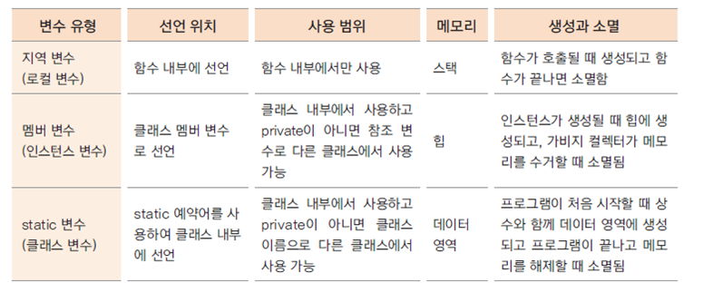

## static 변수

```java
static int serialNum;
```

- 인스턴스들 사이에서 공통으로 특정 변수가 필요한 경우에 사용된다.

  - ex) 학생마다 새로운 학번 생성

  

  

<br/>

- 인스턴스가 생성될 때 만들어지는 변수가 아닌, 처음 프로그램이 메모리에 로딩될 때 메모리를 할당한다.
- 즉, 클래스 변수이다. == 인스턴스 생성과는 상관없이 사용할 수 있다.
- 클래스 이름으로 직접 참조가 가능하다. (Student.serialNum = 100);

## static 메서드

- static메서드(클래스 메서드)에서는 인스턴스 변수를 사용할 수 없다.
  - static 메서드는 인스턴스 생성 여부와 무관하게 클래스 이름으로 바로 호출이 가능하다.
  - 인스턴스 생성전에 호출 될 수 있으므로 static 메서드 내부에서는 인스턴스 변수를 사용할 수 없다.
  - static은 data영역에 먼저 생성되고 인스턴스 변수는 인스턴스가 생성된 후 heap영역에 생긴다.



- static 변수는 프로그램이 메모리에 있는 동안 계속 그 영역을 차지하므로 너무 큰 메모리를 할당하는 것은 좋지 않음
- 클래스 내부의 여러 메서드에서 사용하는 변수는 멤버 변수로 선언하는 것이 좋음
- 멤버 변수가 너무 많으면 인스턴스 생성 시 쓸데없는 메모리가 할당됨
- 결국은 상황에 적절하게 변수를 사용해야 함...

## 싱글톤 패턴

> 학교안에 정수기가 단 하나 존재하고, 학교안의 여러 학생들이 공통으로 하나뿐인 정수기를 사용하는 것과 같다...고 정처기 교재가 말했다. 땡큐 시나공.

<br/>

- 프로그램에서 인스턴스가 단 한 개만 생성되어야 하는 경우 사용하는 디자인 패턴이다. (위 예시의 경우 학교가 인스턴스에 해당한다. 교실은 단 하나만 필요하다.)
- static 변수, 메서드를 활용하여 구현 할 수 있다.
- 코드 재사용성, 확정성면에서 좋다.

<br/><br/>

다음은 static을 활용해 구현한 싱글톤 패턴이다.


외부에서 School 인스턴스를 사용하려면 인스턴스를 생성하지않고 아래와 같이 getInstance()를 사용해 인스턴스를 불러오면 된다.

```java
School school = School.getInstance();
```

### 예제

```java
// Car.java
public class Car {
	private static int serialNum = 10000;
	private int carNum;


	public Car() {
		carNum = ++serialNum;
	}

	public int getCarNum() {
		return carNum;
	}
}
```

```java
// CarFactory.java
public class CarFactory {
	private static CarFactory instance = new CarFactory();
	private CarFactory() {}

	public static CarFactory getInstance() {
		return instance;
	}

	public Car createCar() {
		Car instance = new Car();
		return instance;
	}

}
```

```java
// CarFactoryTest.java
public class CarFactoryTest {

	public static void main(String[] args) {
		// TODO Auto-generated method stub
		CarFactory factory = CarFactory.getInstance();
		Car mySonata = factory.createCar();
		Car yourSonata = factory.createCar();

		System.out.println(mySonata.getCarNum());     //10001 출력
		System.out.println(yourSonata.getCarNum());   //10002 출력

	}

}
```

<br/>

외부 클래스인 CarFactoryTest는 CarFactory의 getInstance(), createCar(), Car의 getCarNum()에만 접근이 가능하다. 외부에서는 사용하는 클래스의 내부 전체를 파악할 필요가 없고 필요한 메서드의 사용방법만 알고있으면 된다.

- pubilc과 private를 사용해 외부에서 접근 가능한 메서드를 지정한다.
- 인스턴스를 직접 생성하지않고 해당 클래스 내부에서 선언한 public함수를 사용해 생성한다. (getInstance, createCar)
- 멤버 변수에 직접 접근하지않고 해당 클래스 내부에서 선언한 public함수를 사용해 접근한다. (getCarNum)

## 회고

static은 상수, 변하지 않는 수를 선언할 때 사용된다고 단순히 알고있었는데 오늘 학습으로 static변수와 인스턴스 변수가 생성되는 시점과 공간이 다르며, 이로 인해 static변수는 모든 인스턴스가 사용할 수 있고 static 메서드는 내부에서 인스턴스 변수를 사용할 수 없게 된다는 것을 배웠다. <br/>

오늘은 디자인 패턴중 싱글톤 패턴을 학습했다. 싱글톤 패턴외에 다른 디자인 패턴도 앞으로 학습해 재사용성 높은 코드를 개발해야겠다. 예쁜 코드 가즈아~<br/>
