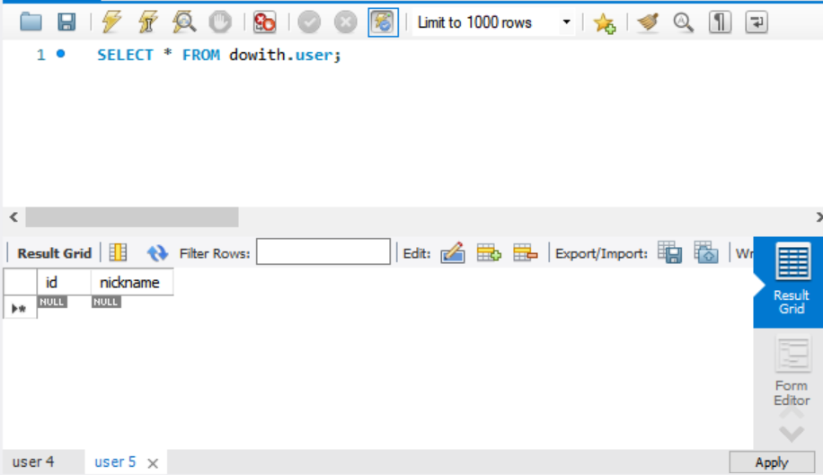

## Re-dowith!

스프링을 사용해서 백엔드를 개발한 적이 없어 이번에 도전해보려고 한다. `dowith` 은 2020년에 동아리분들과 만들었던 프로젝트이다. 이 때는 `Django`를 사용해서 개발을 했었는데 스프링 연습을 위해 `dowith` 백엔드를 스프링 부트로 개발해보고자 한다.


## MariaDB 연결

`re-dowith`은 MariaDB를 사용해 데이터베이스를 연동해보려고 한다. 


### 1. 데이터베이스 생성

MariaDB를 사용해 `dowith`이라는 데이터베이스를 생성한다.


### 2. build.gradle에 의존성 추가

프로젝트의 `build.gradle`에서 의존성을 추가해준다. 

```java
implementation group: 'org.mariadb.jdbc', name: 'mariadb-java-client', version: '2.4.1'
```


### 3. properties 추가

프로젝트의 `resource`폴더 하단에 있는 `application.properties`에 db와 연결하기 위한 정보를 작성해준다.

```java
spring.jpa.hibernate.ddl-auto=update
spring.datasource.driverClassName=org.mariadb.jdbc.Driver
spring.datasource.url=jdbc:mariadb://{DB주소/DB이름}
spring.datasource.username={DB 유저 이름}
spring.datasource.password={DB 유저 패스워드}
```

<br/>

```java
// 예시
spring.jpa.hibernate.ddl-auto=update
spring.datasource.driverClassName=org.mariadb.jdbc.Driver
spring.datasource.url=jdbc:mariadb://127.0.0.1:3306/dowith
spring.datasource.username=root
spring.datasource.password=mypassword
```


<br/>

여기까지 했다면 MariaDB로 생성한 데이터베이스와 스프링 프로젝트가 연동이 된다.


## DB 연동 테스트

DB가 잘 연동되었는지 확인해보기 위해 간단한 UserEntity를 생성했다.

```java
package org.dowith.auth.domain;

import lombok.AllArgsConstructor;
import lombok.Data;
import lombok.NoArgsConstructor;

import javax.persistence.*;

@Data
@Entity
@NoArgsConstructor
@AllArgsConstructor
public class User {
    @Id
    @GeneratedValue(strategy = GenerationType.IDENTITY)
    private Long id;

    @Column(nullable = false)
    private String nickname;

}
```

<br/>

Entity를 생성한 뒤, 데이터베이스를 보면 `user`라는 이름을 가지는 테이블이 생긴것을 볼 수 있다.




<br/>

스프링 프로젝트와 DB연결을 완료했다. 다음 포스팅에서는 본격적으로 로직을 작성해보겠다.


