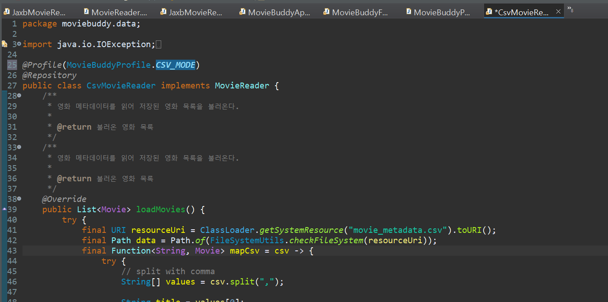
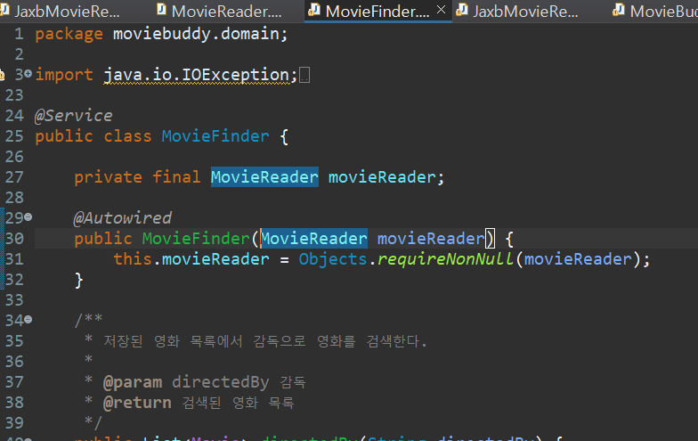
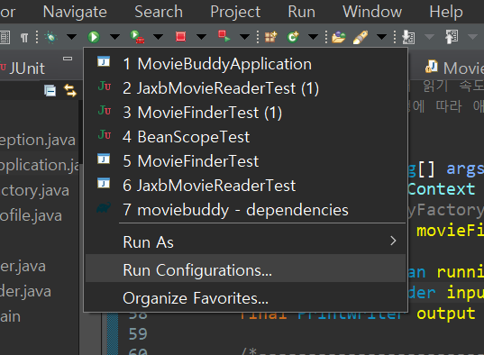
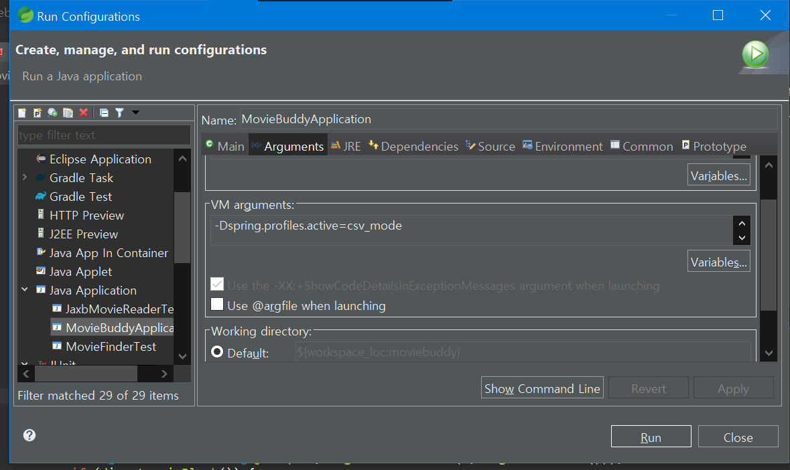
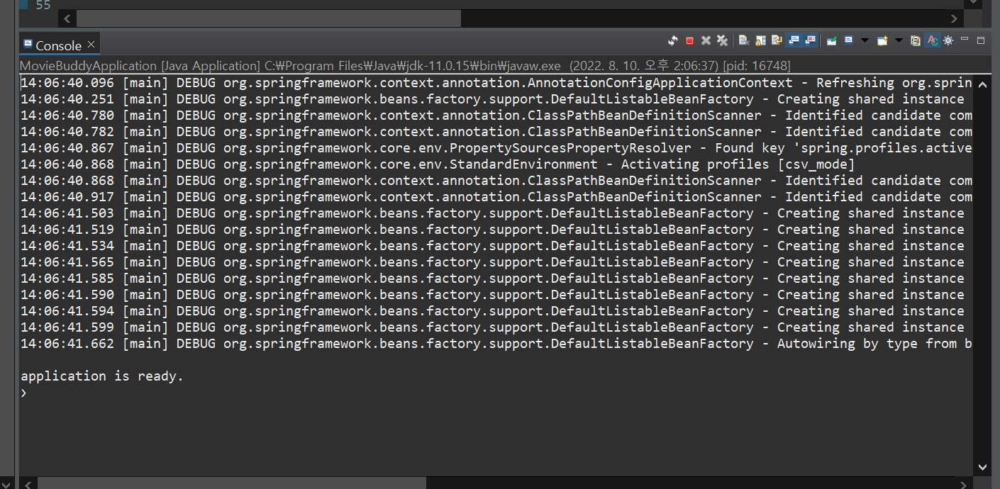

## 현재 moviebuddy 상태

지금은 CsvMovieReader와 JaxbMovieReader를 모두 스프링 컨테이너에 빈으로 등록하고 MovieFinder에서 빈의 이름을 가지고 의존 관계를 주입 받고 있다.

- CSV파일을 읽는 방식에서 XML 파일을 읽는 방식으로 바꾸고 싶다면, 코드의 빈 이름 부분을 변경해야한다!
- 헉! 너무 번거로워!
- 환경에 따라 알아서 적절한 빈을 선택하게 할 수는 없을까??

## 빈 정의 프로파일

빈 정의 프로파일은 환경에 따라 다른 빈을 등록할 수 있게 하는 메커니즘이다! (우리가 찾고 있던 바로 그거!!)<br/>

> 환경 by 환경이란?
>
> - 개발 서버와 QA서버, 프로덕션 서버에서 사용하는 데이터 소스의 유형이 다를 때
> - 성능 검증 서버에서 배포시에만 모니터링 인프라를 활성화시킬 때
> - 고객별로 사용자화된 애플리케이션을 제공할 때 ⬅ moviebuddy는 사용자에 따라 CSV문서 또는 XML 문서를 읽고 동작해야하므로 이 상황에 처했다고 볼 수 있다!

### 1️⃣ MovieBuddyProfile 클래스 추가

- 패키지 `moviebuddy`에 클래스 `MovieBuddyProfile`을 생성한다.

- 다음과 같이 클래스 안에 상수 두 개를 선언한다.

  ```java
  public static final String CSV_MODE = "csv_mode";
  	public static final String XML_MODE = "xml_mode";
  ```

  <br/>

- 이 클래스는 상수를 모아 둘 클래스이기 때문에 생성될 필요가 없다. 생성자를 private로 숨겨두자.

  ```java
  //클래스 내부에 다음과 같이 작성
  private MovieBuddyProfile() {}
  ```

### 2️⃣ @Profile

프로파일을 작성했으니 `CsvMovieReader`와 `JaxbMovieReader`에 가서 `@Profile`을 통해 MovieBuddyProfile의 어떤 상수가 활성화될 때 적용될 것인지 명시해준다.



### 3️⃣ MovieFinder 변경

이제 환경에 따라 적절한 MovieReader를 적용할 것이므로 `MovieFinder`에서 `@Qualifier("csvMovieReader") ` 를 삭제한다.



### 4️⃣ @ActiveProfiles

작동이 잘되는지 테스트를 실행해보기전에 테스트 클래스 위에 주석하나를 더 추가한다!<br/>

```java
@ActiveProfiles(MovieBuddyProfile.CSV_MODE)
```

- 위 주석은 프로파일의 해당 모드를 활성화 시키겠다는 의미이다.

> 만약 위 주석이 없다면?<br/>
>
> 의존 관계 주입을 위한 빈이 아무것도 없기 때문에 MovieFinder를 생성하는데 실패한다... <br/>
>
> 활성화된 프로파일이 없기 때문이다!

<br/>

- JaxbMovieReader 테스트 또한 @ActiveProfiles 주석을 추가한다.

## 프로덕션 환경에서 프로파일 적용

테스트가 아닌 프로덕션 환경에서 프로파일을 적용하는 두 가지 방법이 있다.

1. ApplicationContext가 제공하는 getEnvironment().setActiveProfiles를 사용
2. 애플리케이션을 실행할 때 JVM 파라미터로 프로파일을 전달해서 실행

<br/>

오늘은 두 번째 방법으로 프로파일을 적용해보겠다.<br/>

### 1️⃣ 화살표 아이콘 옆의 세모를 눌러서 Run Configurations... 를 누른다.



### 2️⃣ VM Arguments 입력

- 프로파일을 적용할 자바 어플리케이션, MovieBuddyApplication의 Arguments란에서 VM arguments를 입력한다.

`-Dspring.profiles.active=csv_mode`



## 스프링 로그 확인

`SLF4J`를 사용해 스프링 로그를 확인해보자! <br/>

build.gradle에 `implementation 'ch.qos.logback:logback-classic:1.2.3'`를 써서 의존성을 추가한다.<br/>

이제 MovieBuddyApplication을 실행하면



다음과 같이 콘솔창에 로그가 뜨는 것을 볼 수 있다.
