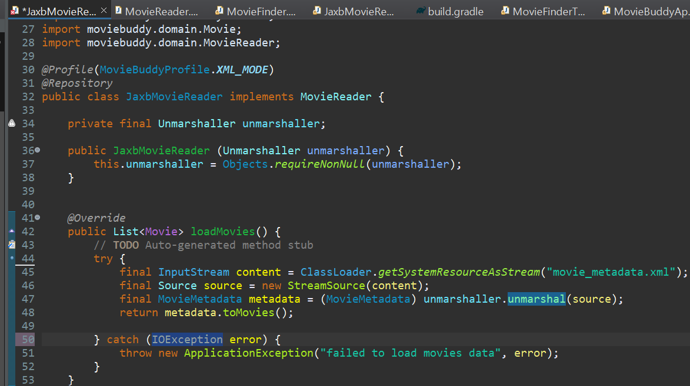
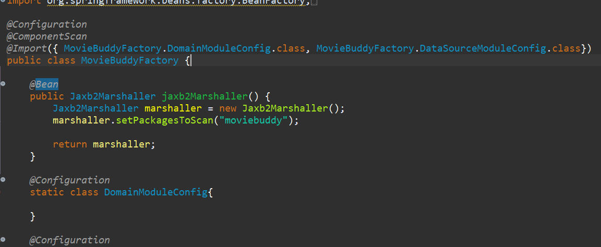

## JaxbMovieReader... 지금이 최선일까?

자바 생태계에는 JAXB외에도 자바 객체와 XML을 매핑시킬 수 있는 다양한 기술들이 있다. 이렇게 특정 기술에 종속적으로 개발을 하면 추후 다른 기술로 변경하기가 어렵다. <br/>

<br/>

코드는 특정 환경과 구현 기술에 종속적이지 않게 작성해야한다. 그래야 필요에 따라 다른 기술로 쉽게 바꿀 수 있다.

<br/><br/>

스프링은 xml과 java객체 매핑시 구현 기술과 무관하게 일관된 방식으로 사용할 수 있는 서비스 추상화로 **스프링 OXM 모듈**을 제공한다.


## 스프링 OXM 모듈

자바 객체와 xml을 매핑해서 상호 변환해 주는 기술을 `Object-XML Mapping`이라고 하고, 이를 줄여서 `OXM`이라고 한다.<br/>

스프링의 OXM에는 Marshaller와 Ummarshaller 인터페이스가 존재한다.<br/>


### 의존성 추가

build.gradle에 `implementation 'org.springframework:spring-oxm:5.3.9'`를 추가한다.


### Unmarshaller

`JaxbMovieReader`에서 Unmarshaller객체를 생성하고 생성자를 만들어서 입력받는다.

> Unmarshaller는 반드시! `oxm` 모듈에서 import 해와야한다.

<br/>



* oxm 모듈의 Unmarshaller로 객체를 만들고
* 생성자를 가지고 unmarshaller를 필수적으로 입력받는다.
* loadMovies에서 JAXB를 사용하는 코드를 지우고,
* 예외처리문의 error또한 IOException 에러로 바꿔준다.


### marshaller 빈 정보 등록

`MovieBuddyFactory`에 Jaxb2Marshaller 빈을 등록한다.

> JAXB를 이용해서 언마샬링 또는 마샬링을 해주는 스프링의 OXM 모듈은 Jaxb2Marshaller라는 객체로 구현되어 있다.<br/>
>
> 이 클래스는 Marshaller와 Unmarshaller 클래스를 모두 구현하고 있기 때문에 unmarshaller로도 동작을 하고 있다.

* JAXBContent를 만들 때 지정했던 movie 메타데이터 클래스를 탐지할 수 있도록 `PakageToScan`이라는 옵션을 통해서 스캐닝을 통해 movie 메타데이터 클래스를 탐지할 수 있도록 설정한다.

<br/>



<br/><br/>

이후 JaxbMovieReaderTest를 실행하면 로그에

```
oxm.jaxb.Jaxb2Marshaller - Creating JAXBContext by scanning packages [moviebuddy]
oxm.jaxb.Jaxb2Marshaller - Found JAXB2 classes: [class moviebuddy.data.JaxbMovieReader$MovieMetadata]
```

라고 적히는 것을 볼 수 있다.

> * Jaxb2Marshaller가 패키지를 스캐닝해서  JAXBContext를 생성하는 것을 볼 수 있다. 
>
> * 또한 XML을 java 객체로 변화하기 위한 클래스(JaxbMovieReader)를 자동으로 탐지해서 관련된 컨텍스트를 구성한다.


## XmlMovieReader

이제 `JaxbMovieReader`는 직접적으로 Jaxb를 사용하지않으니 이름을 `XmlMovieReader`로 바꿔주자!<br/>

파일이나 클래스 이름에서 우클릭후, Refactoring -> rename을 통해 클래스 이름을 바꿀 수 있다.<br/>

JaxbMovieReaderTest도 Xml로 바뀌지않았다면 임의로 고쳐주자.


## 이식 가능한 서비스 추상화

* 환경과 세부 기술의 변화와 관계없이 일관된 방식으로 기술을 다룰 수 있는 것

* 포조로 개발된 코드는 특정 환경이나 구현 방식에 종속되지 않아야 한다!!!

> 우리는 엔터프라이즈 자바 플랫폼을 사용하면서 많은 자바 EE 기술을 사용하게 된다.<br/> 
>
> 코드가 특정 환경 & 기술에 종속되지 않아야 한다는 말은 자바 EE 기술을 사용하지말라는 말이 아니라, 포조가 세부 기술에 직접 노출되지 않도록 만들라는 뜻이다.


* MovieFinder와 MovieReader는 각자 담당하는 코드의 기능적인 관심에 따라 수평적으로 분리되었다. 서로 불필요한 영향을 주지않으면서 독자적으로 확장이 가능하게 설계되었다.
* 이처럼 같은 애플리케이션 로직을 담았지만 역할에 따라 분리를 행한다.

---

* OXM 서비스 추상화는 이와 조금 다르다.
* 애플리케이션의 비즈니스 로직과 그 하위에서 동작하는 저수준의 XML 기술이라는 아예 다른 계층의 특성을 갖는 코드를 분리한 것이다.

---

* XmlMovieReader는 XML 문서를 다루는 방법에 있어서는 독립적이다.
* Unmarshaller 인터페이스와 의존 관계 주입을 통해 추상화된 API로 저수준의 OXM 매핑 기술을 사용하기 때문이다
* 어떤 구현 기술을 사용하든지, XmlMovieReader의 코드는 변하지 않는다.
* 즉, XmlMovieReader와 OXM 매핑 기술의 결합도가 낮은 것이다...!!!

---

관심사에 따른 수직적 구분이든, 로직과 기술이라는 수평적인 구분이든 모두 결합도가 낮으며 서로 영향을 주지 않고 자유롭게 확장될 수 있는 구조를 만들 수 있는 데는 제어의 역전과 의존 관계 주입이 중요한 역할을 하고있음을 알 수 있다.

---

스프링은 이처럼 서비스 추상화 기술을 통해 포조를 보호할 수 있도록 지원하고 있다. 우리가 사용한 OXM 매핑 추상화 처럼 캐시, 메일과 같이 스프링이 정의한 추상화 API를 직접 이용하는 방식도 제공이 되며 앞으로 학습할 스프링 AOP나 템플릿 콜백 패턴과 결합하여 직접 API를 사용하지 않지만  스프링에 의해 제어되는 트랜잭션 서비스 추상화, 또는 원격 호출 서비스 추상화 등이 있다.

---

이후 수업에서 스프링이 제공하는 서비스 추상화 기술을 더 자세히 알아볼 예정이다!

