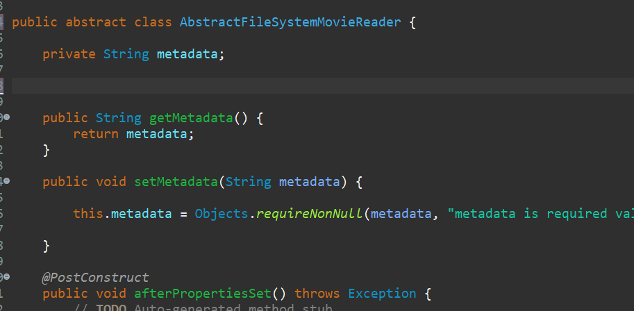

## [미션2] 영화 메타데이터 위치 변경 기능

현재 loadMovies메소드에서 메타데이터의 위치를 지정하고 있고 해당 위치에 있는 메타데이터를 불러읽고 있다.

<br/>

메타데이터 위치를 결정하는 것과 메타데이터를 읽는 행위도 변화의 이유와 시기가 다르기 때문에 분리할 필요가 있다.

<br/>

메타데이터의 위치를 외부에서 입력받게 바꿔보자.

### 1. setter 메소드 활용

- `CsvMovieReader`클래스 내부에 `metadata` 변수를 생성한다.

```java
private String metadata;
```

<br/>

- 우클릭후, `Source` -> `Generate Getter and Setters`

- `metadata`는 필수조건이므로 `setter`를 다음과 같이 수정한다

```java
public void setMetadata(String metadata) {
		this.metadata = Objects.requireNonNull(metadata, "metadata is required value");
	}
```

<br/>

- `loadMovies`에서 url을 가져오는 부분의 코드를

  ```java
  final URI resourceUri = ClassLoader.getSystemResource("movie_metadata.csv").toURI();

  // 에서


  final URI resourceUri = ClassLoader.getSystemResource(getMetadata()).toURI();

  //로 바꿔준다.
  ```

### 2. 빈 등록

`MovieBuddyFactory`의 DataSourceModuleConfig 클래스에 다음과 같이 코드를 추가한다.

```java
@Configuration
	static class DataSourceModuleConfig {

		@Profile(MovieBuddyProfile.CSV_MODE)
		@Bean
		public CsvMovieReader csvMovieReader() {
			CsvMovieReader movieReader = new CsvMovieReader();
			movieReader.setMetadata("movie_metadata.csv");

			return movieReader;
		}
	}
```

## 메타데이터 url이 올바른지 미리 테스트

### 1. `CsvMovieReader`의 setter 메소드에서 검사

```java
public void setMetadata(String metadata) throws FileNotFoundException, URISyntaxException {
		URL metadataURL = ClassLoader.getSystemResource(metadata);
		if (Objects.isNull(metadataURL)) {
			throw new FileNotFoundException(metadata);
		}
		if (Files.isReadable(Path.of(metadataURL.toURI())) == false) {
			throw new ApplicationException(String.format("cannot read to metadata. [%s]", metadata));
		}

		this.metadata = Objects.requireNonNull(metadata, "metadata is required value");

	}
```

다음과 같이 코드를 작성해서 url이 잘 들어왔는지 (잘못 들어왔다면 Null로 들어온다.)<br/>

해당 url이 읽을 수 있는 url인지 검사하는 코드를 추가한다.

### 2. 빈 생명주기

1️⃣ `CsvMovieReader`에 `InitializingBean` 인터페이스를 implements해준다.

2️⃣ `InitializingBean`내부에 선언된 afterPropertiesSet 클래스를 오버라이딩하고 1번에서 작성한 setter 안의 코드를 채워넣는다.

```java
@Override
	public void afterPropertiesSet() throws Exception {
		// TODO Auto-generated method stub
		URL metadataURL = ClassLoader.getSystemResource(metadata);
		if (Objects.isNull(metadataURL)) {
			throw new FileNotFoundException(metadata);
		}
		if (Files.isReadable(Path.of(metadataURL.toURI())) == false) {
			throw new ApplicationException(String.format("cannot read to metadata. [%s]", metadata));
		}

	}
```

> InitiailzingBean외에 빈이 소멸될 때 사용할 수 있는 DisposableBean등이 있다.

### 3. 자바 표준 애노테이션

- 스프링은 콜백 인터페이스 외에도 JSR 250으로 정의되어 있는 자바 표준 애노테이션을 사용해서 빈 생명 주기에 관여를 할 수도 있다.

> JSR 250은 자바 플랫폼을 위한 공통 애노테이션에 관한 스펙으로 자주 사용되는 여러 가지 애노테이션을 표준화한 것이다.

#### 1️⃣ 의존성 추가

`implementation 'javax.annotation:javax.annotation-api:1.3.2'`

<br/><br/>

#### 2️⃣ PostConstruct

- implements 해주었던 InitializingBean을 제거한다.

- @PostConstruct 를 사용한다.

- ```java
  @PostConstruct
  	public void afterPropertiesSet() throws Exception {
  		// TODO Auto-generated method stub
  		URL metadataURL = ClassLoader.getSystemResource(metadata);
  		if (Objects.isNull(metadataURL)) {
  			throw new FileNotFoundException(metadata);
  		}
  		if (Files.isReadable(Path.of(metadataURL.toURI())) == false) {
  			throw new ApplicationException(String.format("cannot read to metadata. [%s]", metadata));
  		}

  	}
  ```

## XmlMovieReader도 변경

XmlMovieReader도 메타데이터의 위치가 변경이 가능하게 코드를 짜보자. XmlMovieReader에도 위에서 CsvMovieReader에 추가한 코드가 중복적으로 사용된다. <br/>

상속과 추상 클래스를 이용해 앞에서 작성한 코드를 재사용해보자!

### CsvMovieReader Refactor

- CsvMovieReader에서 우클릭후, `Refactor` -> `Extract Superclass`를 선택한다.

- 메소드 getter, setter, afterProerperitesSet과 프로퍼티 metadata를 지닌`AbstractFileSystemMovieReader`를 생성한다.

  

<br/>

- `AbstractFileSystemMovieReader`를 추상클래스로 바꾸고 생성자 코드를 삭제한다.

  

### XmlMovieReader 확장

- 위 클래스를 상속받는다.

  `public class XmlMovieReader extends AbstractFileSystemMovieReader implements MovieReader`

- 메타데이터의 위치를 getMetadata()로 받게 수정한다.

  `final InputStream content = ClassLoader.getSystemResourceAsStream(getMetadata());`

### 빈 추가

`MovieBuddyFactory`에 빈을 추가한다.

```java
@Profile(MovieBuddyProfile.XML_MODE)
		@Bean
		public XmlMovieReader xmlMovieReader(Unmarshaller unmarshaller)  {
			XmlMovieReader movieReader = new XmlMovieReader(unmarshaller);
			movieReader.setMetadata("movie_metadata.xml");

			return movieReader;
		}
```
