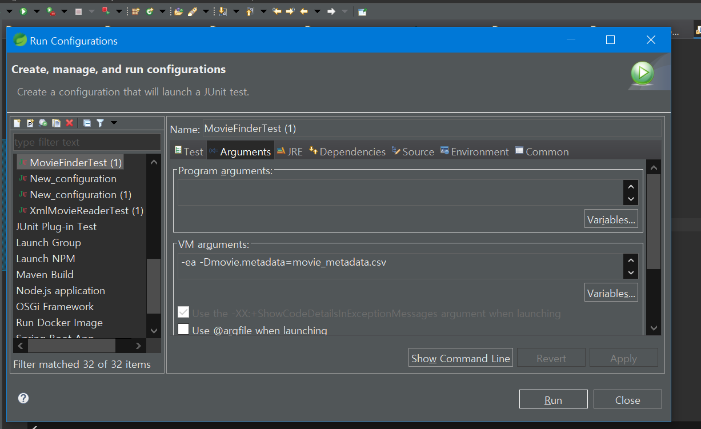
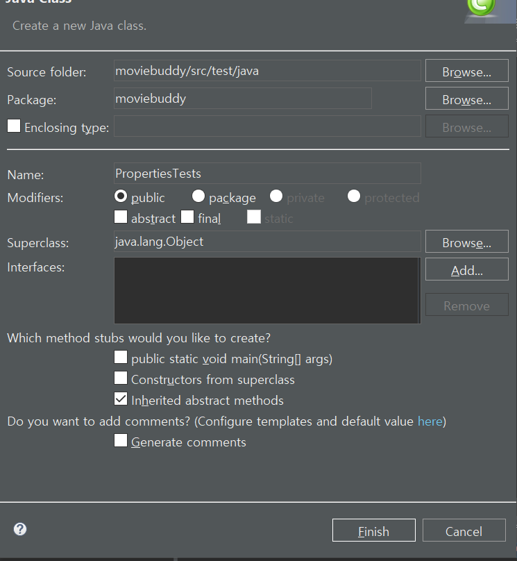

## [미션2] 영화 메타데이터 위치를 변경 가능

외부에서 메타데이터 위치를 주입할 수 있도록 CsvMovierReader와 XmlMovieReader에 설정자를 추가하고 초기화 과정에서 읽을 수 있는 메타데이터인지 검증하는 기능을 추가했다.<br/>

그러나 아직 개선의 여지가 있다. 메타데이터 위치를 변경하려면 결국 `MovieBuddyFactory` 코드를 변경해야 한다.<br/>

코드를 변경하지않고 위치를 변경하려면 어떻게 해야 할까?

## getProperty

애플리케이션 외부에서 설정정보를 읽어, 메타데이터 위치를 설정하게 한다.<br/>

System의 `getProperty`함수를 사용해 OS의 환경변수나 VM의 아규먼트를 읽을 수 있다. <br/>

### 1. MovieBuddyFactor 코드 수정

```java
movieReader.setMetadata(System.getProperty("movie.metadata"));
```

MovieBuddyFactory의 CsvMovieReader와 XmlMovieReader 에서 movierReader.setMetadata안의 인자를 위와 같이 바꾼다.

### 2. VM 아큐먼트 설정



`RunConfigurations`에 들어가 Junit의 `MovieFinderTest`에 다음과 같이 VM argument를 추가한다.<br/>

`MovieFinderTest`를 실행하면 잘 동작하는 것을 볼 수 있다.

## Properties load test

- src -> test -> java에 resources 폴더 생성

- 패키지 익스플로러에서 메인 폴더(루트) 우클릭 후 Gradle- > Refresh Gradle Project를 통해 프로젝트 갱신

- 생성한 resources에 config.properties라는 파일 생성

- config.properties에 `name=hongo`라고 작성

- src -> test -> java아래에 클래스`PropertiesTests` 생성

  

- `PropertiesTests`안에 다음과 같이 작성

```java
package moviebuddy;

import java.io.IOException;
import java.nio.file.Files;
import java.nio.file.Paths;
import java.util.Properties;

import org.junit.jupiter.api.Assertions;
import org.junit.jupiter.api.Test;

public class PropertiesTests {
	@Test
	void Load_PropertiesFile() throws IOException {
		Properties config = new Properties();
		config.load(Files.newInputStream(Paths.get("./src/test/resources/config.properties")));

		Assertions.assertEquals(1, config.size());
		Assertions.assertEquals("hongo", config.get("name"));
	}
}
```

- 실행을 하면 config.properties의 값을 잘 받아오는 것을 알 수 있다.

## Environment 인터페이스

그러나 위처럼 우리가 설정해줄 필요없이 설정 정보를 읽을 수 있는 방법이 있다.<br/>

스프링에는 외부 설정 파일이나 앞서 사용했던 VM 아규먼트와 같이 시스템 환경 변수나 그 외에도 다양한 방식으로 부터 일관된 방식으로 환경 정보를 읽을 수 있는 런타임 환경 서비스 추상화인 `Environment 인터페이스`가 존재한다.

<br/> <br/>

- `DataSourceModuleConfig` 클래스 내부에 Environment 생성

```java
private final Environment environment;

		public DataSourceModuleConfig(Environment environment) {
			this.environment = environment;
		}
```

> 스프링에 의해 자동으로 의존성 주입이 일어난다.

<br/>

- movieReader.setMetadata(System.getProperty("movie.metadata")); 코드에서 System을 enviroment로 변경한다.

<br/> <br/>

이처럼 Environment인터페이스를 사용해 인터페이스가 제공하는 `getProperty` 메소드를 통해 외부의 설정 정보를 읽어서 메타데이터의 위치를 설정할 수 있다.

## 빈 프로퍼티 값 설정해보기

### @Value

`AbstractFileSystemMovieReader`의 setter메소드위에 Value 어노테이션을 추가한다. <br/>

`@Value("${movie.metadata}")`<br/>

MovieFactory의 datasourcemodule 클래스안에서 정의했던 코드를 다 지우고 실행하면 잘 동작하는 것을 볼 수 있다.

> 이처럼 Value어노테이션을 사용하면 자동으로 property의 값을 가져오는 것을 볼 수 있다.
