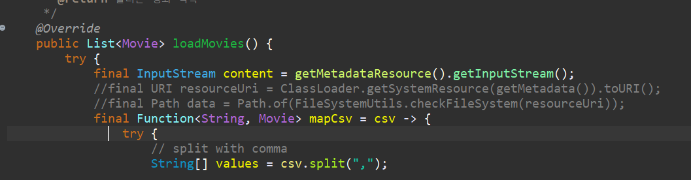
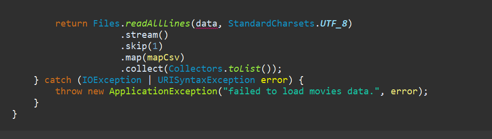
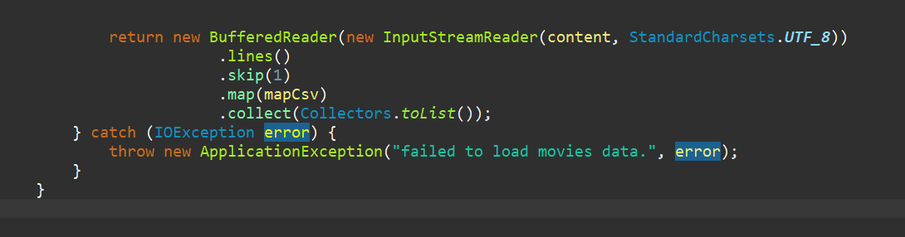
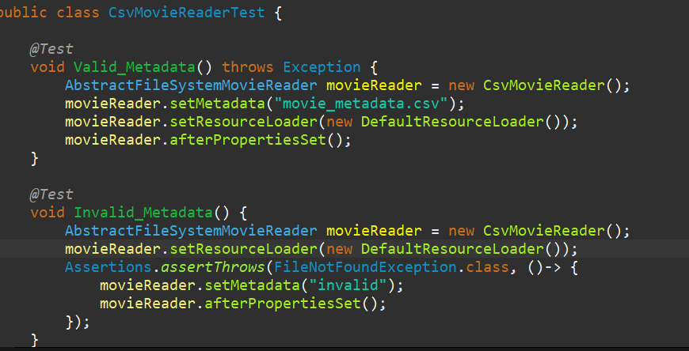
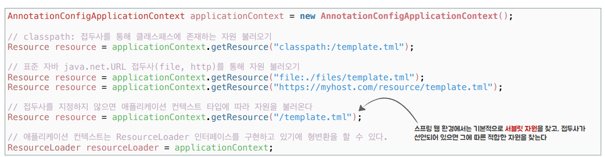

## 리소스 추상화

> - 저번 포스팅에서는 스프링 환경 추상화를 사용해 애플리케이션 외부에서 메타데이터 위치를 변경할 수 있도록 개선했다.
>
> - 현재 메타데이터가 클래스 패스에 존재할 때만 읽어올 수 있다. 오늘은 이 부분을 개선해보자!

<br/>

스프링은 리소스 추상화를 통해서 다양한 외부 자원 정보를 읽어들일 수 있다.

## ResourceLodader

getResource라는 메소드를 통해서 주어진 위치에 있는 자원을 취득할 수 있도록 도와주는 컴포넌트이다. 모든 애플리케이션 콘텍스트는 리소스 로더 인터페이스로 구현하고 있다.

- 인자안의 접두사로 다른 방식의 리소스도 얻을 수 있다.

  - ex) `Resource template = ctx.getResource("classpath:some/resource/path/myTemplate.txt");`

    > classpath에서 리소스를 가져온다.

  - `Resource template = ctx.getResource("https://myhost.com/resource/path/myTemplate.txt");`

    > http로부터 가져온다.

### 📌 ResourceLoader를 사용해보자!

- `AbstractFileSystemMovieReader` 클래스에서 `ResourceLoaderAware` 인터페이스를 implements한다.
  - `ResourceLoaderAware` 는 리소스 로더를 외부에서 의존 관계 주입을 받을 수 있게 해준다.

<br/>

- `ResourceLoaderAware` 를 상속받은`AbstractFileSystemMovieReader`클래스 내부에서 우클릭 `Source` -> `Override/Implement Methods`를 클릭해서 setResourceLoader함수를 생성한다.

### 📌 Resource를 획득해보자!

```java
public Resource getMetadataResource() {
		return resourceLoader.getResource(getMetadata());
	}
```

`AbstractFileSystemMovieReader` 클래스 내부에 `getMetadataResource`함수를 만든다.

> 위에서 생성한 리소스 로더를 사용해 리소스를 획득한다.

### 📌url valid 검사 코드 수정 (afterPropertiesSet)

기존의 afterPropertiesSet함수는 다음과 같았다.

```java
@PostConstruct
	public void afterPropertiesSet() throws Exception {
		// TODO Auto-generated method stub
		URL metadataURL = ClassLoader.getSystemResource(metadata);
		if (Objects.isNull(metadataURL)) {
			throw new FileNotFoundException(metadata);
		}
		if (Files.isReadable(Path.of(metadataURL.toURI())) == false) {
			throw new ApplicationException(String.format("cannot read to metadata. [%s]", metadata));
		}

	}
```

<br/>

리소스를 사용해서 위 코드를 수정해보자.

<br/> <br/>

```java
	@PostConstruct
	public void afterPropertiesSet() throws Exception {
		// TODO Auto-generated method stub

		Resource resource = getMetadataResource();
		if (!resource.exists()) {
			throw new FileNotFoundException(metadata);
		}
		if (!resource.isReadable()) {
			throw new ApplicationException(String.format("cannot read to metadata. [%s]", metadata));
		}


	}
```

`exists()`로 파일이 존재하는지와 `isReadable()`로 읽을 수 있는 파일명인지를 쉽게 검사할 수 있다.

> 이렇게 해서 자바의 URL API와 NIO를 쓰던 API 코드는 다 제거하고 스프링의 리소스 인터페이스를 기반으로 동작하도록 변경했다.
>
> 이제 `AbstractFileSystemMovieReader`는 더 이상 파일을 이용해서 동작하는 코드가 아니라 스프링이 제공하는 리소스 추상화를 사용하도록 변경되었다. `AbstractFileSystemMovieReader`라는 이름을 `AbstractMetadataResourceMovieReader`로 바꿔준다.

### 📌 CsvMovieReader 수정



- 클래스로더를 사용해 읽어오던 URI를 리소스를 사용해 InputStream형식으로 받아오게 수정한다.

<br/> <br/>



파일을 리턴하는 코드를 위 InputStream형식인 content를 사용해 수정해보자.

<br/>



수정된 코드는 위와 같다.

- `InputStreamReader`를 통해 content를 UTF-8 형식으로 읽어오낟.
- `BufferedReader`를 통해 InputStream을 읽어온다.
- 버퍼는 이미 stream형태이므로 .stream()을 지운다.
- 라인별로 가져오기위해 .lines()를 추가한다.
- 더 이상 URL을 직접적으로 다루지 않기 때문에 URL 관련 에러는 삭제한다.

## 리소스로더로 수정한 코드를 테스트해보자!

`CsvMovieReaderTest`로 코드를 테스트해보자.<br/>

`CsvMovieReaderTest`에는 리소스를 의존 관계 주입을 해주는 코드가 없으므로 작성해주자.



클래스 내부의 함수안에 `setResoruceLoader`를 통해 리소스 의존 관계 주입을 해준다. 인자로 들어가는 구현체는 스프링에서 지원하는 `DefaultResourceLoader`를 사용한다.

### 📌 XmlMovieReader 수정

클래스로더를 사용해 파일을 읽어들이는 부분을 getMetadataResource()를 사용해 읽어오도록 수정한다.

```java
final InputStream content = getMetadataResource().getInputStream();
```

## 클래스 패스가 아닌 원격지에 있는 리소스를 획득하려면?

현재 클래스패스에 있는 파일을 찾아 불러오고 있다. 원격지에 있는 리소스를 취득해서 사용하는 방식으로 바꿔보려면 어떻게 해야할까?<br/>

답은 간단하다...

`application.properties` 에서 선언한 movie.metadata의 value를 변경해주면 된다.

```
movie.metadata=https://www.~
```

위와 같이 수정하면 클래스 패스가 아닌 http로 받게 수정할 수 있다.

## 리소스 추상화 정리

저수준 접근을 위한 리소스 인터페이스로 자바의 표준 URL 클래스와 URL 접두사들에 대한 표준 핸들러가 존재하지만, 다양한 저수준 리소스에 접근하기에는 한계가 있다.<br/>

- 그래서 스프링은 리소스 인터페이스로 저수준 리소스 접근을 추상화하고 더 많은 기능을 제공한다.
  - 클래스 패스, 파일, http등 내장된 구현체를 제공한다.

<br/>

- 리소스 로더를 통해 리소스를 가져올 수 있다.



> getResource() 함수를 통해 클래스패스, 파일, http등 다양한 방식으로 파일을 가져올 수 있다.
