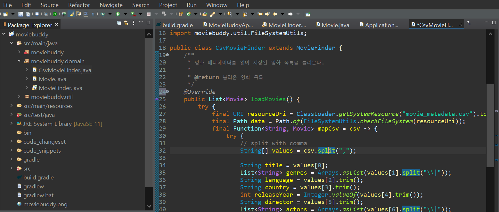
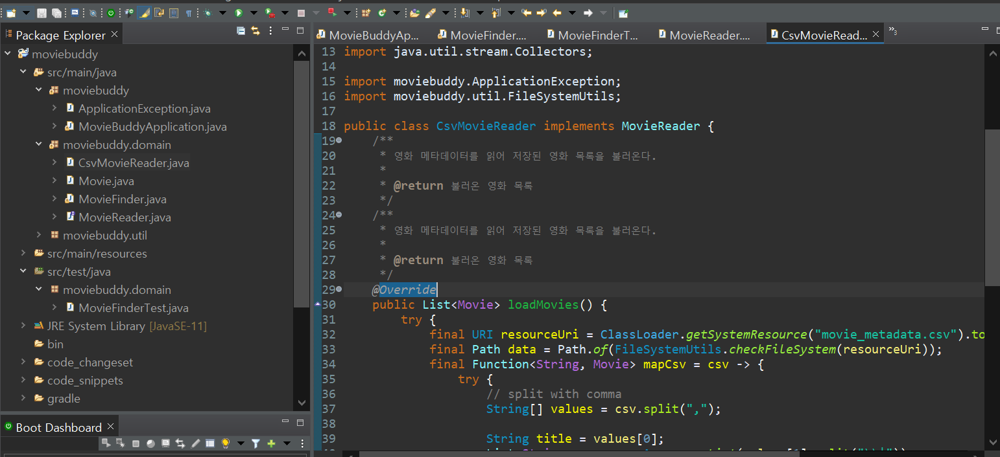
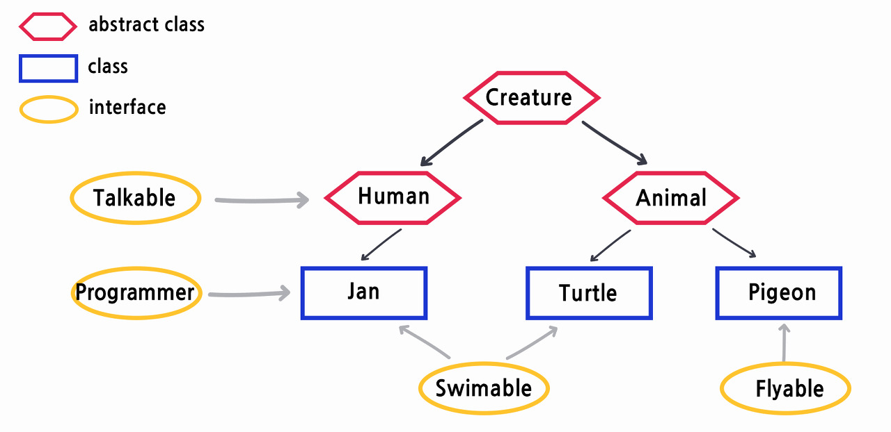

## 📌 [미션1] XML 데이터 입력 기능 추가

현재 csv파일형태로 영화 목록 리스트를 받아오고있다. 미션1은 영화 목록 리스트를 xml형태로도 받아올 수 있게 확장하는 것이다. <br/>

이번 포스팅에서는 XML 데이터 입력 기능을 구현해보진않지만, 기능을 CSV reader와 XML reader로 나누기 위해 어떤 전략을 취하면 좋을지 얘기해보겠다.

## 1. 분기문으로 로직을 분리해서 구현

!<br/><br/><br/>

첫 번째 방법은 분기문으로 로직을 분리하면 된다.<br/>

CSV파일을 받는 함수 `loadMoviesCSV()`와 XML파일을 받는 함수`loadMoviesXML()`를 생성해 아래와 같이 분기문으로 로직을 분리한다.

```java
if (mode == "CSV"){
    return loadMoviesCSV();
} else if (mode == "XML"){
    return loadMoviesXML();
}
```

<br/>

> 그러나 이 방법에는 크나큰 단점이 있으니...<br/>
>
> 만약 또 다른 형식의 메타데이터를 읽어야 한다면, 계속해서 `load MoviesXXX()`라는 함수를 만들어야하고 분기문의 처리도 길어진다.<br/>
>
> 이렇게 새로운 기능을 추가해야할 때마다 기존의 코드를 변경해야한다면 버그가 발생할 확률이 높아진다.

## 소프트웨어 개발시 지켜야 할 것

> 오늘 완성해야 하는 기능을 구현하는 코드를 짜야하는 동시에 내일 쉽게 변경할 수 있는 코드를 짜야 한다.

<br/>

개발을 시작하는 시점에서 모든 요구사항을 수집하는 것이 불가능에 가깝다. 개발이 진행되는 동안 요구사항이 변경되기때문에, 오늘 요구하는 기능을 온전히 수행하면서 내일의 변경을 수용할 수 있도록 소프트웨어를 설계해야한다.<br/>

<br/>

`MovieFinder` 클래스에는 크게 두 가지 관심사가 있다.

- CSV 파일로 작성된 영화 메타데이터를 읽어들이기
- 조건에 맞는 영화를 검색하기

<br/><br/>

위 관심사를 상속과 다형성을 이용해서 분리해보자

## 2. 상속과 다형성을 이용해 로직을 분리

- `MovieFinder` 클래스를 추상화 클래스로, `loadMovies` 메소드도 추상 메소드로 변경한다.
- `moviebuddy.domain`에 클래스 `CsvMovieFinder`과 `XmlMovieFinder`를 생성합니다.
- 두 클래스 모두 `MovieFinder`를 상속받은 후, 내부에서 `loadMovies`를 정의합니다.
  - `@Override` 어노테이션을 사용해 메소드 오버라이딩을 합니다.



<br/><br/>

> 이처럼 부모 클래스에 기본적인 알고리즘의 흐름을 구현하고 중간에 필요한 처리를 자식 클래스에게 위임하는 구조를 템플릿 메소드 패턴이라고 한다.

## 그럼 상속이 코드 재사용면에서 가장 좋은 방법일까?

그렇진않다...! <br/>

상속은 아래 두 가지 관점에서 설계에 안 좋은 영향을 끼친다.<br/>

- 캡슐화를 위반한다.
- 설계를 유연하지 못하게 만든다.

<br/>

코드를 재사용하기 위해서는 `상속`보다는 `합성`을 먼저 고려하는 것이 좋다. (추상 클래스보다는 인터페이스를 우선해라!)

<br/>

### 합성이란?

합성은 다른 객체의 인스턴스를 자신의 인스턴스 변수로 포함해서 재사용하는 방법을 말한다.

> 객체는 인터페이스를 통해 참조해라!

<br/>

**인터페이스**는 자바가 추상화를 위해 제공하는 유용한 도구이다. <br/>

인터페이스는 정의된 메시지를 통해서만 재사용이 가능하기 때문에 구현을 효과적으로 캡슐화할 수 있으며, 참조되는 인스턴스를 교체하는 것이 비교적 쉽기 때문에 설계를 유연하게 만들어준다.<br/>

<br/>

즉, 코드를 재사용하기 위해서는 상속보다는 합성이 더 좋은 방법이다.<br/>

<br/>

상속을 이용한 방법에서 합성을 이용한 방법으로 다시 바꿔보자!

## 3. 합성을 이용해 분리

> `MovieFinder` 클래스를 추상 클래스에서 일반 클래스로 다시 바꾸고 새로운 인터페이스 `MovieReader`를 생성해보자
>
> - `MovieReader` 인터페이스는 내부에 `loadMovies`라는 메소드가 정의된다.
> - `MovieReader` 인터페이스를 구현한 `CsvMovieReader`와 `XMlMovieReader`를 작성해보자!

<br/>

**위에서 상속과 다형성을 위해 수정한 코드를 모두 복구했다는 가정하의 과정입니다.**

- `moviebuddy.domain`에 `MovieReader`라는 이름의 인터페이스를 생성한다.
- `MovieReader`안에서 `loadMovies`라는 함수를 정의한다.

```java
package moviebuddy.domain;

import java.util.List;

public interface MovieReader {
	List<Movie> loadMovies();
}
```

<br/>

- `moviebuddy.domain` 에 클래스 `CsvMovieReader`를 만듭니다.
- implements를 사용해서 `MovieReader`를 참조하게 한 뒤, 클래스안에서 오버라이딩을 사용해 함수 `loadMovies`를 작성합니다.



<br/>

- `MovieFinder` 클래스에서 `MovieReader`객체를 생성 후 객체를 사용해 `loadMovies`함수를 불러옵니다.


## 회고

오늘은 스프링의 로직을 분리해봤다.<br/>

두 가지 방법을 사용했는데 첫 번째는 "상속과 다형성"을 이용한 방법이고 두 번째는 "합성"을 이용한 방법이다.<br/>

장고로 백엔드를 개발하면서도 상속을 종종 사용해봤기에 상속과 다형성은 익숙한 방법이었지만 합성은 오늘 처음 해봤다. <br/>

처음 해본거라 그런지 상속과 합성의 차이가 크게 다가오지않았다... 굉장히 비슷하다고 느껴졌는데, 다른게 있다면 추상클래스로 분리하느냐, 인터페이스로 분리하느냐의 차이...?<br/>

그래서 추상클래스와 인터페이스의 차이를 더 자세하게 알아보기로 했다.<br/>

추상클래스와 인터페이스의 차이를 알아보기 전에 두 개의 개념을 더 자세히 공부해보자.

### 추상클래스

> 추상클래스는 내부에 하나 이상의 `추상 메소드`가 있거나 abstract으로 정의된 경우를 말한다.<br/>
>
> - 추상메소드는 내부가 아직 구현되지 않은 메소드를 말한다.
>   - 선언부만 작성하고 구현부는 작성하지 않은 메소드
>   - 상속받는 클래스에 따라 구현되는 내용이 달라질 수 있다.
> - 추상 메소드는 abstract으로 정의한다.
> - 클래스안에 추상 메소드가 하나라도 있다면, 그 클래스는 추상클래스이다.

<br/>

- 추상클래스에는 추상 메소드외에 일반적인 메소드가 들어갈 수도 있다.
- 추상클래스는 일반 변수들을 가질 수 있다.
- 추상클래스의 목적은 확장이다. 상속을 통해 자식클래스에서 내용이 완성되도록 유도하는 클래스이다.
- 생성자가 존재할 수도 있다.
- 상속을 위한 클래스이기에 혼자서 객체를 생성할 수 없다.
- 다중 상속이 불가능하다.

<br/>

```java
abstrack class 클래스명 {
    ...
    public abstract void 메서드명();
}
```

### 인터페이스

> 내부의 모든 메소드가 추상 메소드이다.
>
> - 인터페이스의 모든 메서드는 `public abstract`로 선언해야 하며, 이는 생략될 수 있다. (컴파일시 자동으로 생성)
> - 모든 멤버 변수는 `public static final` 이어야하며, 이는 생략될 수 있다. (컴파일시 자동으로 생성)

<br/>

- 인터페이스는 일반 메소드, 일반 변수를 가질 수 없다. (인터페이스 변수들은 static이어야만 한다.)
- 인터페이스 또한 혼자서 객체를 생성할 수 없다.
- 다중 상속이 가능하다.

```java
interface 인터페이스명 {
    ...
    public abstract void 메서드명();
    public default void 메서드명() {};
}
```

### 추상클래스 vs 인터페이스

`is a kind of` 와 `be able to`로 구분되기도 한다.



상속의 경우 Human은 Creature이다. 처럼 `is a kind of`로 나타낼 수 있고 확장의 개념이다.<br/>

합성의 경우 사람 Jan은 프로그래머이면서 수영을 할 수 있다 처럼 `be able to`의 성격을 지닙니다.

<br/><br/>

결론은, 자바의 특성상 한 개의 클래스만이 상속가능하기때문에 클래스의 구분은 상속을 통해 해결하고, 해당 클래스가 할 수 있는 기능들은 인터페이스로 구현한다고 보면 될 것 같다. <br/>

위 예제처럼 추상클래스는 부모와 자식이 쭉 연결되어있고 조상의 모든 기능들을 자식이 상속받는다. 그러나 인터페이스는 Jan과 Turtle처럼 다른 조상클래스를 상속받고 있더라도, 같은 기능을 공유하고 있다면 둘 다 같은 인터페이스를 참조할 수도 있다.

참고 자료 :

https://wildeveloperetrain.tistory.com/112

https://myjamong.tistory.com/150
