## 📌 [미션1] XML 데이터 입력 기능 추가

이전 포스팅에서 XML 데이터 입력 기능을 위해 로직을 합성으로 분리하는 준비 단계를 거쳤다.  

오늘은 본격적으로 기능을 구현해보자!

## JAXB

> 자바 클래스를 XML로 표현하는 자바 표준 API

자바에서는 XML 문서를 자바 객체로 매핑하는 도구들이 있다. `JAXB`는 그 중 하나이며, `JAXB`를 이용해 XML 메타 데이터를 입력해보겠다.

* 마샬링 : 자바 객체 -> XML 문서
* 언마샬링 : XML 문서 -> 자바 객체

## 1. JAXB에 대한 의존성 추가

* src -> build.gradle 파일에 들어간다.

* dependencies에 아래와 같이 작성해 외부 의존성을 추가한다.

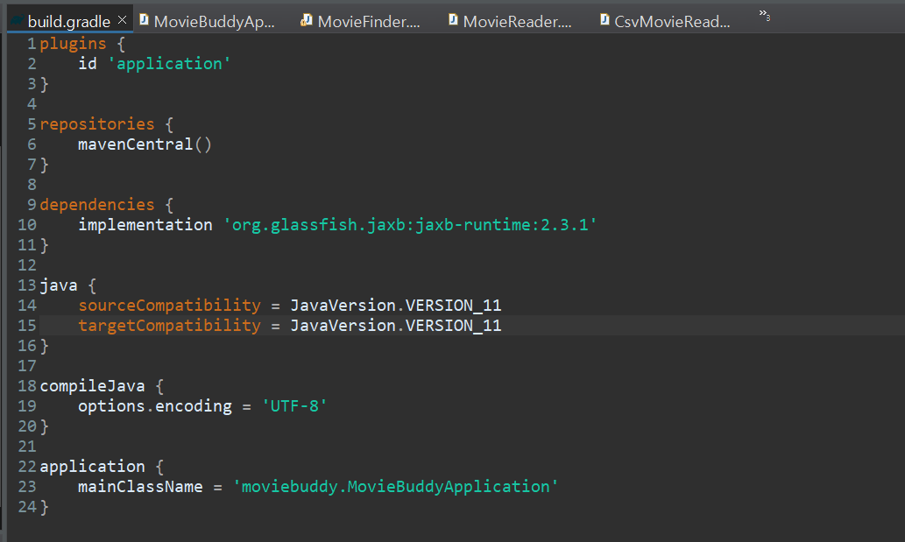

## 2. JaxbMovieReader 클래스 추가

> JaxbMovieReader 클래스를 생성해서 안에 xml 메타데이터를 매핑할 자바 객체를 만들어보자!

* 도메인에 JaxbMovieReader 클래스를 추가한다.
* 클래스에 MovieReader 인터페이스를 합성한다.
  * 옆의 경고아이콘을 통해 loadMovies 함수를 오버라이딩한다.
* MovieMetadata 클래스를 작성한다.
  * src/main/resources의 xml 메타데이터 예시를 보면 가장 루트에 moviemetadata 클래스로 묶여있는걸 볼 수 있다.
  * 이를 매핑하기 위해 MovieMetadata 클래스를 만든다.
  * moviemetadata안에는 영화 정보가 movies클래스로 묶여 들어있다.
  * MovieMetadata 클래스 또한 내부에 movies라는 클래스를 가질 것이다.

* 코드에서 우클릭 -> source 를 통해 movies에 대한 getter와 setter함수를 생성한다.

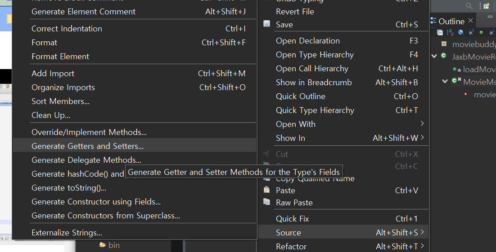

 

* 영화 메타 데이터 정보들을 가지는 MovieData 클래스를 정의한다. 

* xml 파일에서 movies안에 있던 정보들을 MovieData 클래스안에 속성으로 정의하고 각 속성에 대한 getter와 setter를 생성한다.

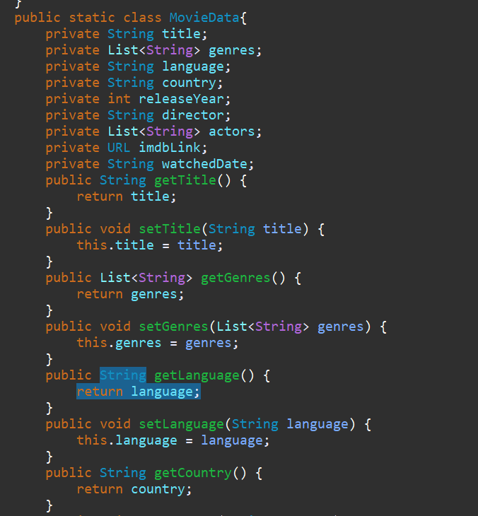

 

* MovieMetadata 클래스 위에 XML의 루트 클래스가 무엇인지 어노테이션으로 명시한다.
  * `@XmlRootElement(name = "moviemetadata")`를 클래스위에 작성한다.

 

여기까지 했다면 XML객체에 매핑할 수 있는 자바 객체를 완성했다!

## 3. xml 데이터를 자바객체로 매핑하기(loadMovies 함수)

> 2번에서 만든 자바객체에 xml 데이터를 매핑해보자

JAXB를 사용하기위해선, JAXBContext 객체를 생성해야한다.

* loadMovies 메소드 안에 JAXBContext 객체를 생성한다.
  * 중간 중간 import가 안되어있다면 경고 아이콘을 눌러 import를 해준다.
  * JAXBContext는 checked exception이 발생하므로 try문을 통해 예외처리를 해준다.
  * (error시 던지는 exception은 moviebuddy에서 정의한 예외처리이다.)

 

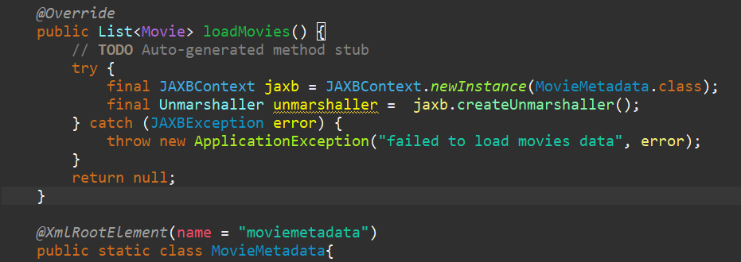

 

* unmarshaller를 사용해 xml 메타 데이터를 자바 객체로 받아온다.

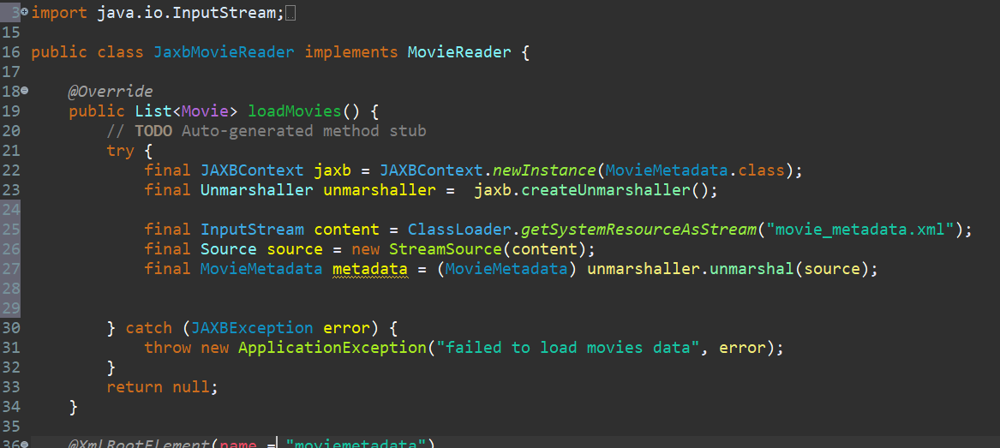

> * xml파일을 getSystemResourceAsStream함수를 통해 InputStream형태로 받아온다.
> * 우리는 Source객체로 언마샬링을 할 것이기에 위에서 받은 데이터를 ㄴSource 객체로 만든다.
> * Source 객체로 unmarshal을 한 것을 앞에서 만든 MovieMetadata 자바 객체로 매핑해준다.
>   * unmarshal함수는 캐스팅이 필요하다. 컴파일 에러가 뜨면 경고 아이콘을 사용해 캐스팅을 해주자.

 

여기까지 하면 xml 메타데이터를 자바 객체에 매핑하는 것 까지 끝났다! 이제 매핑해온 Moviemetadata 객체 metadata로 Movie List를 만들어 내면 된다.

## Moviedata객체를 Movie객체로 변환

>  MovieMetadata안의 Moviedata객체를 Movie객체로 변환한다.

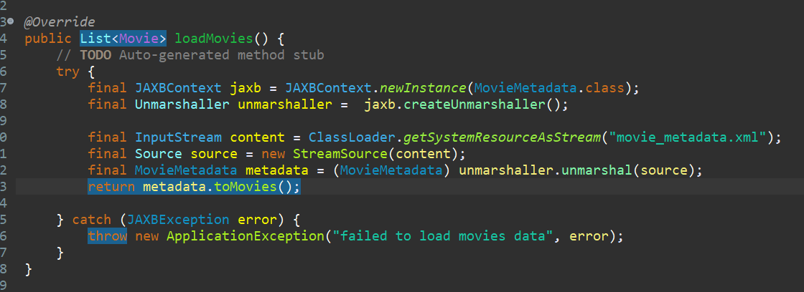

loadMovies함수에 metadata를 `toMovies`함수를 가지고 Movie객체들로 바꿔 반환하는 코드를 추가한다.

  

* 클래스 MovieData안에 MovieData객체를 Movie 객체로 바꾸는 toMovie함수를 생성한다.
* MovieData의 멤버 변수들을 of함수를 사용해 Movie에 매핑해준다.

 

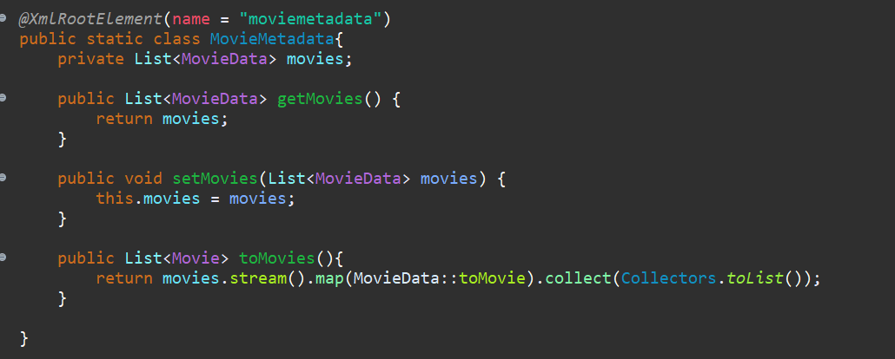

* MovieMetadata안에 toMovies함수를 정의한다.
* MovieData List를 Movie 리스트로 변환시킨다.

 

`return movies.stream().map(it -> it.toMovie()).collect(Collectors.toList());`라 써도 가능하다.

## 테스트

> 작성한 코드가 잘 작동하는지 테스트를 해보자!

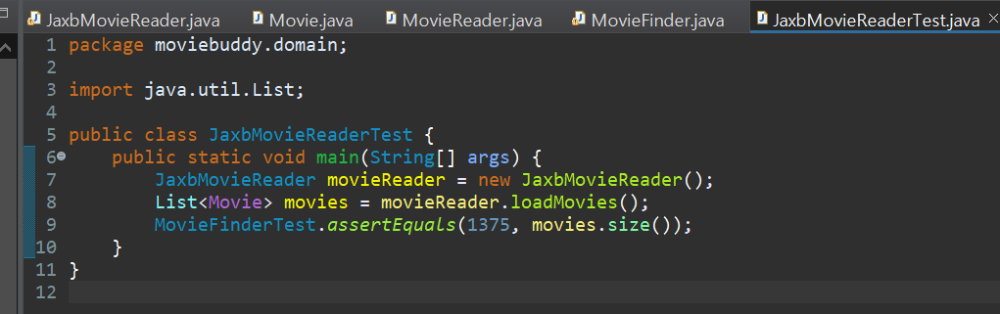

* test domain에 다음과 같이 코드를 작성한다.
* assertEquals는 미리 moviebuddy에서 작성한 함수로, 첫 번째 인자와 두 번째 인자가 같지 않으면 에러를 내보낸다.
* xml 데이터의 수가 1375개이므로 우리가 JaxbMovieReader로 매핑한 movies의 size와 1375가 같다면 데이터가 잘 매핑되었다고 볼 수 있다.

## JUnit

> 자바용 테스트 프레임워크

### 테스트 방법이 별론데요...?

1375와 movies의 size가 같다면 잘 매핑되었을 확률이 크겠지만, 테스트 결과가 가시적으로 보이지않고, 실행 로그등을 볼 수 없어 최적의 테스트라고 볼 수 없다. 

그래서 테스트를 도와주는 도구인 `JUnit`을 가지고 테스트를 다시 해보려고 한다.  

개발자는 `JUnit`이 정한 규칙에 따라 테스트할 코드를 메소드로 작성을 해둔 후 실행하면, `JUnit`이 테스트 객체를 생성하고 개발자가 자겅한 테스트 코드를 실행시켜준다.

### 의존성 추가

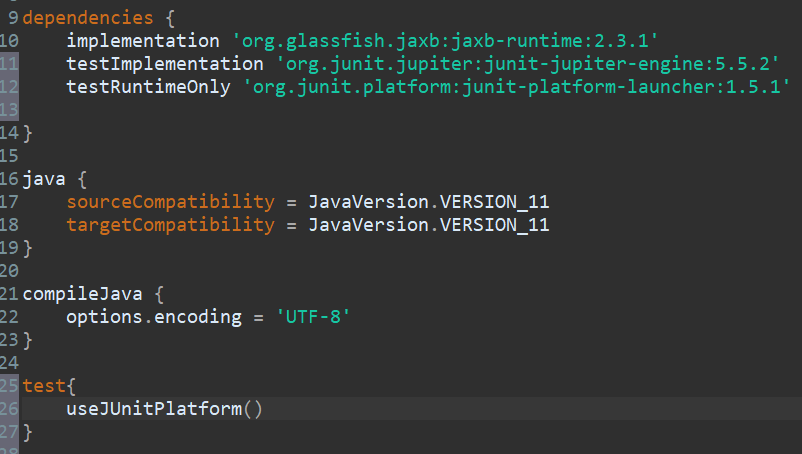

* build.gradle에서 의존성을 추가하고 test{}로 JUnit으로 테스트함을 써준다.

 

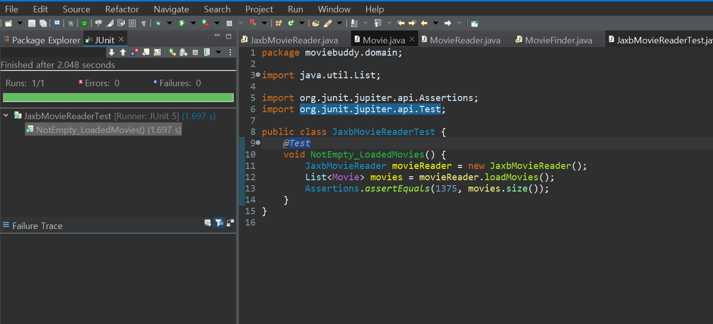

* JaxbMovieReaderTest 클래스의 코드를 위와 같이 수정한다.
* 이후 JUnit을 사용해 실행시키면 결과를 좌측에 보여준다.
* 초록색은 테스트 결과가 성공이라는 것을 의미한다.

 

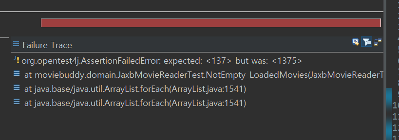

* 위는 기대값을 137 넣었지만 실제 size는 1375라 테스트가 실패한 경우이다.
* 테스트를 실패했다면 실패한 이유도 알려준다.

