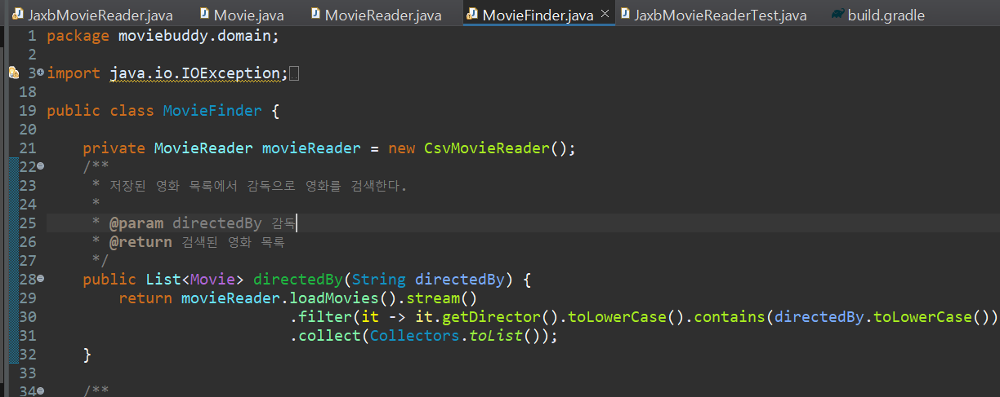
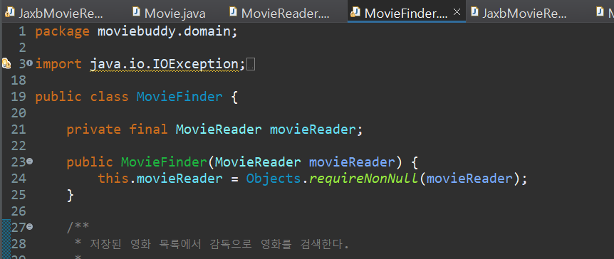
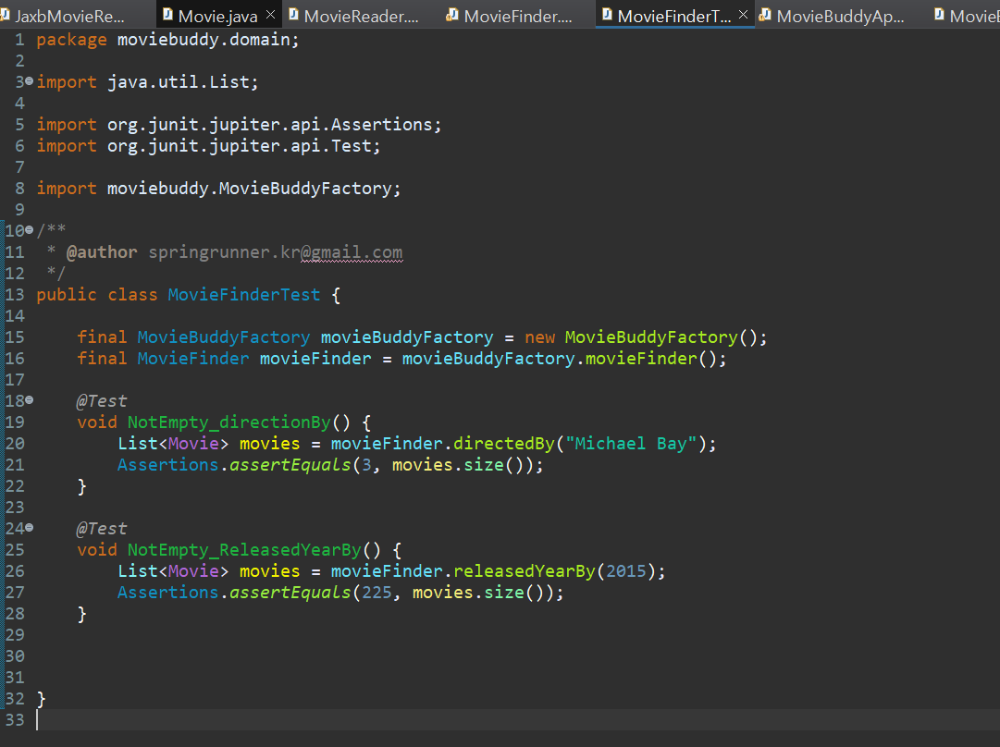

## MovieFinder 클래스의 관심사 분리

### 📌 독립적이지 않은 MovieFinder

그럼 이제 메타데이터 속성이 뭐든 확장이 편리한 코드가 되었을까? <br/>

아쉽게도 그렇진않다.<br/>

<br/>

아래는 검색어에 따라 특정 영화정보를 찾아주는 MovieFinder클래스이다.



<br/>

> private MovieReader movieReader = new CsvMovieReader();

코드를 보면 movieReader 객체를 new CsvMovieReader()로 생성하는 것을 볼 수 있다.<br/>

<br/>

만약 xml데이터로 입력받고싶다면, JaxbMovieReader()로 코드를 변경해줘야하는 번거로움이 존재한다.<br/><br/>

이 문제를 해결하기위해선 메타데이터를 읽는 전략을 결정하는 책임을 분리해야한다.

> 즉 MovieFinder 내부에서 Csv인지 Jaxb인지를 결정하지않고, 외부에서 결정하게 한다.

### 📌 MovieFinder 코드 변경



<br/>

위처럼 MovieFinder객체를 생성할 때 외부에서 movieReader를 입력받는 코드로 변경한다.

> movieReader는 필수적인 필드이므로 Objects.requireNonNull을 사용했다.

<br/><br/>

이후 MovieFinderTest클래스와 MovieBuddyApplication 클래스에서 MovieFinder객체를 생성하는 코드를 아래와 같이 수정해준다. <br/>

- `final MovieFinder movieFinder = new MovieFinder(new CsvMovieReader());`

## 중복 코드 제거

MovieFinderTest클래스와 MovieBuddyApplication 클래스 둘 다 MovieFinder객체를 생성하는 코드를 가지고있다. <br/>

중복된 코드인 동시에 객체를 생성하고 관계를 구성하는 코드 또한 하나의 관심사이기에 분리할 필요가 있다.

 <br/>

> 객체의 생성 방법을 정의하고 생성한 객체를 반환하는 역할을 하는 객체를 보편적으로 Factory라고 부른다.

### 📌 MovieBuddyFactory

`moviebuddy`안에 클래스 MovieFactory를 생성하고 코드를 작성한다. <br/>

Factory로 객체를 생성하고 생성한 객체를 반환하는 관심사를 분리한다.

```java
public class MovieBuddyFactory {
	public MovieFinder movieFinder() {
		return new MovieFinder(new CsvMovieReader());
	}

}
```

<br/> <br/>

MovieFinderTest클래스와 MovieBuddyApplication 클래스에서 MovieFinder객체를 생성하는 부분을 다음과 같이 MovieBuddyFactory에서 가져오는 것으로 바꾼다.

```java
final MovieBuddyFactory movieBuddyFactory = new MovieBuddyFactory();
final MovieFinder movieFinder = movieBuddyFactory.movieFinder();

```

## JUnit을 사용해 테스트 개선



<br/>

JUnit을 사용해 directionBy와 RealesedYearBy함수가 잘 동작하는지 확인해보자.

- 원래는 메인 메소드 안에 MovieBuddyFactory와 MovieFinder 객체를 생성하는 코드가 있었지만 두 개의 함수를 작성할 것이기 때문에 해당 코드를 함수 밖으로 빼 테스트 함수가 호출할 수 있게한다.
- 어노테이션 @Test 를 붙이고 JUnit으로 클래스를 실행하면 결과를 확인할 수 있다.
