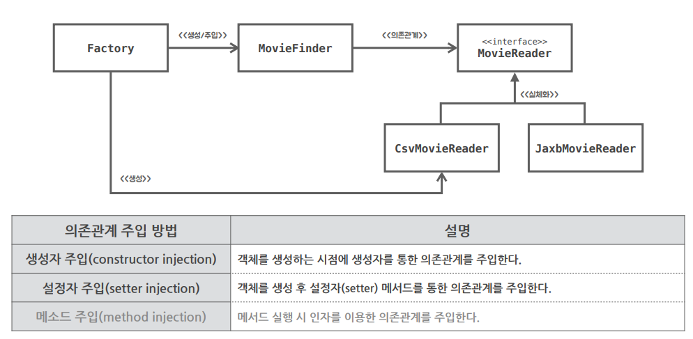

## 제어의 역전

> 말 그대로 프로그램의 제어 흐름의 구조가 뒤바뀌는 것으로 프레임워크나 서블릿 컨테이너 등에 적용된 개념이다.
>
> * 이를 적용하면 설계가 깨끗해지고 유연성, 확장성이 증가한다.
> * 특정 기술이나 환경에 종속되지 않은 보편적으로 사용되는 프로그래밍 모델이다.

  

일반적으로 자바 프로그램의 흐름은 메인 메소드와 같이 프로그램이 시작되는 지점에서 사용할 객체를 결정하고 결정한 객체를 생성하고, 생성된 객체에 있는 메소드를 호출한다. 

* 이후 호출된 객체 메소드안에서 또 다시 사용할 객체를 결정, 생성, 호출하는 흐름이 반복된다.
* ex) MovieBuddy의 메인함수가 Movie Finder를 호출 -> MovieFinder가 MovieReader를 호출
* 이처럼 모든 객체가 능동적으로 자신이 사용할 객체를 결정하고 언제 어떻게 그 객체를 만들지 스스로 관장한다.
* 모든 종류의 흐름을 사용하는 쪽에서 제어하는 구조이다.

  

**그럼 제어의 흐름 구조가 바뀌는게 뭘까?** 

이전 포스팅에서 Factory를 생성해 MovieFinder객체를 생성하게 했다. 

* MovieBuddy는 Factory가 전달해주는 MovieFinder 객체를 사용한다.
* MovieBuddy객체가 자신이 사용할 객체를 스스로 결정하지않는다.
* 제어 권한을 자신이 아닌 다른 대상, Factory에게 위임했다.
* 이런걸 제어의 흐름 구조가 바뀌었다고한다.

> 자바 프로그램을 시작하는 메인 메소드를 제외한 모든 객체는 제어 권한을 위임받는 특별한 객체에 의해 결정되고 만들어진다.

## SOLID 원칙

> 다섯가지 소프트웨어 설계 원칙

* 함수와 데이터 구조를 클래스로 배치하는 방법, 그리고 클래스를 서로 결합하는 방법으로 구성되어 있다.
* 모듈과 컴포넌트 내부 구조를 이해하기 쉽고, 변경에 유연하게 만드는데 목적을 두고 있다.

### 📌 개방 폐쇄 원칙 (OCP)

> 소프트웨어 개체는 확장에는 열려 있어야 하고, 변경에는 닫혀 있어야 한다.

ex) MovieFinder는 메타데이터 읽기라는 기능을 확장하는 데는 열려있다.

* MovieFinder에 전혀 영향을 주지않고도 MovieReader를 통해 해당 기능을 확장할 수 있다.
* MovieFinder 내부 함수등은 그런 변화에 영향을 받지 않고 유지할 수 있으므로 변경에는 닫혀 있다고 말할 수 있다.

### 📌 의존성 역전 원칙 (DIP)

ex) 코드를 리팩토링 하기 전에는 MovieFinder가 직접 CsvMovieReader를 의존하고 있었다.

* 상위 정책인 MovieFinder가 하위 정책인 CsvMovieReader에 의존중 : 이런 구조에서는 추상화된 MovieReader의 다형성이 동작하기 어렵다.
* 즉, MovieFinder가 직접 능동적으로 CsvMovieReader를 생성하고 있기 때문에 JaxbMovieReader와 같은 다른 MovieReader 구현체를 사용할 수가 없다.

> 의존성 역전 원칙이 적용된 후에 코드 구조를 보면, MovieFinder는 추상화된 MovieReader에만 의존해서 런타임의 생성자를 통해 CsvMovieReader객체를 전달받아 동작한다.
>
> * 다형성을 적극적으로 활용할 수 있으며, 재사용성이 증가한다.

## 디자인 패턴

> 소프트웨어 개발 과정에서 발견된 설계의 노하우를 정리하여 이름을 붙인 것

### 📌전략 패턴

> 필요에 따라 변경이 필요한 알고리즘을 추상화를 통해 통째로 외부로 분리시키고, 이를 구현한 구체적인 알고리즘 클래스를 필요에 따라 바꿔 사용할 수 있게 하는 디자인 패턴

ex) MovieFinder는 메타 데이터 읽기라는 기능을 MovieReader라는 인터페이스로 추상화함.

* 메타 데이터 읽기는 xml, csv로 읽는 등 변경의 여지가 있기 때문임.
* 이후 CsvMovieReader, JaxbMovieReader와 같이 구체적인 클래스를 작성해 필요에 따라 바꿔 사용할 수 있게함.

### 📌 템플릿 메소드 패턴

> 어떤 작업을 처리하는 일부분을 서브 클래스로 캡슐화해서 전체 구조는 바꾸지 않으면서도 특정 행위를 수행하는 전략만 바꾸는 패턴

ex) 상속을 통해 구현한 MovieFinder

* 합성 이전에 상속으로 MovieFinder를 리팩토링했을 때 MovieFinder내부에서 영화를 찾는 로직은 그대로 두고, 영화 목록을 얻는 loadMovies 메소드만 추상화 시켰었다.
* 이후 상속을 통해 서브 클래스에서 영화 목록을 얻는 행위를 구체적으로 작성했다. 

## 의존관계와 의존관계 주입

* 의존관계 : 어떤 객체가 동작하기 위해 다른 객체를 필요로 할 때, 두 객체 사이에 의존 관계가 형성된다.

협력을 위해 필요한 의존관계는 유지하면서도 변경을 방해하는 의존 관계는 제거해야 한다.

 

 

 

* MovieFinder와 MovieReader는 연결되어 있다.
  * 이처럼 어떤 클래스가 다른 클래스에 접근할 수 있는 경로를 가지거나 해당 클래스의 메소드를 호출하는 경우 두 클래스 사이에 의존 관계가 있다고 말한다.
* CsvMovieReader와 JaxbMovieReader는 인터페이스 MovieReader를 실체화시키고 있다.

  

MovieFinder가 메타데이터를 읽어오기 위해선 CsvMovieReader또는 JaxbMovieReader가 필요하다.

*  MovieFinder는 실행시 CsvMovieReader또는 JaxbMovieReader에 의존한다.
* 그러나 코드 수준에서 MovieFinder는 MovieReader에 의존하고 있다.
* 즉, 코드 시점의 의존 관계와 실행 시점의 의존 관계가 다르다.
  * == 클래스(코드상) 사이의 의존 관계와 객체(실행시) 사이의 의존 관계는 다를 수 있다.

> 덕분에 MovieFinder는 MovieReader에게 영화 메타데이터 읽기라는 같은 메시지를 전달하나, 전달받는 객체가 CsvMovieReader냐, JaxbMovieReader냐에 따라 다른 읽기 기능을 수행할 수 있다. (다형성)

 

의존관계 주입 : 생성과 사용을 분리하면서 MovieFinder에는 오로지 MovieReader를 사용해 영화를 검색하는 책임만 남게 되었다.

* 외부의 다른 객체가 MovieFinder에게 MovieReader를 생성해 전달해야한다는 것을 의미한다.
* 이처럼 외부의 독립적인 존재가 객체를 생성한 후, 이를 전달해서 의존 관계를 해결하는 방법을 의존관계 주입이라고 한다.
