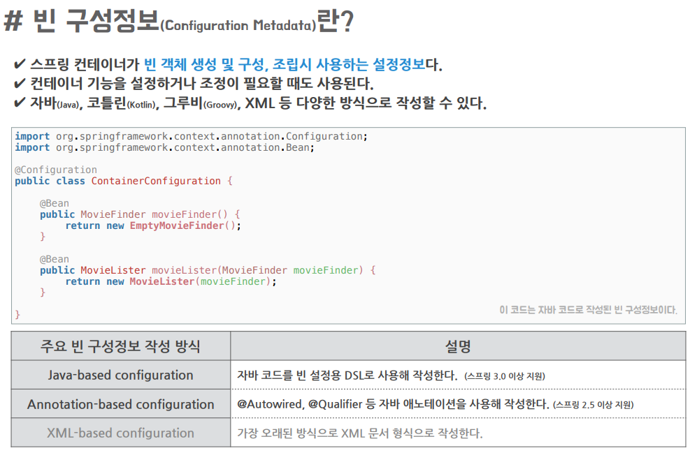
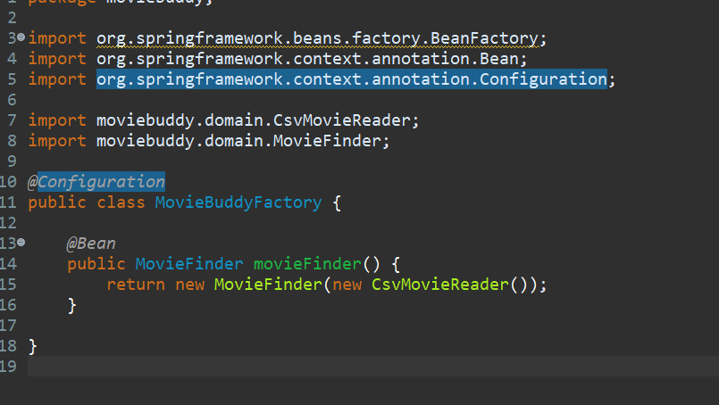
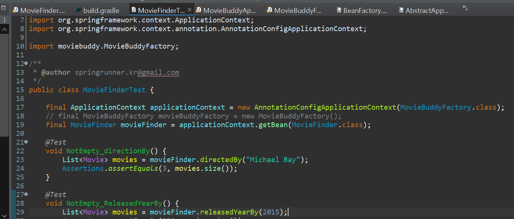

## 스프링 IoC 컨테이너와 빈

> 스프링 애플리케이션에는 객체의 생성, 의존관계 설정, 사용, 제거 등의 작업을 애플리케이션 코드 대신 독립된 컨테이너가 담당한다. <br/>
>
> 컨테이너가 코드 대신 객체에 대한 제어권을 가지고 있다고 해서 IoC라고 부른다. (그래서 스프링 컨테이너를 IoC 컨테이너라고 한다.)
>
> - IoC (Inversion of Control)

<br/>

- 스프링 IoC 컨테이너 : 제어의 역전 원칙에 따라 객체의 생성, 의존관계 주입과 같은 기능을 제공하는 IoC 컨테이너이다.
- 빈(Bean) : 스프링 컨테이너가 생성과 관계설정, 사용 등을 제어해주는 제어의 역전 원리가 적용된 객체를 빈이라한다.

- ApplicationContext : 빈팩토리(Bean Factory)의 특징을 그대로 가지고 있으면서 동시에 스프링 AOP 통합과 국제화 지원, 이벤트 기반 또는 웹 애플리케이션을 지원하는 인터페이스. 빈을 생성하고 관리한다. (BeanFactory인터페이스 내부에는 getBean이라고 빈을 생성하는 메소드가 존재한다.)

### 📌 빈 구성정보



- 스프링 IoC 컨테이너의 기본적인 업무는 빈 구성 정보를 읽고, 빈을 생성하고, 이를 관리하는 것이다.

- 이 때 컨테이너가 필요로 하는 빈 구성정보는 빈이 어떻게 만들어지고 어떻게 동작하게 할 것인가에 대한 설정 정보이다.

- 스프링은 빈 구성정보를 읽고 내부적으로 BeanDefinition이라는 인터페이스로 추상화된 객체를 만들어 사용한다. 스프링 IoC 컨테이너는 Bean Definition으로 만들어진 객체를 사용해 애플리케이션을 구성한다.
  - 그러므로 빈 구성정보는 특정한 파일 포맷이나 형식에 제한되거나 종속되지 않는다.

## 스프링 Ioc 컨테이너를 직접 생성해보자!

기존에 생성했던 `MovieBuddyFactory`클래스를 ApplicationContext로 바꿔보자.

(ApplicationContext == 빈 팩토리의 특징을 그대로 가지고 있는 인터페이스)

<br/><br/>

### 📌 1. dependency 추가

```java
implementation 'org.springframework:spring-context:5.3.9'
implementation 'org.springframework:spring-context-support:5.3.9'
```

build.gradle에 위 두개의 의존성을 추가해준다.

### 📌 2. 주석을 사용해 빈 구성

`MovieBuddyFactory`를 빈클래스로 바꾸기 위해 다음 주석을 붙여준다.



- 빈 등록을 위해 클래스 상단에 @Configuration 주석을 붙여준다.
- 내부 메소드에 @Bean을 붙여준다.

> 스프링 컨테이너는 @Configuration이 붙어있는 클래스를 자동으로 빈으로 등록해주고, 해당 클래스를 파싱해서 @Bean이 있는 메소드를 찾아서 빈을 생성해준다.<br/>
>
> 참고 블로그 : https://mangkyu.tistory.com/234 (@Configuration에 대해 자세하게 설명해주심)

<br/>

### 📌 3. ApplicationContext를 사용해 객체를 생성



`MovieFinderTest`와 `MovieBuddyApplication`에서 MovieBuddyFactory객체와 MovieFinder객체를 생성하는 부분을 변경해준다.<br/><br/>

- 방금 생성한 ApplicationContext 객체를 생성한다.
  - AnnotationConfigApplicationContext함수를 사용해 생성하고, MovieBuddyFactory클래스가 필요하므로 인자로 MovieBuddyFactory클래스를 넣어준다.
- MovieBuddyFactory클래스를 사용해 ApplicationContext를 생성했으므로, MovieBuddyFactory내부의 빈이었던 MovieFiner객체를 ApplicationContext의 getBean함수로 생성할 수 있다.

> 이로써 객체의 생성과 제어를 ApplicationContext를 사용해 한 번에 구현할 수 있게 되었다!
