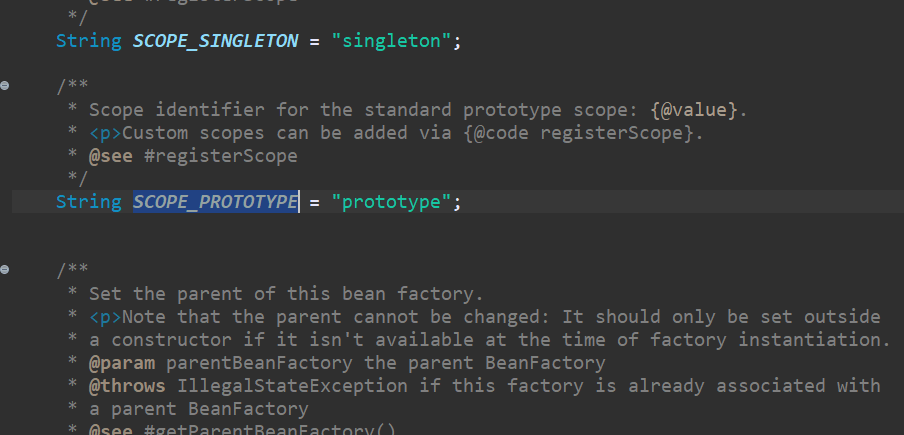

## 자바 코드로 의존관계 주입

### 1. 메소드 콜

> 말 그대로 메소드를 호출해서 의존 관계를 주입한다.

### 2. 메소드 파라미터

> 말 그대로 파라미터로 넘긴다.

* movieFinder를 생성할 때, 인자에 있는 MovieReader를 보고 빈 내부에 MovieReader 빈이 들어가 있는지 찾고 넣는다.

### 빈 스코프

> 스프링 컨테이너는 빈을 생성할 때 단 하나의 빈을 만들지, 아니면 빈이 요청 될 때마다 새로운 빈 객체를 생성할지 결정하는 메커니즘을 가지고 있다. 이 메커니즘을 "빈 스코프"라고 한다.

 

* 단 하나의 빈 객체만 만들 때는 싱글톤 스코프라고 부른다. (디폴트값)
  * 해당 빈을 의존하는 모든 빈에 유일한 객체를 공유한다.

 

* 빈이 요청될 때마다 새로운 빈을 생성할 때는 프로토타입 스코프라고 부른다.

#### 📌 싱글톤 테스트

스코프의 디폴트값은 싱글톤이므로, 여러 빈 객체를 부를때, 하나의 빈 객체만이 사용됐는지 테스트해보자!

위 코드는 테스트를 위해 만든 BeanScopeTest 클래스이다.  

먼저 만든 빈 객체인 movieFinder와 다른 빈 객체가 같은 것인지 확인해보는 코드이다. 

테스트 실행 결과를 보면 두 객체가 같은 객체임을 알 수 있다.  

#### 📌 프로토타입 테스트

프로토타입을 테스트 해보기전에, 빈의 스코프를 프로토타입으로 변경해주자.

 

주석 `@Scope`를 통해 프로토타입 스코프를 설정해준다.

> `ConfigurableBeanFactory` 클래스를 정의한걸 보면
>
> 
>
> `ConfigurableBeanFactory .SCOPE_PROTOTYPE`이 단순히 문자열 "prototype"인걸 알 수 있다.  
>
> 그러므로 `@Scope("prototype")`이라고 해도 무방하긴하다.

  

코드를 수정했으니 테스트를 해보자!

두 객체가 같지 않으므로 테스트를 실패하는 것을 볼 수 있다.

## 빈 구성정보 조합하기

자바 코드로 작성하는 빈 구성 정보는 관심사가 같은 컴포넌트들을 함께 묶어 모듈화가 가능하다. 

따라서 여러 개의 빈 구성 정보를 작성하고 조합을 할 수 있다.

  

 

* `DomainModuleConfig`와 `DataSourceModuleConfig`라는 두 개의 빈 구성정보를 추가한다.
* `MovieBuddyFactory` 내부에 있던 빈 두 개를 각각에 옮겨준다.

* @Import는 다른 클래스에서 빈 구성 정보를 불러오기 위해 사용한다.

> 만약 xml형식으로 작성된 빈 구성 정보가 있다면 @ImportResource("xml파일위치")로 주석을 붙이면 된다.

 

위처럼 빈 구성정보를 조합할 수 있다!
