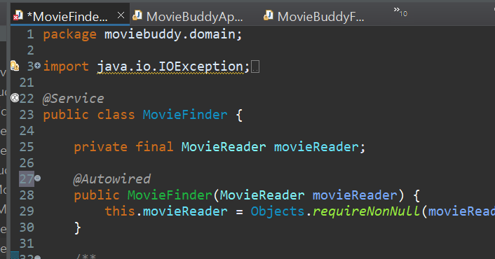
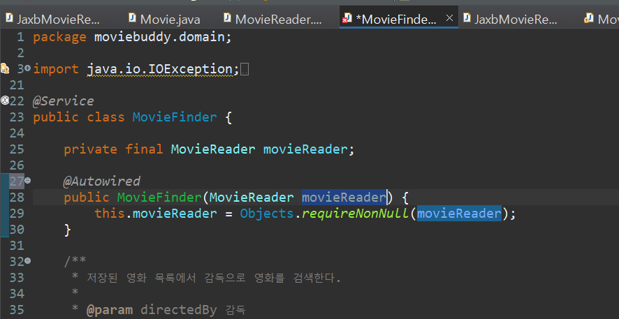

## 자동 클래스 탐지로 빈 등록

> `@ComponentScan`으로 자동 클래스 탐지 기능을 활성화할 수 있다!

<br/>

* MovieBuddyFactory 클래스에 `@ComponentScan`  주석을 단다.
* MovieBuddyFactory 클래스 내부에 작성했던 CsvMovieReader를 리턴하는 클래스를 지운다.
* CsvMovieReader 클래스에 `@Component` 주석을 붙인다.
  * CsvMovieReader 클래스가 자동으로 빈 등록된다.

<br/>

<br/>

`@ComponentScan`으로 자동 클래스 탐지 기능을 활성화하면, 지정된 패키지 경로에서 Component 애노테이션과 같이 스테레오타입으로 선언된 클래스를 찾아 빈으로 등록하고 관리한다.<br/>

> 패키지를 지정하지 않으면 ComponentScan 애노테이션이 선언된 클래스를 기준으로 탐색한다. (MovieBuddyFactory를 기준으로 탐색)
>
> * MovieBuddyFactory는 `moviebuddy`패키지에 위치하고 있다.
> * `moviebuddy` 패키지를 포함해, 그 하위인 `moviebuddy.domain`, `moviebuddy.util`과 같은 하위의 모든 패키지를 대상으로 자동 클래스 탐지 기법이 동작한다.


#### 📌 ComponentScan에 패키지를 지정하려면?

```java
@ComponentScan(basePackages = {"moviebuddy"})
```

위처럼 패키지명을 적어준다.

> `@ComponentScan(basePackages = {"moviebuddy.util"})` 이라고 하면 작동하지않는다. <br>
>
> * 현재 moviebuddy.util아래는 FileSystemUrils.java 클래스밖에 없는데, MovieBuddyFactory는 `MovieFinder`와 `MovieReader`(Csv or Jaxb) 이렇게 두 가지의 빈 구성정보가 필요하기 때문이다.


### 다른 애노테이션들

`@Component` 외에도 `@Controller`, `@Repository`, `@Service` 등의 어노테이션들로 빈을 정의할 수 있다. (org.springframework.stereotype)

*  `@Service` : 다른 빈이 필요로 하는 서비스를 제공하는 보다 복잡한 비즈니스 기능을 가진 빈을 정의하는데 사용된다.

* `@Repository` : 데이터베이스와 같이 데이터 접근 기술이 사용되는 빈을 정의하는데 사용된다.

  > CsvMovieReader클래스또한 파일에 접근함.  @Component대신 @Repository를 붙여도 정상적으로 동작한다.


## 자동으로 의존관계 해결 (자동 와이어링 기법)

> @Autowired를 사용해 자동으로 의존관계를 주입할 수 있다.

<br/>

* MovieBuddyFactory에 있는 MovieFinder클래스를 지운다. : 직접 빈을 등록하는 코드가 다 사라짐
* MovieFinder.java에 아래와 같이 주석을 붙인다.



<br/>

* MovieFinder객체는 @Service로 인해 스프링 컨테이너에 의해 자동으로 발견되고 컨테이너에 등록된다.
* 이후 스프링 컨테이너는 MovieFinder빈을 등록하는 과정에서 생서자에 붙어 있는 @Autowired를 인식하고 필요한 의존 관계를 주입해준다. : 빈을 컨테이너에 자동으로 등록

> 생성자가 하나라면, @Autowired를 생략해도 된다. 사실 MovieFinder에서도  생성자가 하나이므로  @Autowired를 안써도된다.


## 같은 타입의 빈이 두 개 이상?

JaxbMovieReader에도 @Repository를 붙여 빈 등록을 해주자!<br/>

결과는...?! 실행 실패...

* MovieReader 타입의 빈이 두 개 이상 찾아졌기때문! (Csv & Jaxb)


### 🛠 자동 와이어링 기법 과정

* 처음은 타입을 기반으로 해당하는 빈을 찾아서 의존 관계 주입을 먼저 해결
* 같은 타입의 빈이 두 개 이상이라면, 이름으로 의존 관계를 구성함



> MovieFinder를 보면 MovieReader 객체의 이름이 `movieReader` 인걸 알 수 있다.<br/>

<br/>

* 등록하고싶은 MovieReader에 (Csv or Jaxb) 주석을 다음과 같이 수정한다.

  ```java
  @Repository("movieReader")
  ```

<br/>

* 또는, MovieFinder.java에서 정해줄수도 있다.

  ```java
  public MovieFinder(@Qualifer("csvMovieReader") MovieReader movieReader) {
  	this.movieReader = Objects.requireNonNull(movieReader);
  	}
  ```

  > 클래스 이름은 CsvMovieReader 이지만 빈으로 등록될때 맨 첫글자가 대문자에서 소문자로 변경된다.

