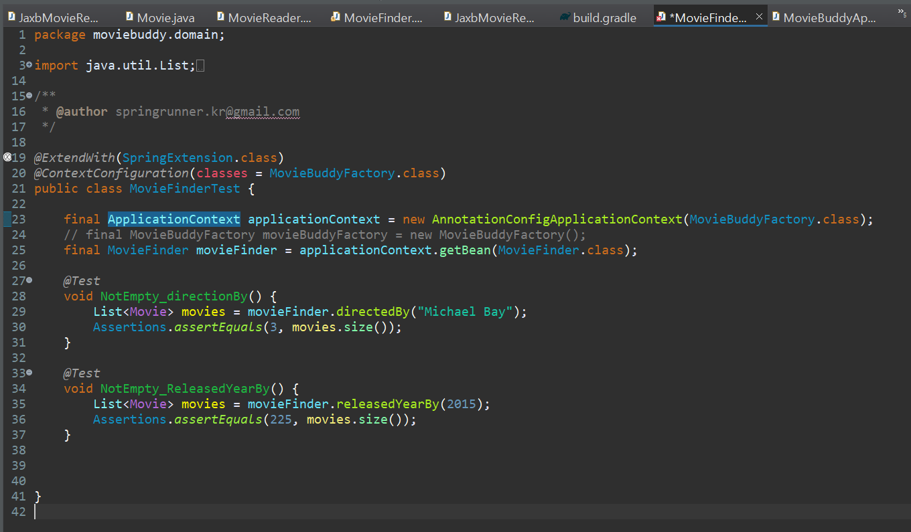
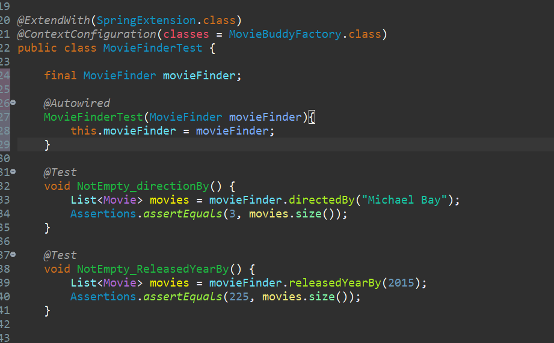
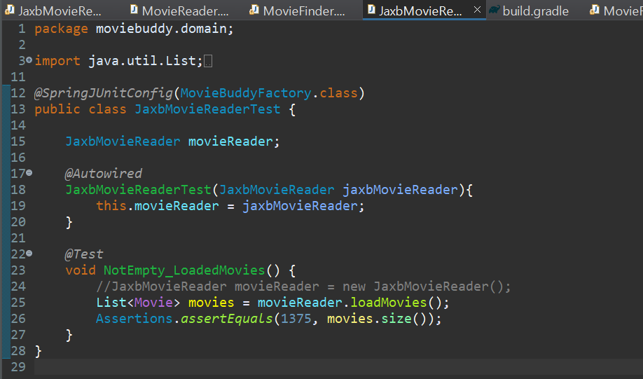

## 스프링 테스트 컨텍스트 프레임워크

> 테스트에 사용되는 스프링 컨테이너를 생성 및 관리하고 테스트에 적용해주는 기능을 가진 테스트 프레임워크

* JUnit 또는 TestNG와 같은 자바용 테스트 프레임워크와 잘 통합되어 동작한다.
* 실 운영환경과 유사한 구성으로 동작하는 통합 테스트를 손쉽게 만들 수 있다.


## 스프링 테스트 컨텍스트 프레임워크를 사용해보자!


### 📌 의존성 추가

`build.gradle`에 `testImplementation 'org.springframework:spring-test:5.3.9'` 의존성을 추가한다.


### 📌 어노테이션 추가

`MovieFinderTest.java`를 스프링 테스트로 바꿔보자!<br/>

클래스 `MovieFinderTest` 위에 어노테이션 두 개를 추가한다. <br/>

```java
@ExtendWith(SpringExtension.class)
@ContextConfiguration(classes = MovieBuddyFactory.class)
```



<br/>

* `ExtendWith`는 JUnit이 테스트 실행 전략을 확장할 때 사용하는 어노테이션이다. 
  * 안에 인자로 들어간 SpringExtension클래스는 스프링 테스트 컨텍스트 프레임워크에서 지원하는 JUnit 지원 클래스로, JUnit이 테스트를 실행하는 과정에서 테스트가 필요로 하는 스프링 컨테이너를 구성하고 관리해준다.

<br/>

* `ContextConfiguration`이 지정되어있다면, 해당 어노테이션이 지정한 빈 구성정보를 바탕으로 스프링 컨테이너를 만든다.


> 사실 @SpringJUnitConfig(MovieBuddyFactory.class)로 위 두 개의 어노테이션을 대체할 수 있다.<br/>
>
> * @SpringJUnitConfig안에서 @ExtendWith와 @ContextConfiguration를 정의하고 있기 때문.

### 📌 의존 관계 주입

* 이제 스프링 테스트 컨텍스트 프레임워크에 의해서 어플리케이션 컨텍스트 (=스프링 컨테이너)가 생성될 것 이기 때문에 직접 어플리케이션 컨텍스트를 생성하는 코드는 지운다.
* 어플리케이션 컨텍스트 코드를 지웠기때문에, 스프링이 제공하는 의존 관계 주입 기능을 활용해서 필요한 의존 관계를 취득하면 된다.

* `@Autowired`를 생성자 레벨, 세터 레벨, 필드에도 적용할 수 있다.


#### 1️⃣ 생성자를 통해 의존 관계 주입

* 의존 관계 주입 방법 중, 생성자를 통해 주입 받는 방식을 사용해보자. (@Autowired)




#### 2️⃣ 세터 메소드를 통해 의존 관계 주입

* movieFinder의 final 키워드를 없애고

* 생성자를 지우고 아래 세터 메소드를 생성한다.

  ```java
  @Autowired
  void setMovieFinder(MovieFinder movieFinder){
      this.movieFinder = movieFinder;
  }
  ```


#### 3️⃣ 필드 레벨에서 의존 관계 주입

* 앞서 생성한 세터 메소드도 지우고
* `@Autowired MovieFinder movieFinder`와 같이 movieFinder 필드 앞에 어노테이션을 붙여서 필드 레벨에서 바로 의존 관계를 주입할수도 있다.

> 그러나 필드 레벨에서 의존 관계를 주입하는 것은 지양하라고 한다.<br/>
>
> 테스트를 하는게 힘들어진다고 한다...

<br/>


## JaxbMovieReaderTest도 스프링 테스트로 바꿔보자



<br/>

* MovieBuddyFactory로 MovieFinder, CsvMovieReader, JaxbMovieReader를 생성할 수 있다.
* 타입을 JaxbMovieReader로 정해줬으므로 자동와이어링이 잘 수행된다.
