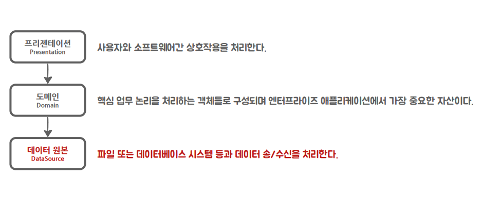
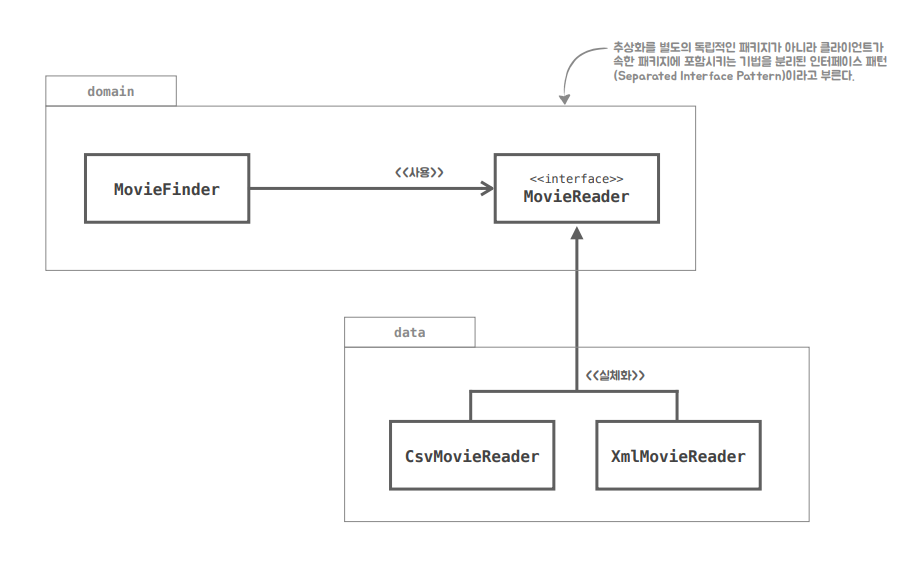
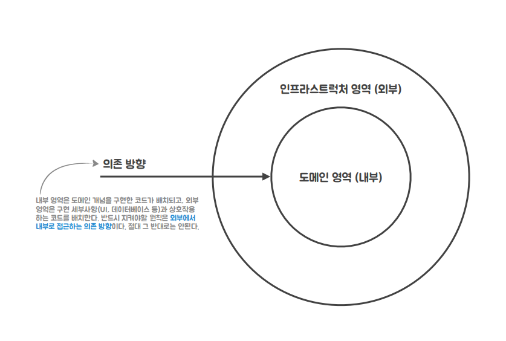

## 데이터 원본 계층

엔터프라이즈 애플리케이션의 계층은 보편적으로 `프레젠테이션`, `도메인`, `데이터 원본`계층으로 나뉜다. 

   

도메인 계층을 구체적인 세부 기술로부터 보호하기 위해 영화 메타데이터 파일을 다루는 객체를 데이터 원본 계층으로 분리할 필요가 있다.

- 영화 메타데이터 파일을 다루는 CsvMovieReader와 , JaxbMovieReader를 옮겨보자!

## 데이터 원본 계층을 위한 패키지 생성

- `moviebuddy.data`라는 패키지를 만들고 데이터(파일)과 관련된 클래스인 `MovieReader`, `CsvMovieReader`, `CsvMovieReader` 세 가지 소스를 해당 패키지로 옮기자.

### 🤔 잘 분리한걸까?

NO! 

현재 MovieFinder와 CsvMovieReader, CsvMovieReader는 모두 추상화된 MovieReader 인터페이스에 의존하고 있다!

> 음, 개방 폐쇄 원칙을 준수하고 의존성 역전 원칙도 잘 따르고 있구나! 유연하고 재사용가능한 코드이다!

  

**하지만 domain 패키지만 배포 후 재사용하겠다고 한다면 domain 패키지의 MovieFinder가 data패키지의 MovieReader에 의존하고 있기때문에 재사용이 불가능하다!**

> domain 패키지를 사용하기 위해선 data패키지또한 필요하기에, 두 패키지는 항상 함께 배포가 되어야한다... 
>
> 또한 data 패키지에서 변경이 일어나면 domain 패키지도 영향을 받는다.

  

위 문제는 `MovieReader`를 data 패키지에 위치시켰기에 발생한 문제이다. 그럼... `MovieReader`를 다시 domain 패키지로 이동시킨다면?

### 😃 MovieReader를 다시 domain 패키지로!

이처럼 추상화를 별도의 독립적인 패키지가 아니라 클라이언트에 속한 패키지에 포함하는 구조를 "분리된 인터페이스 패턴"이라고 부른다.

- MovieFinder와 MovieReader를 하나의 패키지 안에 모으면서 domain 패키지를 완벽하게 독립시킬 수 있다.
- 성격이 다른 MovieReader가 필요하다면(Csv나 Jaxb), 다른 패키지를 추가하고 새로운 MovieReader 구현체를 만들면 상위 수준의 협력 관계를 재사용할 수 있다.

> 이렇듯 의존성 역전 원칙에 따라 상위 수준의 협력 흐름을 재사용하기 위해서는 추상화가 제공하는 인터페이스의 소유권 역시 역전시켜야한다.

### 📌 외부에서 내부로 접근하는 의존 방향

- **소프트 웨어의 구조적 가치 : 변경하기 쉬운 소프트웨어를 만드는 것**

  > 소프트 웨어를 변경하기 쉽게, 유연하게 하기 위해서는 선택 사항을 가능한 많이, 가능한 오랫동안 열어 두어야한다.

   

- **열어 두어야할 선택사항이란?\***
  - 상대적으로 중요하지않은 구현 세부 사항을 의미한다.

 

- **소프트웨어를 구성하는 두 가지 요소**
  - `정책` : 모든 업무 규칙과 업무 절차를 구체화 한 것. 소프트웨어의 핵심가치
  - `구현 세부사항` : 입출력 장치, 데이터베이스 등 시스템을 사용 또는 구동하는데 필요한 것. 정책과 소통할 때 필요한 요소지만, 정책이 가진 행위에는 조금도 영향을 미치지 않는다.

  

 

- 내부 : 핵심 도메인 개념을 구현한 코드를 배치 ex) MovieFinder
- 외부 : 입출력 장치나 데이터베이스 등의 구체적인 기술을 사용하는 구현 세부 사항과 상호작용하는 코드를 배치 ex) CsvMovieReader, JaxbMovieReader

> 내부의 핵심적인 코드들을 외부의 기술적인 부분들과 분리시키는 것이 핵심!
>
> - 이렇게 분리를 시키면 테스트 하기 쉽고, 변경하기도 쉽다.

## 스프링의 본질과 개발자의 역할

객체 지향에서 가장 중요한 것은 애플리케이션의 기능을 구현하기 위해서 협력에 참여하는 객체들 사이의 상호 작용이다.

- 객체들은 협력에 참여하기 위해 역할을 부여받고 역할에 적합한 책임을 수행한다.
- 스프링은 어떻게 객체가 설계되고, 어떻게 관계를 맺고 사용되는지에 관심을 두는 프레임워크이다.

 

개발자의 역할은 객체를 어떻게 설계할지, 분리할지, 개선할지, 어떤 의존 관계를 가질지를 결정한다.
