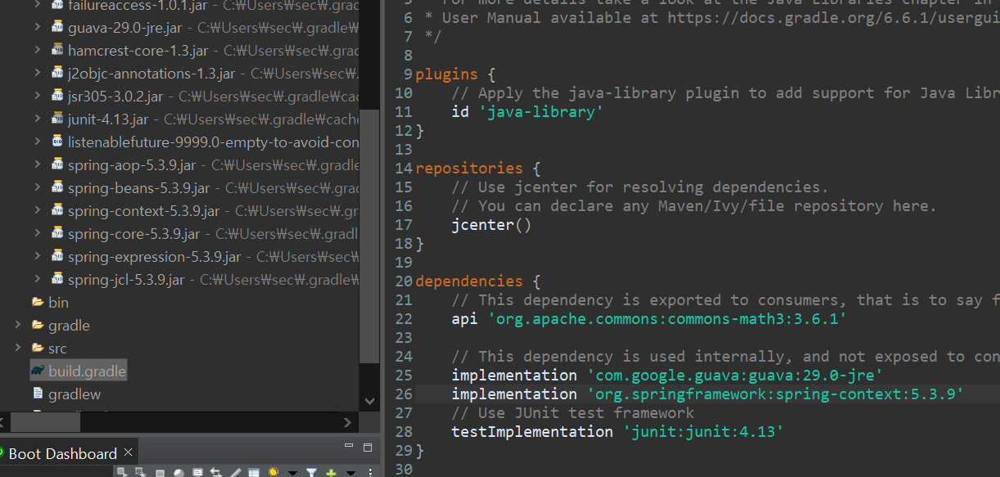

## 스프링 실습전에 알고가자!

### 그레이들

빌드툴의 일종이다.

* Maven의 표준 디렉터리 구조를 따르고 있다.

 

#### 📌 그레이들의 의존성 관리와 전이 의존성

> 그레이들은 의존 라이브러리를 관리할 수 있는 기능을 제공한다.

유저가 의존성을 직접 관리하는 것은 복잡하다. 

그레이들을 사용하면 주요 의존성만으로 관련성 있는 스프링 모듈과 서드파티 라이브러리가 모두 자동으로 사용된다. 

* 전이 의존성 : 의존성 그래프를 따라 자동으로 하위 의존성을 사용하는 것

> 하단의`Gradle Tasks` -> `help` -> `dependencies` 를 더블클릭하면 콘솔창에서 의존성 그래프를 볼 수 있다.

  

#### 📌 직접 그레이들의 의존성 관리를 이용해보자!

* 그레이들 프로젝트인 `moviebuddy` 프로젝트를 생성한다.

* `moviebuddy` 프로젝트에 `spring-context`모듈을 추가해보자!

  * `spring-context` 모듈은 내부적으로 `spring-core`, `beans`, `aop`, `expression`, `jcl`모듈을 사용하고 있다.

  

  > build.gradle파일에 `spring-context`모듈을 추가하면, 내부 모듈들도 같이 추가되는 것을 볼 수 있다.

## 프로젝트 실행

### 그레이들로 프로젝트 실행

그레이들 프로젝트를 깃허브에서 클론해온뒤  

* cmd 를 켜고 해당 프로젝트 파일이 있는 곳으로 이동
* cmd에 `gradle build`를 입력
  * windows에서는 ./gradle.bat build를 해야한다고 하는데 어째선지 나는 전자는 되지않고 gradle build라고 해야 됐다...
* ls를 하면 build라는 폴더가 생긴걸 볼 수 있다. `unzip build/distributions/moviebuddy.zip -d build/`를 입력해서 해당 폴더를 압축해제한다.
* `build/moviebuddy/bin/moviebuddy`를 입력하면 프로젝트가 실행된다.

### STS에서 프로젝트 실행

* MovieBuddyApplication.java에 들어가서
* 우클릭 -> `Run As` -> `2 Java Application`을 누르면 실행된다.

## 프로젝트 구조

`src/main/java` -> `moviebuddy`안을 보면

* ApplicationException.java
* Movie.java
* MovieBuddyApplication.java

총 세가지의 클래스가 있다. 

### ApplicationException.java

`moviebuddy` 애플리케이션이 동작하는 과정에서 오류가 있을 때, 그 오류를 예외 객체로 잡아서 외부에 전파하기 위해서 사용이 된다.

### Movie.java

영화의 정보를 담기 위한 속성들로 구성된 모델 클래스. 

영화의 제목, 장르, 언어, 국가 등의 정보들로 구성됨. 영화를 시청한 날짜도 기록 가능.

### MovieBuddyApplication.java

애플리케이션의 주요 로직이 담겨있음. 

* entry point인 main 메소드를 가지고 있다.
* main 메소드가 호출되면, MovieBuddyApplication 클래스를 생성하고 run 메소드를 호출하도록 구성되어있다.
* run 메소드에는 애플리케이션의 핵심 로직들이 담겨있다.

#### run method

* running : 애플리케이션 동작을 제어하는 플래그
* input : 유저 입력
* output : 수행 결과 
* commandAction : 명령어별로 실행할 로직을 정의하고 있는 곳 (key가 명령어이고, value가 명령이 실행될 로직)
