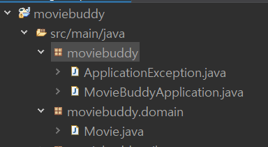
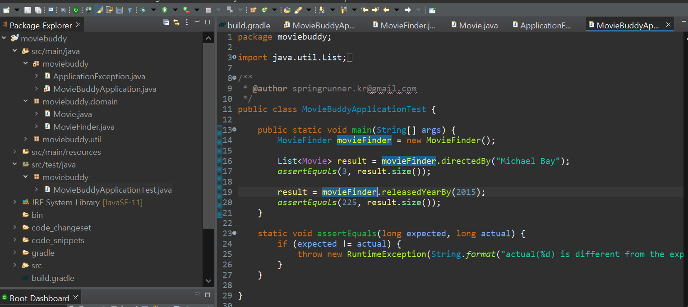
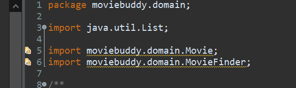
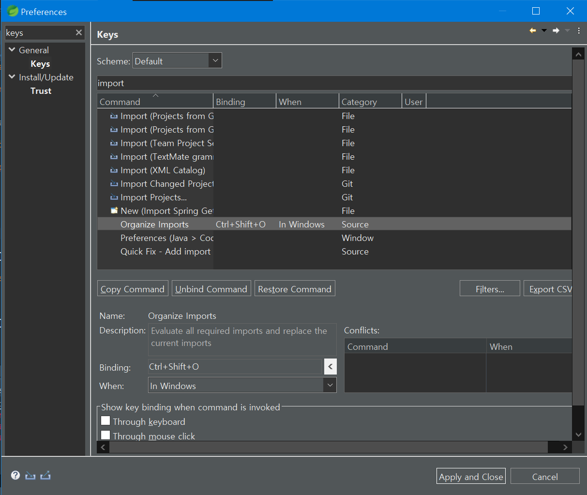

## 관심사의 분리 & 계층화

> Spring은 객체 지향 프로그래밍을 지향한다.
>
> 기능(관심)별로 객체를 분리하는 것을 `관심사의 분리`라고 한다.

 

- 관심이 같은 것을 한 곳으로 모으고 다른 것은 따로 떨어뜨려 서로 영향을 주지 않도록 분리한다.
- 복잡한 소프트웨어를 계층으로 나눔으로써 관심사를 분리한다.
- 앤터프라이즈 애플리케이션은 크게 3가지로 계층을 나눈다. (필요에 따라서 더 세분화된 계층을 가질 수도 있다.)

### 프레젠테이션

- 사용자와 소프트웨어간 상호작용을 처리한다.

- HTML기반 웹 UI나 모바일 앱으로 만들어지는 경우가 가장 많다.
- 데스크톱이나 명령줄 기반 클라이언트도 있다.
- 사용자에게 정보를 표시하고 사용자가 입력한 명령을 도메인과 데이터 원본에서 수행할 수 있는 작업으로 해석한다.

> ex) 유저 명령을 받고, 요청한 영화 목록 결과를 출력

### 도메인

- **핵심 업무 논리를 처리하는 객체들**로 구성되며 엔터프라이즈 애플리케이션에서 가장 중요한 자산이다.
- 비즈니스 논리라고도 부른다.

> ex) 영화 메타데이터를 읽고 검색

### 데이터 원본

- 파일 또는 데이터베이스 시스템등과 데이터 송/수신을 처리한다.
- 메시징 솔루션, 다른 엔터프라이즈 애플리케이션 등의 다른 시스템과 통신하며 데이터를 조회하거나 저장하는 등의 처리를 한다.

## 도메인 관심사를 분리해보자

`moviebuddy` 프로젝트의 도메인 관심사 두 개를 분리해보자!

- 사용자 명령을 입력받아 비즈니스 로직을 실행하고 결과를 출력하는 관심사 (프레젠테이션)
- csv 파일로 작성된 영화 메타데이터를 읽어 들인 후 조건에 맞는 영화를 검색하는 관심사

#### 📌 도메인 패키지를 생성하고, 도메인에 관련되어 있는 클래스인 `Movie` 클래스를 이동시킨다.

- moviebuddy에서 우클릭 -> `New` -> `Pakage`로 패키지 생성
- 생성한 패키지 moviebuddy.domain으로 `Movie`클래스를 옮긴다.

#### 📌 Moviebuddy.domain안에 MovieFinder클래스를 생성한다.

> 도메인에는 애플리케이션의 핵심로직을 처리하는 객체를 넣는다.

- 영화 목록을 불러들이고 영화를 검색하는 코드를 도메인으로 이동시킨다.

- `MovieFinder`라는 클래스를 생성하고 `MovieBuddyApplication`에 있는 loadMovies, directedBy, releasedYearBy메소드를 이동시킨다.
- `MovieBuddyApplication`에 있는 `run` method 아래에 `final MovieFinder movieFinder = new MovieFinder();` 코드를 작성해 MovieFinder객체를 생성한다.
- `MovieBuddyApplication`의 directedBy, releasedYearBy메소드를 호출하는 부분을 MovieFinder.directedBy와 같은 형식으로 바꾼다.

- src/test/java아래의 `MovieBuddyApplicationTest.java`클래스도 비슷하게 변경해준다.

> **굳이 안해도 되지만 추가적으로 할 것** 
>
> 클래스 이름도 MovieFinderTest로 변경해준다.
>
> - 클래스 이름에서 우클릭 후 `Refactor` -> `Rename`을 누른 뒤 변경후 이름 바운더리 밖에서 엔터를 치면 변경 창이 나오고 클래스명이 변경된다.
>
> test 클래스도 new pakage를 통해 도메인 폴더를 만들고 옮겨준다.

 

#### 📌 부록

- 사용하지않는 클래스들이 import 된 것을 볼 수 있다.
- import 최적화는 단축키 `ctrl` + `O` +`shift`를 통해 할 수 있다.
- 단축키는 preference에서 확인해볼 수 있다.

 

> 자동완성 단축키는 ctrl+space
