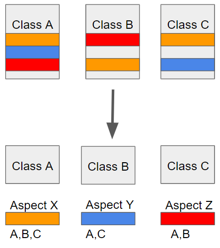
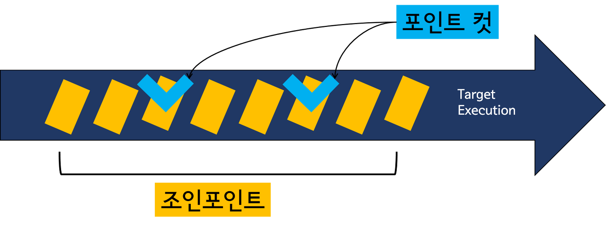
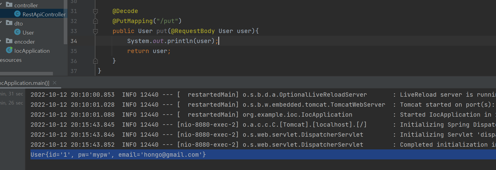
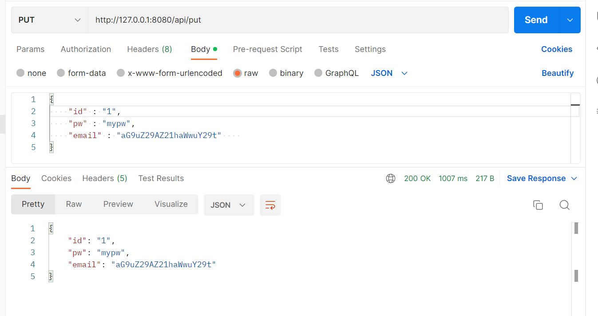

## AOP (Aspect Oriented Programming )

AOP는 Aspect Oriented Programming의 약자로 관점 지향 프로그래밍이라고 불린다. 

* 관점 지향은 쉽게 말해 어떤 로직을 기준으로 핵심적인 관점, 부가적인 관점으로 나누어서 보고 그 관점을 기준으로 각각 모듈화하겠다는 것이다. 여기서 모듈화란 어떤 공통된 로직이나 기능을 하나의 단위로 묶는 것을 말한다.
* 핵심적인 관점은 어플리케이션의 핵심 비즈니스 로직이 되고,
* 부가적인 관점은 로직을 실행하기 위해서 행해지는 DB연결, 로깅, 파일 입출력등을 예시로 들 수 있다.

<br/>



AOP에서 각 관점을 기준으로 로직을 모듈화한다는 것은 코드들을 부분적으로 나누어서 모듈화하겠다는 의미이다. **이 때 소스 코드상에서 다른 부분에 계속 반복해서 쓰는 코드들이 발견되는데 이를 흩어진 관심사(Crosscutting Concerns)라고 한다.**

* ex) 여러 개의 클래스에서 같은 인코딩 코드가 존재함.
* ex) 여러 개의 클래스에서 동일한 파라미터를 입력받음.

<br/>

>  이처럼 흩어진 관심사를 Aspect로 모듈화하고 핵심적인 비즈니스 로직에서 분리하여 재사용하는 것이 AOP의 목적이다. 비즈니스 로직을 다루는 클래스에서는 로직만을 수행하게 하고, 부가적인 기능은 AOP가 관리하도록 한다.


### 📌 스프링 AOP 특징

* **스프링 빈에만 AOP를 적용 가능하다.** 때문에 AOP를 적용할 클래스에는 @Component 를 적용해야한다.

* 프록시 패턴 기반의 AOP 구현체가 사용된다. 프록시 객체를 쓰는 이유는 접근 제어 및 부가기능을 추가하기 위해서임...

* 모든 AOP 기능을 제공하는 것이 아닌 스프링 IoC와 연동하여 엔터프라이즈 애플리케이션에서 가장 흔한 문제(중복코드, 프록시 클래스 작성의 번거로움, 객체들 간 관계 복잡도 증가등)에 대한 해결책을 지원하는 것이 목적

* 의존성 추가 필요 `implementation 'org.springframework.boot:spring-boot-starter-aop'`

  


### 📌 주요 개념과 Annotation

* `Aspect` : 흩어진 관심사를 모듈화 한 것.
* `Target` : Aspect를 적용할 곳 (메소드, Annotation, 클래스 등)
* `Advice` : 실질적으로 어떤 일을 해야할 지에 대한 것. 실질적인 부가 기능을 담은 구현체
* `JointPoint` : Advice가 적용될 위치, 끼어들 수 있는 지점. (메서드 진입지점, 생성자 호출 시점, 필드에서 값을 꺼내올 때 등 다양한 시점에 적용이 가능하다.)
* `PointCut` : `JointPoint`의 상세한 스펙을 정의한 것. **특정 조건에 의해 필터링된 Joinpoint**, 수많은 Joinpoint 중에 특정 메서드에서만 공통기능(횡단관심사)을 수행시키기 위해서 사용한다. ("A란 메서드의 진입 시점에 호출할 것"과 같이 더욱 구체적으로 Advice가 실행될 지점을 정할 수 있다.)



<br/>

| Annotation       | 의미                                                         |
| ---------------- | ------------------------------------------------------------ |
| `@Aspect`        | AOP 프레임워크에 포함된다는 것을 의미한다.(흩어진 관심사를 모듈화한 것) |
| `@PointCut`      | 메소드, Annotation등 AOP를 적용 시킬 지점을 설정한다.        |
| `@Before`        | 메소드 실행 이전                                             |
| `@After`         | 메소드가 성공적으로 실행된 후. (예외가 발생해도 실행)        |
| `@AfterReturing` | 메소드 호출 성공 실행시 (Not Throws)                         |
| `@AfterThrowing` | 메소드 호출 실패 예외 발생시 (Throws)                        |
| `@Around`        | Before / After 모두 제어                                     |


## 예시1 - 메서드 파라미터 로그 찍기

간단한 get메서드와 post메서드를 가지는 Restful API를 생성했다.

```java
package org.example.ioc.controller;

@RestController
@RequestMapping("/api")
public class RestApiController {

    @GetMapping("/get/{id}")
    public String get(@PathVariable Long id, @RequestParam String name){
        System.out.println(id);
        System.out.println(name);
        return id +" "+name;
    }

    @PostMapping("/post")
    public User post(@RequestBody User user){
        System.out.println(user);
        return user;
    }
}
```

```java
package org.example.ioc.dto;

public class User {
    private String id;
    private String pw;
    private String email;

    // get & set 생략

    @Override
    public String toString() {
        return "User{" +
                "id='" + id + '\'' +
                ", pw='" + pw + '\'' +
                ", email='" + email + '\'' +
                '}';
    }
}

```

<br/>

위 메소드들이 작동할 때 받은 파라미터와 메서드 이름등을 AOP를 사용해 출력해보겠다.

```java
package org.example.ioc.aop;

@Aspect // aop
@Component // java bean
public class ParameterAop {
    
    @Pointcut("execution(* org.example.ioc.controller..*.*(..))") // 해당 패키지 하위의 클래스안의 모든 메서드들에 적용
    private void cut(){}

    @Before("cut()")
    public void before(JoinPoint joinPoint){
        MethodSignature methodSignature = (MethodSignature) joinPoint.getSignature();
        Method method = methodSignature.getMethod();
        System.out.println("before start");
        System.out.println(method.getName());
        Object[] args = joinPoint.getArgs();
        for(Object obj : args){
            System.out.println("type :" + obj.getClass().getSimpleName());
            System.out.println("value: " +obj);
        }
        System.out.println("before end");
    }

    @AfterReturning(value = "cut()", returning = "obj")
    public void afterReturn(JoinPoint joinPoint, Object obj){
        System.out.println("after returning start");
        System.out.println("return obj : "+obj);
        System.out.println("after returning end");
    }
}


```

* `@Componet`를 사용해 자바 빈으로 등록하고, `@Aspect`를 사용해 AOP 객체임을 명시한다.
* `@PointCut`을 사용해 관심사를 적용할 클래스나 메서드등을 상세하게 설정할 수 있다. 어노테이션 옆 괄호안에 pointcut 표현식이 들어갔다. 이에 대해서는 후에 자세히 포스팅하겠다...!
* `@Before`과 `@AfterReturning`등을 사용해서 aop 기능이 수행될 시점을 지정할 수 있다.

<br/>

```
// get 메서드 실행 결과
before start
get
type :Long
value: 1
type :String
value: "hongo"
before end
1
"hongo"
after returning start
return obj : 1 "hongo"
after returning end

// post 메서드 실행 결과
before start
post
type :User
value: User{id='1', pw='mypw', email='hongo@gmail.com'}
before end
User{id='1', pw='mypw', email='hongo@gmail.com'}
after returning start
return obj : User{id='1', pw='mypw', email='hongo@gmail.com'}
after returning end

```


## 예시2 - 메서드 실행시간 로그 찍기

어떤 곳에는 적용하고 싶고 어떤 곳에는 적용하고 싶지 않다면 어떻게 할 수 있을까? `execution`으로도 사용할 수 있지만  어노테이션을 사용해서 하는 방식도 있다.

* 어노테이션 `Timer`를 생성한다.

```java
@Target({ElementType.TYPE, ElementType.METHOD})
@Retention(RetentionPolicy.RUNTIME)
public @interface Timer {
}
```

* `@Target` : 해당 어노테이션을 어디에 적용할 수 있는지
* `@Retention` : 어노테이션이 유지되는 범위

<br/>

```java
@Aspect
@Component
public class TimerAop {
    @Pointcut("execution(* org.example.ioc.controller..*.*(..))")
    private void cut(){};

    @Pointcut("@annotation(org.example.ioc.annotation.Timer)")
    private void enableTimer(){}

    @Around("cut() && enableTimer()")
    public void around(ProceedingJoinPoint joinPoint) throws Throwable {
        StopWatch stopWatch = new StopWatch();
        stopWatch.start();

        Object result = joinPoint.proceed(); // 어노테이션이 적용된 메서드나 클래스등을 실행

        stopWatch.stop();
        System.out.println("total time : "+stopWatch.getTotalTimeSeconds());
    }
}
```

* 메서드 수행 시간을 측정하는 AOP `TimerAop`를 생성한다.
* cut()과 enableTimer()가 `PointCut`으로 지정한 범위의 클래스나 메서드가 실행될 때 around()함수가 작동한다.

<br/>

```java
@RestController
@RequestMapping("/api")
public class RestApiController {

    @GetMapping("/get/{id}")
    public String get(@PathVariable Long id, @RequestParam String name){
        System.out.println(id);
        System.out.println(name);
        return id +" "+name;
    }

    @PostMapping("/post")
    public User post(@RequestBody User user){
        System.out.println(user);
        return user;
    }

    @Timer // delete에 @Timer 적용
    @DeleteMapping("/delete")
    public void delete() throws InterruptedException {
        Thread.sleep(1000);
    }
}
```

```
// delete 실행 결과
before start
delete
before end
total time : 1.0067128
after returning start
return obj : null
after returning end
```

<br/>

### 만약, AOP를 사용할 수 없다면 코드가 어떻게 될까?

```java
@Timer // delete에 @Timer 적용
@DeleteMapping("/delete")
public void delete() throws InterruptedException {
    StopWatch stopWatch = new StopWatch();
    stopWatch.start();
    
    Thread.sleep(1000);
    
    stopWatch.stop();
    System.out.println("total time : "+stopWatch.getTotalTimeSeconds());
}
```

* 위와 같이 핵심 로직을 다루는 delete메서드안에 timer코드가 들어가게 된다.

<br/>

### delete 메서드뿐만아니라 다른 메서드들도 Timer 기능이 필요하게 된다면?

```java
@RestController
@RequestMapping("/api")
public class RestApiController {

    @GetMapping("/get/{id}")
    public String get(@PathVariable Long id, @RequestParam String name){
        StopWatch stopWatch = new StopWatch();
    	stopWatch.start();
        
        System.out.println(id);
        System.out.println(name);
        
        stopWatch.stop();
    	System.out.println("total time : "+stopWatch.getTotalTimeSeconds());
        
        return id +" "+name;
    }

    @PostMapping("/post")
    public User post(@RequestBody User user){
        StopWatch stopWatch = new StopWatch();
    	stopWatch.start();
        
        System.out.println(user);
        
        stopWatch.stop();
   		System.out.println("total time : "+stopWatch.getTotalTimeSeconds());
        return user;
    }

    @Timer // delete에 @Timer 적용
    @DeleteMapping("/delete")
    public void delete() throws InterruptedException {
        Thread.sleep(1000);
    }
}
```

* 위와 같이 같은 코드가 횡단에 중복적으로 들어가게 된다.


### 돌아와 AOP!

```java
@RestController
@RequestMapping("/api")
public class RestApiController {

    @Timer
    @GetMapping("/get/{id}")
    public String get(@PathVariable Long id, @RequestParam String name){
        System.out.println(id);
        System.out.println(name);
        return id +" "+name;
    }
	
    @Timer
    @PostMapping("/post")
    public User post(@RequestBody User user){
        System.out.println(user);
        return user;
    }

    @Timer // delete에 @Timer 적용
    @DeleteMapping("/delete")
    public void delete() throws InterruptedException {
        Thread.sleep(1000);
    }
}
```

* AOP가 적용된 어노테이션인 @Timer를 메서드에 달아주면 부가적인 기능은 AOP에 작성하고 메서드들에서는 핵심 로직만 신경쓸 수 있게 된다.

* 이처럼 핵심 로직과 부수적인 기능을 분리하고 코드 중복을 막기 위해 AOP를 사용한다.


## 예시3 - 파라미터 인코딩&디코딩

클라이언트로부터 put요청이 올 때 RequestBody의 email을 base64로 인코딩된 형식으로  받고 있으며, 스프링에서는 email을 디코딩해야해서 사용해야한다고 가정해보자. 어떻게 코드를 작성해야할까?

```java
@PutMapping("/put")
public User put(@RequestBody User user){
    // user의 email을 디코딩하는 코드
    
    // user put 처리 핵심 로직
    
    // user의 email을 인코딩하는 코드
    return user;
}
```

* 핵심 로직을 수행하기 전에 email을 디코딩해주고 다시 클라이언트에게 응답을 보낼 때는 인코딩된 email을 전해주는 코드가 필요할 것이다.
* 디코딩과 인코딩은 put메서드의 핵심로직이 아니다. 우리는 이를 분리하기 위해 AOP를 사용할 수 있음을 배웠다.


### 가라 AOP

AOP 어노테이션을 사용해서 디코딩/인코딩 로직을 분리해보자

```java
@Target({ElementType.TYPE, ElementType.METHOD})
@Retention(RetentionPolicy.RUNTIME)
public @interface Decode {
}
```

```java
@Component
@Aspect
public class DecodeAop {

    @Pointcut("execution(* org.example.ioc.controller..*.*(..))")
    private void cut(){};

    @Pointcut("@annotation(org.example.ioc.annotation.Decode)")
    private void enableDecode(){}

    @Before("cut() && enableDecode()")
    private void before(JoinPoint joinPoint){ // 디코딩
        Object[] args = joinPoint.getArgs();
        for(Object object : args){
            if(object instanceof User){
                User user = User.class.cast(object);
                String base64email = user.getEmail();
                String email = new String(Base64.getDecoder().decode(base64email));
                user.setEmail(email);
            }
        }
    }

    @AfterReturning(value = "cut() && enableDecode()", returning = "object")
    public void afterReturn(JoinPoint joinPoint, Object object)// 인코딩 
    {
        if(object instanceof User){
            User user = User.class.cast(object);
            String email = user.getEmail();
            String base64email = Base64.getEncoder().encodeToString(email.getBytes());
            user.setEmail(base64email);
        }
    }
}

```

```java
@Decode
@PutMapping("/put")
public User put(@RequestBody User user){
    System.out.println(user);
    return user;
}
```

<br/>

### 실행 결과



<br/>



* request로 인코딩된 이메일을 받지만
* 스프링에서는 이메일을 디코딩해서 사용하고
* response로는 다시 인코딩된 이메일을 던지는 것을 볼 수 있다.


## 참고

* https://engkimbs.tistory.com/746 [새로비:티스토리])


