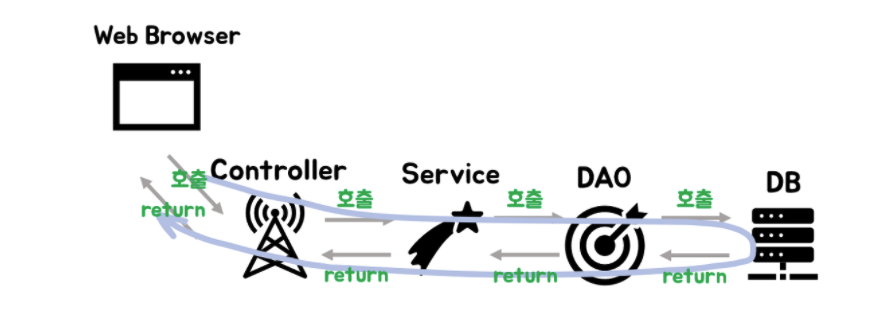

## Controller와 Service의 차이는 무엇일까?

| Controller                                                   | Service                                                      |
| ------------------------------------------------------------ | ------------------------------------------------------------ |
| 사용자의 요청이 진입하는 지점이며 요청을 받아 적절한 Service에 보내 처리가 일어나게 한다. Service에서 처리한 내용을 View에 던져준다. | 실질적인 데이터 처리를 수행한다. 비즈니스 로직을 수행하고 데이터베이스에 접근하는 DAO를 이용해서 결과값을 받아 온다. |

 

아래 예시를 보면 이해에 도움이 될 것이다.

1) Client가 Request를 보낸다.(Ajax, Axios, fetch등..)
2) **Request URL에 알맞은 Controller가 수신 받는다. (@Controller , @RestController)**
3) **Controller 는 넘어온 요청을 처리하기 위해 Service 를 호출한다.**
4) **Service는 알맞은 정보를 가공하여 Controller에게 데이터를 넘긴다.**
5) **Controller 는 Service 의 결과물을 Client 에게 전달해준다.**

> `Controller`는 `View`와 `Service` 사이의 인터페이스 같은 존재이며, 코드의 가독성과 적절한 분리를 위해 `Controller`와 `Service`로 분리한 것 같다. 복잡한 데이터 처리는 `Service`에서 일어난다.

## DAO (Data Access Object)

데이터베이스에 접근하여 SQL문을 실행할 수 있는 객체이다. 데이터베이스를 사용해 데이터를 조회하거나 조작하는 기능을 전담한다. (이름부터 데이터 엑세스 오브젝트이니 말 다했다...) `Service`는 `DAO`의 CRUD를 응용, 조합해서 사용한다. (트랜잭션 단위)  

`Service`에서 데이터베이스에 접근이 필요한 메서드를 호출하면, `DAO`가 이를 수행하고 쿼리 결과를 반환한다.

### 🤔 데이터베이스에 접근하는 로직을 분리해둔 이유

HTTP Request를 웹 어플리케이션이 받게 되면 Thread를 생성하게 되는데, 비즈니스 로직이 DB로부터 데이터를 얻어오기 위해 매번 Driver를 로드하고 Connection 객체를 생성하게 되면 많은 커넥션이 일어나므로 `DAO`를 하나 만들어 DB 전용 객체로 사용한다. 

웹 어플리케이션 서버가 실행되면 일정량의 DB 커넥션 객체를 Pool에 저장해두고 HTTP Request에 따라 필요할 때마다 Pool에서 커넥션 객체를 가져다 쓴다.

## 그럼 JPA는 왜 있죠?

## JPA (Java Persistence API)

여기서 한 가지 의문이 생기는데... JAVA에는 ORM 기술 표준으로 사용하는 인터페이스 모음인 JPA가 존재한다.

> JPA는 자바 어플리케이션에서 관계형 데이터베이스를 사용하는 방식을 정의한 인터페이스이다. 자바 클래스(객체)와 DB 객체를 매핑하여 SQL문이 아닌 자바 메서드를 사용해 DB를 조작할 수 있다.

 

JPA를 사용하면 SQL문을 사용하지않더라도, 데이터베이스 객체와 자바 객체를 연결해서 자바 코드로 데이터를 조회, 조작할 수 있다.  그런데 왜 DAO가 필요한걸까?🤔

   

JPA는 간단한 코드로 DAO를 구현할 수 있도록 해주지만 JPA가 만들 수 있는 코드는 매우 가볍고 쉬운 쿼리를 대체하는 것이라서 복잡도가 높아지면 사용하기 어려워진다고 한다. 그래서 복잡도가 높은 쿼리일 경우 DAO로 같이 사용한다고 한다. (솔직히 자세한건 모르겠다 ... 나중에 더 자세히 배우게되면 포스팅해야겠다)

## Repository

> DB에 접근하는 메서드 들을 사용하기 위한 인터페이스

실제로 DB에 접근하는 객체로, Service와 DB를 연결하는 고리라고 한다.

`@Entity`라는 어노테이션을 사용해서 데이터베이스 객체를 만들었다고 해보자. 객체를 만들었다면, 이 객체를 CRUD할 로직이 필요하다. `Repository`는 이를 정의해주는 계층이다. SQL을 사용해서 DB에 접근한 후 CRUD API를 제공한다.

### 😵 아니 그럼 DAO랑 뭐가 다른거야?!

Repository는 여러 DAO를 사용해 구현될 수 있지만 그 반대는 불가능하다고 한다.

* Repository : **도메인과 관련이 많다.** 객체들의 특정 타입의 저장소이다.(객체의 상태를 관리하는 저장소) 특정 타입의 객체들을 찾을 수 있고 저장할 수 있다. 보통 객체들의 한 가지 타입만 다룬다. 대부분 같은 테이블에 모든 데이터를 저장한다. 보통 단일 타입의 데이터만 처리하기 때문에 하나의 기본 테이블에 논리적으로 연결된다.
* DAO : **데이터 베이스와 관련이 많으며 Table 중심이다.** 데이터를 저장한다. 같은 데이터 타입인지 아닌지는 상관하지 않기에 관련된 데이터를 저장하는 DAO를 큰 제약 없이 생성할 수 있다. Repository보다 더 유연하다.

결론은... 둘다 DAL(Data Access Layer)의 구현체로, DAL을 구현하는 방식에 차이가 있는 것 같다. (어렵다...)

## 참고

https://onlyformylittlefox.tistory.com/13  

https://velog.io/@jybin96/Controller-Service-Repository-%EA%B0%80-%EB%AC%B4%EC%97%87%EC%9D%BC%EA%B9%8C#controller-%EB%9E%80  

https://m.blog.naver.com/jysaa5/221751719334 

https://bbbicb.tistory.com/44
