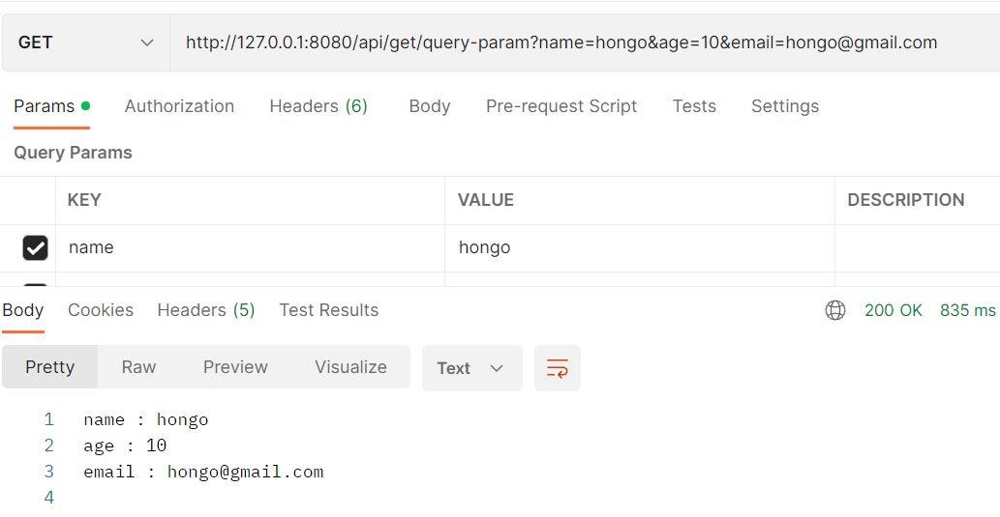
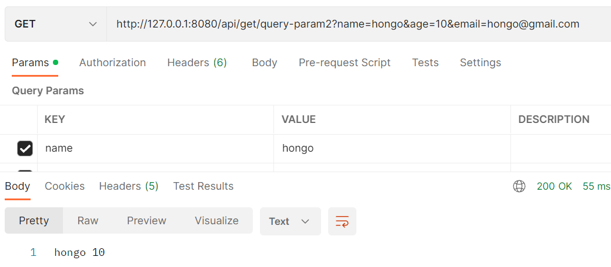
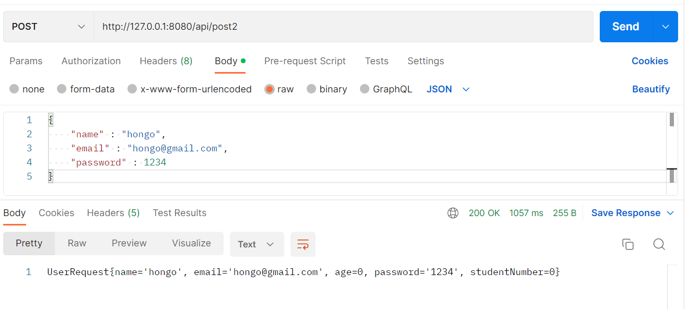

따흐흑... 너무 오랜만의 포스팅같다. 요즘 집에만 있으니 침대에서 뒹굴거리며 게으른 생활을 보냈다. 그치만 오늘 각성함. 남은 10월 불태우자 ~

## 오늘 사용할 어노테이션

| Annotation      | 설명                      |
| --------------- | ------------------------- |
| @RestController | Rest API 설정             |
| @RequestMapping | 리소스를 설정             |
| @GetMapping     | Get Resource 설정         |
| @PostMapping    | Post Resource 설정        |
| @PathVariable   | URL Path Variable Parsing |
| @RequestBody    | Request Body Parsing      |
| @JsonProperty   | Json naming               |
| @JsonNaming     | class Json naming         |

더 자세한 설명은 아래 각각의 API를 설명하면서 진행하겠다!

## Get API

`controller`라는 패키지 하위에 `GetApiController`를 생성했다. Get Api의 구동방식을 간단하게 실습해보기 위한 목적이므로 특정 url에 접속하면 String을 던져주는 get함수를 생성해보자.

```java
@RestController // 해당 class는 rest api를 처리하는 controller로 등록됨
@RequestMapping("/api") // url을 지정
public class GetApiController {

    @GetMapping("/get")
    public String getHello(){
        return "get hello";
    }
}
```

- 현재 도메인은 `http://localhost`이므로 GetApiController 내부의 로직들은 `http://localhost/api`와 매핑된다.
- `@GetMapping`은 해당 메서드가 get method라는 의미로, 안에 들어간 인자는 path를 나타낸다. 물론 `@GetMapping(path = "/get")`과 같이 매개변수명과 매핑이 가능.
- url ~/api/get으로 접속하면 "get hello" String이 반환된다. 아주 간단!

> Rest API와 같이 json으로 response를 하려면 @RestController를 사용한다.<br/>
>
> json이 아니라 html파일을 넘겨주려면 @Controller 를 사용하면 된다.

### 📌 Get - path variable

url에 뒤에 특정 변수가 붙어 변수에 해당하는 response를 던져줄 때가 있다.

- ex) ~/user/1이면 id가 1인 유저를 반환, ~/user/2이면 id가 2인 유저를 반환

<br/>

스프링에서 path variable을 다루는 방식을 알아보자. url끝에 name을 입력받으면 name을 반환하는 함수를 만들어보자.

```java
@RequestMapping("/api/get")
public class GetApiController {

    @GetMapping("path-variable/{name}") // {}안의 변수명과 매개변수 변수명이 같아야함
    public String pathVariable(@PathVariable String name){
        return name;
    }
}
```

- django와 동일하게 url의 변수명과 함수에서 받는 매개변수명이 같아야한다.
- 매개변수는 `@PathVariable` 을 사용해서 path variable임을 명시해줘야한다.

<br/>

#### url 변수명과 매개변수명이 달라도 매핑되게 하는 방법은 없을까?

가능하다. 만약 id라는 url 변수를 받아야하는데 이미 메서드에서 매개변수로 동일한 이름의 변수인 id를 받아야한다고 치자.(물론... 최대한 이런 일이 발생하지 않게 해야 하지 않을까?ㅎㅎ...)

```java
@GetMapping("path-variable/{id}") // {}안의 변수명과 매개변수 변수명이 같아야함
    public String pathVariable(@PathVariable(name = "id") Long paramId, Long id){
        return name;
    }
```

- `@PathVariable(name = "id")`처럼 어노테이션안에 해당 매개변수와 매핑되는 url변수의 이름이 "id"임을 명시해주면 paramId라는 매개변수와 url변수 id가 잘 매핑된다.

### 📌 Get - Query Parameter

검색 기능의 경우 대부분 쿼리 파라미터를 사용한다. 쿼리 파라미터는 `search?name=hongo&age=10`과 같이 key와 value의 쌍으로 구성되어 있다. 이를 자바로 어떻게 받을 수 있을까?

#### 1. Map

key와 value의 쌍이므로, 물론 Map을 가지고도 받을 수 있다.

```java
@GetMapping("/query-param")
    public String queryParam(@RequestParam Map<String,String> queryParam){ // @RequestParam을 사용해서 파라미터임을 명시해줘야함
        StringBuilder sb = new StringBuilder();

        queryParam.entrySet().forEach( entry -> {
            sb.append(entry.getKey() + " : " + entry.getValue() + "\n");
        });

        return sb.toString();
    }
```

그런데 map으로 받으면 모든 key를 다 받을 수 있지만 key의 형태를 정확히 알 수 없다.<br/>

아래와 같이 무슨 파라미터를 전달하든 map이 전부 받는다.



위 코드의 경우 `String name = queryParam.get("name")`과 같이 하나하나 변수에 할당해줘야한다. 매우 귀찮다!<br/>

key의 형태를 미리 알고있다면, 다음과 같이 명시적으로 선언이 가능하다.

#### 2. 미리 선언한 변수에 값 할당

```java
 @GetMapping("/query-param2") // 구린 url명을 용서하세요...~
    public String queryParam2(
            @RequestParam String name,
            @RequestParam int age
    ){
        return name +" " + age;
    }
```



생성한 변수에 값이 잘 할당되는 것을 볼 수 있다. 선언되지 않은 파라미터는 무시된다.

- 그런데 만약 파라미터 변수가 많아진다면?

```java
 @GetMapping("/query-param2") // 구린 url명을 용서하세요...~
    public String queryParam2(
            @RequestParam String name,
            @RequestParam int age,
        	@RequestParam String email,
        	@RequestParam Long id,
        	...
    ){
        return name +" " + age;
    }
```

변수를 하나하나 선언해주기 귀찮아진다...<br/>

다행히도 스프링은 파라미터를 바로 dto 형태로 매핑하는 기능을 제공한다.

#### 3. dto 매핑

```java
public class UserRequest {
    private String name;

    private String email;

    private int age;

    @Override
    public String toString() {
        return "UserRequest{" +
                "name='" + name + '\'' +
                ", email='" + email + '\'' +
                ", age=" + age +
                '}';
    }
}
```

```java
@GetMapping("/query-param3")
    public String queryParam3(UserRequest userRequest){
        return userRequest.toString();
    }
```

> dto와 파라미터를 매핑할 때는 `@RequestParam` 어노테이션을 사용하지않는다. 스프링이 자동으로 dto 내부 변수명과 파라미터명이 일치하면 dto의 변수에 값을 할당해준다.

#### + 추가

```java
public class UserRequest {
    private String name;

    private String email;

    private int age;

    private int studentNumber;

}
```

```json
// json
{
  "name": "hongo",
  "email": "hongo@gmail.com",
  "age": 10,
  "student_number": 1234
}
```

dto의 변수 `studentNumber`는 카멜케이스지만, request로 받은 json의 `"student_number"` 스네이크 케이스이다. json에서의 key와 자바 객체의 변수명이 일치하지않아도 값을 할당할 수 있을까?

#### 1. @JsonProperty

```java
public class UserRequest {
    private String name;

    private String email;

    private int age;

    @JsonProperty("student_number")
    private int studentNumber;

}
```

위와 같이 `@JsonProperty`어노테이션을 사용해서 변수와 매핑되는 json key명을 명시해줄 수 있다.

#### 2. @JsonNaming

```java
@JsonNaming(value = PropertyNamingStrategy.SnakeCaseStrategy.class)
public class UserRequest {
    private String name;

    private String email;

    private int age;

    private int studentNumber;

}
```

`@JsonNaming` 어노테이션을 사용해서 클래스 자체에 json 네이밍 전략을 정해줄 수도 있다.

## Post API

get에서 자세하게 설명했으니까 post는 좀 더 빠르게 넘어가보겠다 ㅎ...

```java
@RestController
@RequestMapping("/api")
public class PostApiController {
    @PostMapping("/post")
    public void post(@RequestBody Map<String, Object> requestData){
        requestData.forEach((key, value) -> {
            System.out.println("key : " + key);
            System.out.println("value : " + value);
        });
    }

    @PostMapping("/post2")
    public void post2(@RequestBody UserRequest userRequest){
        System.out.println(userRequest.toString());
    }
}
// get때와 마찬가지로 map으로받으면 어떤 data가 들어올지 알 수 없음
```

request로 받은 xml이나 json도 key와 value형식으로 되어있다. 때문에 Map을 사용해서 request를 받을 수 있다.

- 이 때 `@RequestBody` 어노테이션을 사용해야함을 명심한다.
- 그러나 get때와 마찬가지로 map으로 받으면 어떤 data가 들어올지 알 수 없다.
- post또한 객체를 사용해서 값을 할당받을 수 있다.



- 입력받지 못한 값은 default로 초기화된다.

## Put API

put도 post와 유사하게 구현할 수 있다. `@PutMapping`을 사용해 put 메서드를 설정하고, `@RequestBody`를 사용해서 request body를 객체에 파싱한다.

```java
@PutMapping("/put")
    public UserRequest put(@RequestBody UserRequest userRequest){
        System.out.println(userRequest.toString());
        return userRequest;
    }
```

- RestController인 경우에는 오브젝트 자체를 리턴하면 스프링부트 자체에서 오브젝트 매퍼를 통해 json으로 반환한다.

<br/>

```java
@PutMapping("/put/{userId}")
    public UserRequest put(@RequestBody UserRequest userRequest, @PathVariable Long userId){
        System.out.println(userRequest.toString());
        return userRequest;
    }
```

## Delete API

```java
@DeleteMapping("/delete/{userId}")
    public void delete( @PathVariable Long userId, @RequestParam String account){
        // instance delete
    }
```

- 위 API들과 마찬가지로 `@DeleteMapping`을 통해 리소스 설정을 해준다.
- PathVariable과 RequestParam을 받을 수 있다.

## Response 내려주기

```java
public ResponseEntity<UserRequest> put (@RequestBody UserRequest userRequest){
        //return ResponseEntity.ok(userRequest);
        return ResponseEntity.status(201).body(userRequest);
    }
```

위와 같이 `ResponseEntity`를 사용해 다양한 response를 내려줄 수 있다. http status와 header의 내용등을 설정해줄 수 있다.

### @Controller - html 파일 내려주기

```java
@Controller
@RequestMapping("/main")
public class PageController {

    @GetMapping("")
    public String home(){
        return "main.html";
    }
}
```

- 리턴 형식이 String이면 `resources` -> `static`에서 return되는 문자열인 main.html 리소스를 찾아 반환한다.

<br/>

`@RestController`가 아니라 `@Controller`어노테이션을 사용하는 클래스 내부에서도 Json Response를 보낼 수 있다.

```java
@Controller
@RequestMapping("/main")
public class PageController {

    @GetMapping("")
    public String home(){
        return "main.html";
    }

    @ResponseBody
    @GetMapping("/user")
    public User getUser(){
        var user = new User(); // 편의상 타입 추정이 가능한 var 사용
        user.setName("hongo");
        user.setEmail("hongo@gmail.com");
        user.setId(1L);
        return user;
    }

}
```

- `@ResponseBody`어노테이션을 사용하면 오브젝트를 리턴해서 json과 매핑이 가능하다.
