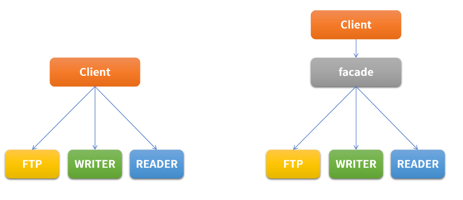

## 싱글톤 패턴

- 생성자를 private으로 선언해 접근하지 못하게 한다.
- `getInstance` 메서드를 사용해 하나의 인스턴스에만 접근할 수 있게 한다.

```java
public class SocketClient{
    private static SocketClient socketClient = null;
    private SocketClient(){}
    
    public static SocketClient getInstance(){
        if(socketClient == null){
            socketClient = new SocketClient();
        }
        return SocketClient;
    }
}
```

> 인스턴스 생성없이 바로 `getInstance` 메서드 호출을 위해 ` static` `키워드를 붙인다.

<br/>

싱글톤에 대한 자세한 것은 해당 포스팅에서 더 볼 수 있다.

[Java - static과 singleton](https://blog.hongo.app/singleton/)


## 어댑터 패턴

실생활에서 110V를 220V로 변경해주거나 그 반대로 해주는 돼지코같은 변환기를 예로 들 수 있다. 호환성이 없는 기존 클래스의 인터페이스를 변환해서 재사용할 수 있게 한다. SOLID중에서 개방폐쇄원칙(OCP)를 따른다. 아래 예시를 봐보자.


### 🔌 인터페이스 - Electronic110V와 Electronic220V

```java
public interface Electronic110V {
    void powerOn();
}
```

```java
public interface Electronic220V {
    void superPowerOn();
}
```

110V와 220V을 사용하는 기기가 구현할 인터페이스이다. 220V는 110V보다 전류가 더 세기에 superPowerOn()이라고 이름을 붙여줬다...ㅎ


### 🔌 클래스 - HairDryer와 AirConditioner

```java
public class HairDryer implements Electronic110V {
    @Override
    public void powerOn() {
        System.out.println("hairdryer power on");
    }
}
```

```java
public class AirConditioner implements Electronic220V{
    @Override
    public void superPowerOn() {
        System.out.println("airconditioner power on");
    }
}
```

헤어드라이어는 110V를 사용하는 기기이고, 에어컨은 220V를 사용한다. 각각 알맞는 인터페이스를 구현한다.


### 🔌  Connect

```java
public class Main {
    public static void main(String[] args){

        HairDryer hairDryer = new HairDryer();
        connect(hairDryer);
    }

    // 콘센트
    public static void connect(Electronic110V electronic110V){
        electronic110V.powerOn();
    }
}
```

클래스 Main에는 110V 콘센트만 존재한다. `connect` 메서드는 매개 변수로 `Electronic110V`인터페이스를 받고 해당 기기를 `powerOn`시킨다. `HairDryer`는 110V를 사용하는 기기로 `Electronic110V`를 구현했기에 `connect`함수의 인자로 넣을 수 있다. 

<br/>

```java
public class Main {
    public static void main(String[] args){

        AirConditioner airConditioner = new AirConditioner();
        connect(airConditioner);
    }

    // 콘센트
    public static void connect(Electronic110V electronic110V){
        electronic110V.powerOn();
    }
}
```

그러나 `AirConditioner`는 220V 인터페이스를 구현했으므로 동작하지 않는다. 이럴 때 어댑터를 사용하면 110V콘센트에도 220V를 연결할 수 있다. 어댑터의 역할을 하는 클래스 `SocketAdapter`를 생성해보자.


### 🔌  SocketAdapter

```java
public class SocketAdapter implements Electronic110V {
    private Electronic220V electronic220V;

    public SocketAdapter(Electronic220V electronic220V){
        this.electronic220V = electronic220V;
    }

    @Override
    public void powerOn() {
        electronic220V.superPowerOn();
    }
}
```

이 어댑터는 220V를 110V 콘센트에서 사용할 수 있게 변환해주는 어댑터이다. 

* `Electronic110V`를 구현한다.
* 내부에 `Electronic220V `객체를 가지고 있다. 이 객체는 어댑터의 생성자로 받아 생성한다.


### 🔌 다시 Connect

```java
public class Main {
    public static void main(String[] args){

        HairDryer hairDryer = new HairDryer();
        connect(hairDryer);

        AirConditioner airConditioner = new AirConditioner();
        //connect(airConditioner);
        Electronic110V adapter = new SocketAdapter(airConditioner);
        connect(adapter);
    }

    // 콘센트
    public static void connect(Electronic110V electronic110V){
        electronic110V.powerOn();
    }
}
```

어댑터를 이용해 위와 같이 클래스를 변환해서 호환성에 맞게 재사용할 수 있다.


## 프록시(Proxy) 패턴

Proxy는 대리인이라는 뜻으로써, 뭔가를 대신해서 처리하는 것을 의미한다. Proxy Class를 통해서 대신 전달하는 형태로 설계되며, 실제 Client는 Proxy로부터 결과를 받는다.<br/>

Cache의 기능으로도 활용이 가능하다. SOLID중에서 개방 폐쇄 원칙(OCP)과 의존 역전 원칙(DIP)을 따른다.

<br/>


### 🌈 프록시 패턴 예시

예시를 통해 프록시 패턴을 자세히 알아보자. 브라우저는 html파일을 가져와 화면에 띄워준다. 

* 인터페이스 `IBrowser` 는 브라우저 인터페이스로 모든 브라우저들이 구현해야 한다.

```java
public interface IBrowser {
    Html show();
}
```

<br/>

* Html은 url을 가지고 있는 Html파일을 나타내고 있다.

```java
public class Html {
    String url;
    Html(String url){
        this.url = url;
    }
}
```

<br/>

* 브라우저는 url을 받아 그에 해당하는 html파일을 반환한다.

```java
public class Browser implements IBrowser{
    private String url;
    Browser(String url){
        this.url = url;
    }

    @Override
    public Html show() {
        System.out.println("browser loading html from "+url);
        return new Html(url);
    }
}
```

<br/>

* main 메서드에서 아래 코드를 실행시키면 다음과 같이 html이 show()를 호출한 만큼 렌더링된다.

```java
public static void main(String[] args){

       Browser browser = new Browser("https://blog.hongo.app");
       browser.show();
       browser.show();
       browser.show();
    }
```

```
// 실행 결과
browser loading html from https://blog.hongo.app
browser loading html from https://blog.hongo.app
browser loading html from https://blog.hongo.app
```


### 🌈 브라우저 프록시 생성

```java
public class BrowserProxy implements IBrowser{
    private String url;
    private Html html; // html cache를 위해 생성

    public BrowserProxy(String url){
        this.url = url;
    }
    @Override
    public Html show() {
        if(html == null){
            html = new Html(url);
            System.out.println("browserProxy loading html from "+url);
            return html;
        }
        System.out.println("browserProxy use cache "+url);
        return html;
    }
}
```

```java
    public static void main(String[] args){

       BrowserProxy browser = new BrowserProxy("https://blog.hongo.app");
       browser.show();
       browser.show();
       browser.show();
    }
```

```
// 실행 결과
browserProxy loading html from https://blog.hongo.app
browserProxy use cache https://blog.hongo.app
browserProxy use cache https://blog.hongo.app
```

이처럼 프록시를 사용해서 캐시를 사용할 수 있다. (위 예시는 진짜 캐싱을 해오는게 아니지만ㅎㅎ... 예시를 위해 저렇게 표현함.)


## 데코레이터(Decorator) 패턴

- 데코레이터 패턴은 기존 뼈대는 유지하되, 이후 필요한 형태로 꾸밀 때 사용한다.
- 상속보다 유연한 구현 방식으로, 확장이 필요한 경우 상속의 대안으로도 활용된다.
- SOLID 중에서 개발 폐쇄 원칙(OCP) 과 의존 역전 원칙(DIP) 를 따른다.

자세한 것은 아래 포스팅을 참고하자.<br/>

[Java - 데코레이터 패턴](https://blog.hongo.app/decorator/)


## 옵저버(Observer) 패턴

리스너를 사용해서 이벤트를 전달한다.

- 관찰자 패턴은 변화가 일어났을 때, 미리 등록된 다른 클래스에 통보해주는 패턴을 구현한 것이다.
- 특정 이벤트에 대해 리스너를 통해 전달하는 event listener에서 해당 패턴을 사용하고 있다.

```java
public interface IButtonListener {
    void clickEvent(String event);
}
```

```java
public class Button {
    private String name;
    private IButtonListener buttonListener;

    public Button(String name){
        this.name = name;
    }
    public void addListener(IButtonListener iButtonListener){
        this.buttonListener = iButtonListener;
    }

    public void click(String message){
        buttonListener.clickEvent(message);
    }
}
```

```java
public static void main(String[] args){
    Button button = new Button("버튼");
    button.addListener(new IButtonListener(){
        @Override
        public void clickEvent(String event){
            System.out.println(event);
        }
    });
    
    button.click("메시지 전달");
}
```

```
// 실행 결과
메시지 전달
```


## 파사드(Facade) 패턴

Facade는 건물의 앞쪽 정면이라는 뜻을 가진다. 여러 개의 객체와 실제 사용하는 서브 객체 사이에 복잡한 의존관계가 있을 때, 중간에 facade라는 객체를 두고, 여기서 제공하는 인터페이스만을 활용하여 기능을 사용하는 방식이다. Facade는 자신이 가지고 있는 각 클래스의 기능을 명확히 알아야 한다.


### 📌 파사드 예시



위와 같이 Client가 FTP를 사용해서 file에 write하고 read할 때 Ftp와 Writer과 Reader라는 세 클래스를 사용한다고 하자. 이 방식을 Facade를 사용해 구현해보자.

<br/>

```java
public class Ftp {
    private String host;
    private int port;
    private String path;

    public Ftp(String host, int port, String path){
        this.host = host;
        this.port = port;
        this.path = path;
    }

    public void connect(){
        System.out.println("FTP Host : " + host + " Port : "+port + " 로 연결합니다.");
    }
    public void moveDirectory(){
        System.out.println("FTP path : " + path + " 로 이동합니다.");
    }
    public void disConnect(){
        System.out.println("FTP 연결을 종료합니다.");
    }
}
```

```java
public class Reader {
    private String fileName;
    public Reader(String fileName){
        this.fileName = fileName;
    }
    public void fileConnect(){
        String msg = String.format("Reader %s 로 연결합니다.", fileName);
        System.out.println(msg);
    }
    public void fileRead(){
        String msg = String.format("Reader %s 의 내용을 읽어옵니다.", fileName);
        System.out.println(msg);
    }
    public void fileDisconnect(){
        String msg = String.format("Reader %s 연결 종료합니다.", fileName);
        System.out.println(msg);
    }
}
```

```java
public class Writer {
    private String fileName;
    public Writer(String fileName){
        this.fileName = fileName;
    }
    public void fileConnect(){
        String msg = String.format("Writer %s 로 연결합니다.", fileName);
        System.out.println(msg);
    }

    public void fileDisconnect (){
        String msg = String.format("Writer %s 연결 종료합니다.", fileName);
        System.out.println(msg);
    }

    public void write(){
        String msg = String.format("Writer %s 로 파일쓰기를 합니다.", fileName);
        System.out.println(msg);
    }
}
```

```java
 public static void main(String[] args){
        Ftp ftpClient = new Ftp("www.foo.co.kr", 22, "/home/etc");
        ftpClient.connect();
        ftpClient.moveDirectory();
        
        Writer writer = new Writer("text.tmp");
        writer.fileConnect();
        writer.write();
        
        Reader reader = new Reader("text.tmp");
        reader.fileConnect();
        reader.fileRead();
        
        reader.fileDisconnect();
        writer.fileDisconnect();
        ftpClient.disConnect();
    }
```

만약 중간에 Facade가 없다면 ftp를 사용해서 파일에 write, read하기 위해 세 클래스를 모두 생성해서 사용해야한다. main메서드에서 FtpClient와 Writer, Reader 객체를 생성해 connect, write, read, disconnect를 각각 호출하는 것을 볼 수 있다.


### 📌 파사드 추가

```java
public class SftpClient {
    private Ftp ftp;
    private Reader reader;
    private Writer writer;

    public SftpClient(Ftp ftp, Reader reader, Writer writer){
        this.ftp = ftp;
        this.reader = reader;
        this.writer = writer;
    }

    public SftpClient(String host, int port, String path, String fileName){
        this.ftp = new Ftp(host,port, path);
        this.reader = new Reader(fileName);
        this.writer = new Writer(fileName);
    }

    public void connect(){
        ftp.connect();
        ftp.moveDirectory();
        writer.fileConnect();
        reader.fileConnect();
    }

    public void disConnect(){
        writer.fileDisconnect();
        reader.fileDisconnect();
        ftp.disConnect();
    }
    public void read(){
        reader.fileRead();
    }
    public void write(){
        writer.write();
    }
}
```

```java
public static void main(String[] args) {
        SftpClient sftpClient = new SftpClient("www.foo.co.kr", 22, "/home/etc", "text.tmp");
        sftpClient.connect();
        sftpClient.write();
        sftpClient.read();
        sftpClient.disConnect();
    }
```

Facade역할을 하는 SftpClient클래스를 생성했다. SftpClient 객체 하나로 Ftp, Reader, Writer를 모두 사용할 수 있게 한다.


## 전략(Strategy) 패턴

유사한 행위들을 캡슐화하여 객체의 행위를 바꾸고 싶은 경우 직접 변경하지 않고, 전략만 변경하여 유연하게 확장하는 패턴이다. SOLID 중에서 개방 폐쇄 원칙(OCP) 과 의존 역전 원칙(DIP) 를 따른다.

- 전략 메서드를 가진 전략 객체(Normal Strategy, Base64 Strategy)
- 전략 객체를 사용하는 컨텍스트 (Encoder)
- 전략 객체를 생성해 컨텍스트에 주입하는 클라이언트


### 📗 전략 메서드를 가진 전략 객체(Normal Strategy, Base64 Strategy)

```java
public interface EncodingStrategy {
    String encode(String text);
}
```

```java
public class NormalStrategy implements  EncodingStrategy{
    @Override
    public String encode(String text) {
        return text;
    }
}
```

```java
public class Base64Strategy implements EncodingStrategy{
    @Override
    public String encode(String text) {
        return Base64.getEncoder().encodeToString(text.getBytes());
    }
}
```

인터페이스 `EncodingStrategy`를 사용해서 전략 객체 `NormalStrategy`와 `Base64Strategy`를 생성한다. `NormalStrategy`는 메시지를 그대로 리턴하고 `Base64Straregy`는 base64로 인코딩해서 리턴한다.


### 📗 전략 객체를 사용하는 컨텍스트 (Encoder)

```java
public class Encoder {

    private EncodingStrategy encodingStrategy;

    public String getMessage(String message){
        return this.encodingStrategy.encode(message);
    }
    public void setEncodingStrategy(EncodingStrategy encodingStrategy) {
        this.encodingStrategy = encodingStrategy;
    }
}
```


### 📗 전략 객체를 생성해 컨텍스트에 주입하는 클라이언트

```java
public static void main(String[] args) {
        Encoder encoder = new Encoder();

        EncodingStrategy base64 = new Base64Strategy();
        EncodingStrategy normal = new NormalStrategy();

        String message = "hello java";

        encoder.setEncodingStrategy(base64);
        String base64Result = encoder.getMessage(message);
        System.out.println(base64Result);

        encoder.setEncodingStrategy(normal);
        String normalResult = encoder.getMessage(message);
        System.out.println(normalResult);

    }
```

`Encoder`는 전략 패턴에 따라 그에 맞는 인코딩 방식을 제공한다.
