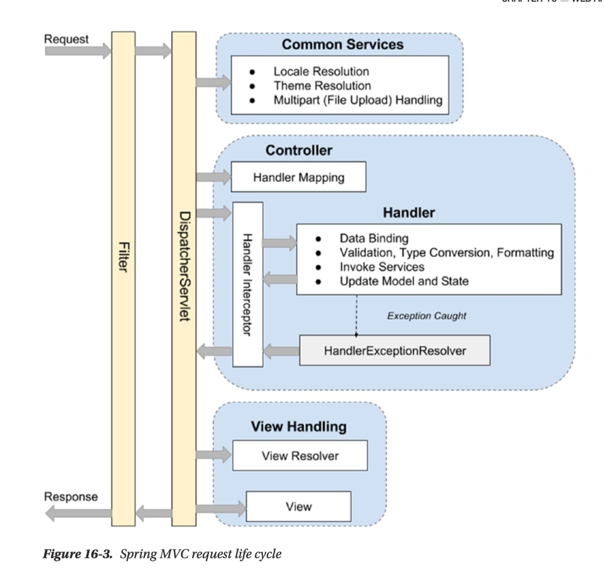
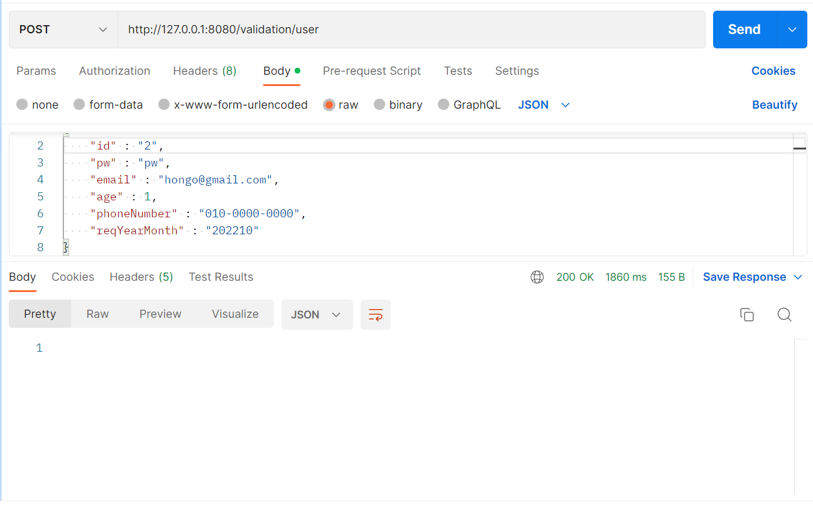
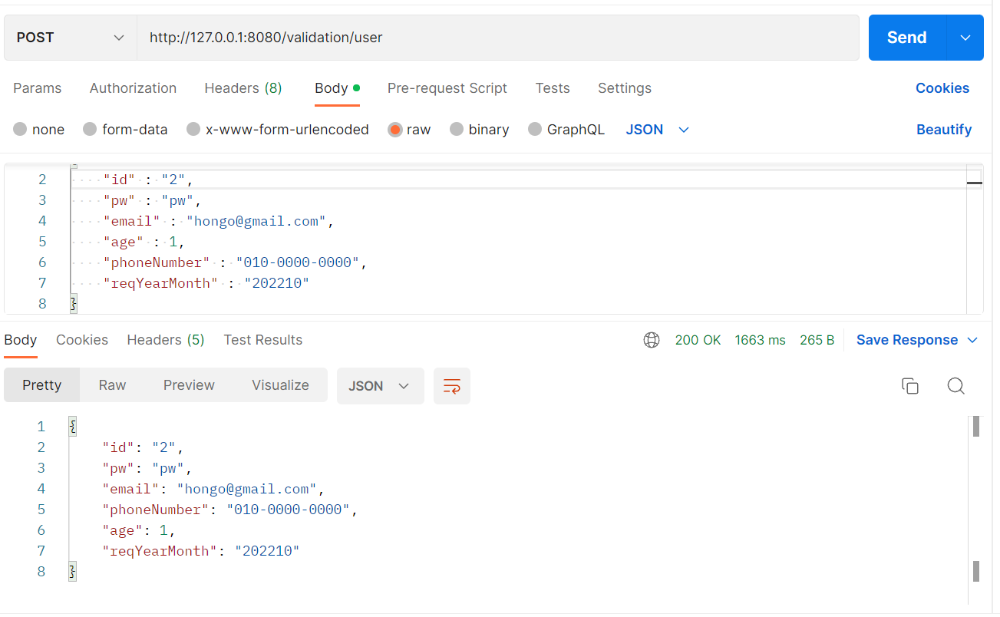

## Filter

Filter란 Web Application에서 관리되는 영역으로써, Spring Boot Framework에서 Client로부터 오는 요청/응답에 대해서 최초/최종 단계의 위치에 존재하며, 이를 통해서 요청/응답의 정보를 변경하거나, Spring에 의해서 데이터가 변환되기 전의 순수한 Client의 요청/응답값을 확인 할 수 있다.

* 즉, Filter를 사용하면 최전방에서 들어오는 정보들을 확인할 수 있다.

* 유일하게 `ServletRequest`, `ServletResponse`의 객체를 변환할 수 있다.
* 주로 Spring Framework에서는 request/response의 Logging용도로 활용하거나, 인증과 관련된 로직들을 해당 Filter에서 처리한다.
* 이를 선/후처리 함으로써, Service business logic과 분리시킨다.




* Filter -> Interceptor -> AOP 순으로 동작한다.


## Filter를 만들어보자!

* ### 첫 번째 시도

```cpp
// package org.example.validation.filter;

@Slf4j
@Component
public class GlobalFilter implements Filter {
    @Override
    public void doFilter(ServletRequest request, ServletResponse response, FilterChain chain) throws IOException, ServletException {
        // 전처리
        HttpServletRequest httpServletRequest = (HttpServletRequest)request;
        HttpServletResponse httpServletResponse = (HttpServletResponse) response;
        String url = httpServletRequest.getRequestURI();
        BufferedReader br = httpServletRequest.getReader();

        br.lines().forEach(line -> {
            log.info("url : {}, line: {}", url, line);
        });

        chain.doFilter(request, response);

        // 후처리
        
    }
}
```

> IllegalStateException 발생!
>
> * getReader()로 버퍼를 가져온 뒤 for문을 사용해 버퍼안을 순회했기때문에 iterator가 끝을 가리키고 있는 상태에서 이후 스프링이 버퍼를 사용하니 원하는 요소를 불러올 수 없음

<br/>

* ### 두 번째 시도

```cpp
@Slf4j
@Component
public class GlobalFilter implements Filter {
    @Override
    public void doFilter(ServletRequest request, ServletResponse response, FilterChain chain) throws IOException, ServletException {
        // 전처리
        ContentCachingRequestWrapper httpServletRequest = new ContentCachingRequestWrapper((HttpServletRequest)request);
        ContentCachingResponseWrapper httpServletResponse = new ContentCachingResponseWrapper((HttpServletResponse) response);
        String url = httpServletRequest.getRequestURI();
        BufferedReader br = httpServletRequest.getReader();

        br.lines().forEach(line -> {
            log.info("url : {}, line: {}", url, line);
        });

        chain.doFilter(request, response);

        // 후처리

    }
}
```

* `ContentCachingRequestWrapper` 로 받아오면 이미 캐싱이 되어있기 때문에 계속해서 버퍼를 읽어올 수 있다.

> 그러나 `ContentCachingRequestWrapper`는 cachedContent의 크기만 정해두고 아직 비워둔 상태이기 때문에 전처리 단계에서는 내용을 출력해볼 수 없다. 스프링이 모든걸 매핑한 다음에 읽어야 한다.

<br/>

* ### 세 번째 시도

```cpp
@Slf4j
@Component
public class GlobalFilter implements Filter {
    @Override
    public void doFilter(ServletRequest request, ServletResponse response, FilterChain chain) throws IOException, ServletException {
        // 전처리
        ContentCachingRequestWrapper httpServletRequest = new ContentCachingRequestWrapper((HttpServletRequest)request);
        ContentCachingResponseWrapper httpServletResponse = new ContentCachingResponseWrapper((HttpServletResponse) response);


        chain.doFilter(httpServletRequest, httpServletResponse);
        String url = httpServletRequest.getRequestURI();
        
        // 후처리
        String reqContent = new String(httpServletRequest.getContentAsByteArray());
        String resContent = new String(httpServletResponse.getContentAsByteArray());
        // data
        log.info("req url : {}, req body : {}", url, reqContent);

        int httpStatusCode = httpServletResponse.getStatus();
        Collection<String> headers = httpServletResponse.getHeaderNames();

        headers.forEach(header -> {
            log.info("header string : {}",header.toString());
        });

        log.info("res status : {}, res body : {}", httpStatusCode, resContent);
    }
}

```

* 실험삼아 url이랑 header이름등 이것저것 찍어봤다.


<br/>

```
// 실행결과 console

2022-10-19 01:59:40.207  INFO 5508 --- [nio-8080-exec-1] o.e.validation.filter.GlobalFilter       : req url : /validation/user, req body : {
    "id" : "2",
    "pw" : "pw",
    "email" : "hongo@gmail.com",
    "age" : 1,
    "phoneNumber" : "010-0000-0000",
    "reqYearMonth" : "202210"
}
2022-10-19 01:59:40.209  INFO 5508 --- [nio-8080-exec-1] o.e.validation.filter.GlobalFilter       : res status : 200, res body : {"id":"2","pw":"pw","email":"hongo@gmail.com","phoneNumber":"010-0000-0000","age":1,"reqYearMonth":"202210"}

```

* console창을 보면 Filter가 잘 수행된 것 같다! 의도했던대로 url, request body, header names등을 log로 출력했다.

<br/>

그러나 response를 봐보자!



* 클라이언트에게 전해주는 response를 보면 텅 빈 것을 볼 수 있다!
* http status code를 보면 요청이 잘 수행되었지만 response로 넘어온 객체가 비어있다.

> 이는 첫 번째 시도때와 마찬가지로 getContentAsByteArray()를 사용해 response를 읽어왔으므로, 커서가 마지막으로 내려가서 더 이상 읽어올 내용이 없기 때문이다.


* ### 네 번째 시도

이를 해결하려면 response의 내용을 한 번 더 복사해주면 된다.

```
httpServletResponse.copyBodyToResponse();
```

위 함수를 사용하면 다시 한 번 더 body의 내용을 채워넣는다.

```cpp
@Slf4j
@Component
public class GlobalFilter implements Filter {
    @Override
    public void doFilter(ServletRequest request, ServletResponse response, FilterChain chain) throws IOException, ServletException {
        // 전처리
        ContentCachingRequestWrapper httpServletRequest = new ContentCachingRequestWrapper((HttpServletRequest)request);
        ContentCachingResponseWrapper httpServletResponse = new ContentCachingResponseWrapper((HttpServletResponse) response);


        chain.doFilter(httpServletRequest, httpServletResponse);
        String url = httpServletRequest.getRequestURI();
        // 후처리
        String reqContent = new String(httpServletRequest.getContentAsByteArray());
        String resContent = new String(httpServletResponse.getContentAsByteArray());
        // data
        log.info("req url : {}, req body : {}", url, reqContent);

        int httpStatusCode = httpServletResponse.getStatus();
        Collection<String> headers = httpServletResponse.getHeaderNames();

        headers.forEach(header -> {
            log.info("header string : {}",header.toString());
        });

        httpServletResponse.copyBodyToResponse();

        log.info("res status : {}, res body : {}", httpStatusCode, resContent);
    }
}

```



* 이번엔 response가 제대로 오는 것을 확인할 수 있다!


## 특정 api에만 Filter를 적용하고 싶다면?

위에서 만든 `GlobalFilter`는 모든 api에 적용되고 있다. 특정 api에만 적용하고 싶다면 어떻게 해야할까?

* ### @ServletComponentScan

어플리케이션에 위 어노테이션을 붙인다.

```java
@SpringBootApplication
@ServletComponentScan
public class IocApplication {
    public static void main (String args[]){
        SpringApplication.run(IocApplication.class, args);
    }
}
```


* ### @WebFilter()

Filter위에 위 어노테이션을 사용해서 적용할 api를 명시한다. (@Component 어노테이션은 지워준다.)

* `urlPatterns`에는 배열도 들어갈 수 있다.

```java
//@Component 
@Slf4j
@WebFilter(urlPatterns = "/api/*")
public class GlobalFilter implements Filter {
    @Override
    public void doFilter(ServletRequest request, ServletResponse response, FilterChain chain) throws IOException, ServletException {
        // 전처리
        ContentCachingRequestWrapper httpServletRequest = new ContentCachingRequestWrapper((HttpServletRequest)request);
        ContentCachingResponseWrapper httpServletResponse = new ContentCachingResponseWrapper((HttpServletResponse) response);


        chain.doFilter(httpServletRequest, httpServletResponse);
        String url = httpServletRequest.getRequestURI();
        // 후처리
        String reqContent = new String(httpServletRequest.getContentAsByteArray());
        String resContent = new String(httpServletResponse.getContentAsByteArray());
        // data
        log.info("req url : {}, req body : {}", url, reqContent);

        int httpStatusCode = httpServletResponse.getStatus();
        Collection<String> headers = httpServletResponse.getHeaderNames();

        headers.forEach(header -> {
            log.info("header string : {}",header.toString());
        });

        httpServletResponse.copyBodyToResponse();

        log.info("res status : {}, res body : {}", httpStatusCode, resContent);
    }
}

```


## 정리

Filter를 사용해서 request와 response의 무언가를 출력해야한다면, 

* `ContentCachingRequestWrapper`, `ContentCachingResponseWrapper`를 사용해서 불러온다. (캐싱을 해서 버퍼를 계속 읽어오게 하기 위해서!)
* `doFilter`이후 후처리에서 body를 가져와서 내용을 찍는다. (전처리 시점에서는 cachedContent가 제대로 들어가있지 않기 때문.)

