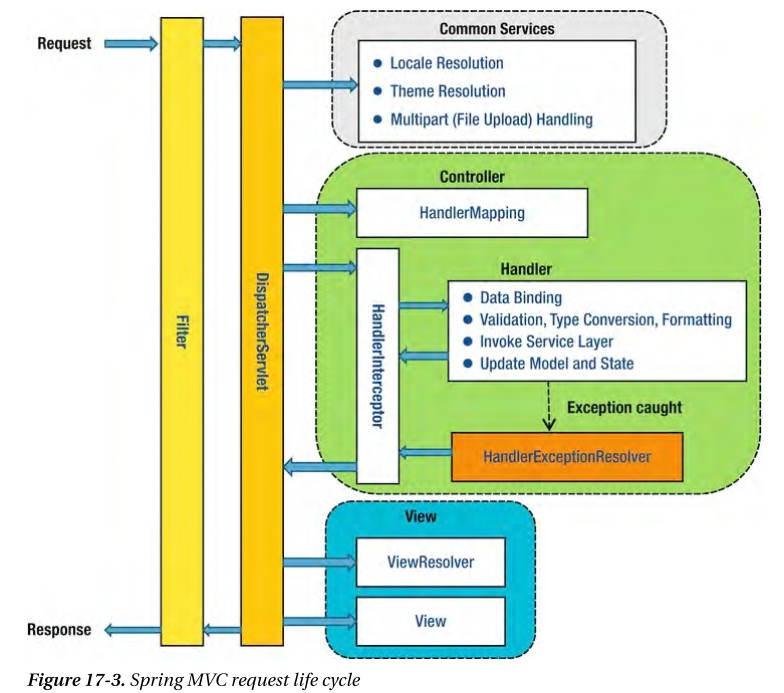

## Interceptor

* Filter와 매우 유사한 형태로 존재하지만, 차이점은 Spring Context에 등록된다. 
* AOP와 유사한 기능을 제공할 수 있으며, 주로 인증 단계를 처리하거나 로깅을 하는데 사용한다.
* 이를 선/후처리 함으로써, Service business logic과 분리시킨다.
* Hanlder를 가지고 어떤 Handler에 Mapping되었는지도 알 수 있다.

