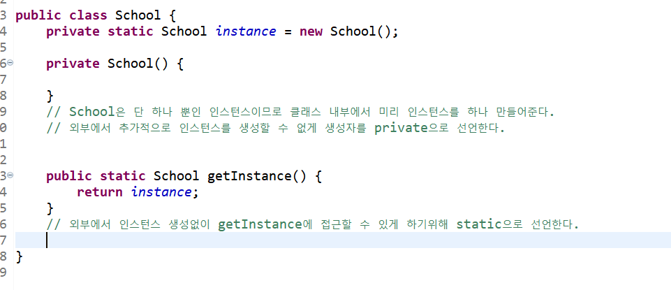
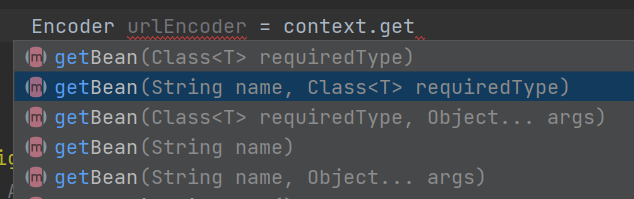

맨날 아하... 그렇구나~ -> 하루 뒤 깜박의 패턴으로 학습했던 IoC, DI, AOP 오늘 날잡아서 열심히 파보도록 하겠다.


## IoC (Inversion Of Control) - 제어의 역전

스프링에서는 일반적인 Java객체를 new로 생성하여 개발자가 관리하지 않고 `Spring Container`에 모두 맡긴다. <br/>

[Java - static과 singleton](https://blog.hongo.app/singleton/) 포스팅을 떠올려보자...<br/>



싱글톤 패턴을 구현하기 위해 직접 클래스 안에서 new를 사용해 자바 객체를 만들었었다. 하지만... 스프링에서는 개발자가 직접 Java객체의 생성을 관리하지 않는다! (진짜로?)<br/>

`Spring Container`라는 공간에 이미 생성하고자 하는 객체들이 만들어져있고, 싱글톤의 형태로 관리가 된다.<br/>

**즉, 개발자에서 -> 프레임워크로 객체 제어 권한이 넘어갔으므로 제어의 역전이라고 한다. 모든 객체의 생명주기 관리를 Spring Container에서 수행한다.**


## DI (Dependency Injection) - 의존성 주입

객체의 생명주기를 스프링 컨테이너가 혼자서 다 하면... 저는 대체 어떻게 객체를 사용해야하죠...?

* 외부로부터 내가 사용할 객체를 주입받으면 됩니다^^.
* 주입을 해주는 애는 스프링 컨테이너


### DI 장점

* 의존성으로부터 격리시켜 코드 테스트에 용이하다.
  * a객체가 b객체에 의존하고 있지만 이 부분을 코드상으로 격리할 수 있다. a객체가 없이 b객체를 코드 테스트 해볼 수 있다.

* DI를 통하여, 불가능한 상황을 Mock와 같은 기술을 통하여 안정적으로 테스트가 가능하다.
  * Mock객체를 만들어서 주입해 테스트 가능
* 코드를 확장하거나 변경할 때 영향을 최소화한다. (추상화)
* 순환참조를 막을 수 있다.


## DI 예시

DI를 어떻게 활용하는지 간단한 예시를 통해 알아보자.

* 아래 코드는 string을 base64로 인코딩하는 코드이다.
* 클래스 `Base64Encoder`를 사용해서 base64 인코딩을 할 수 있다.

```java
public class Main {
    public static void main(String[] args) {
        String url = "blog.hongo.app";
        Encoder encoder = new Encoder();
        String ret = encoder.encode(url);
        System.out.println(ret);
    }
}
```

```java
public class Base64Encoder {
    public String encode(String message){
        return Base64.getEncoder().encodeToString(message.getBytes());
    }
}
```


### 1. url 인코더 추가

* base64외에 url인코더도 요구사항에 추가되었다.

```java
public class Main {
    public static void main(String[] args) {
        String url = "blog.hongo.app";
        Encoder encoder = new Encoder();
        String ret = encoder.encode(url);
        System.out.println(ret);

        UrlEncoder urlEncoder = new UrlEncoder();
        String urlResult = urlEncoder.encode(url);
        System.out.println(urlResult);
    }
}

```

```java
public class UrlEncoder {
    public String encode(String message){
        try {
            return URLEncoder.encode(message, "UTF-8");
        } catch (UnsupportedEncodingException e) {
            throw new RuntimeException(e);
        }
    }
}
```

```java
public class Base64Encoder implements IEncoder{
    public String encode(String message){
        return Base64.getEncoder().encodeToString(message.getBytes());
    }
}
```


* `Base64Encoder`와 마찬가지로 `UrlEncoder`라는 클래스를 생성했다.


### 3. 인터페이스로 추상화

여기서 또 다른 인코더가 더 추가된다면 새로운 클래스를 계속 생성해야한다. 공통되는 부분을 인터페이스를 활용해서 추상화할 수 있다.

```java
public interface IEncoder {
    String encode(String message);
}
```

```java
// 인터페이스 구현

public class Encoder implements IEncoder{
    ...
}

public class UrlEncoder implements IEncoder{
    ...
}
```

```java
public class Main {
    public static void main(String[] args) {
        String url = "blog.hongo.app";
        
        IEncoder encoder = new Encoder();
        String ret = encoder.encode(url);
        System.out.println(ret);

        IEncoder urlEncoder = new UrlEncoder();
        String urlResult = urlEncoder.encode(url);
        System.out.println(urlResult);
    }
}
```

간단한 코드라서 별로 달라진 부분이 안보이긴한다. <br/>

여기서 DI를 활용해 좀 더 추상화해줄 수 있다.

### 

### 4. DI 활용

* `Encoder`라는 클래스를 생성해 내부에서 IEncoder를 가지게 한다. 
* 그리고 IEncoder는 생성자를 통해 입력받을 수 있다.
* `Encoder`가 Base64인코더와 Url인코더 중 어떤 인코더를 의존 주입받느냐에 따라서 `Encoder`의 성질이 달라질 수 있다.

```java
public class Encoder implements IEncoder{
    private IEncoder iEncoder;

    public Encoder(IEncoder iEncoder){
        this.iEncoder = iEncoder;
    }
    public String encode(String message){
        return iEncoder.encode(message);
    }
}
```

```java
public class Main {
    public static void main(String[] args) {
        String url = "blog.hongo.app";

        Encoder encoder = new Encoder(new Base64Encoder());
        String ret = encoder.encode(url);
        System.out.println(ret);

        Encoder urlEncoder = new Encoder(new UrlEncoder());
        String urlResult = urlEncoder.encode(url);
        System.out.println(urlResult);
    }
}
```

> 물론 이 예시에서는 여전히 new를 사용해서 객체를 생성해 전달하고 있지만, DI가 어떻게 활용되는지 느낌을 알기위해 간단하게 예시를 해봤다.
>
> * 이처럼 외부에서 사용할 객체를 주입받아 (Encoder의 생성자로 IEncoder를 받듯이) 그에 맞는 동작을 실행할 수 있다. 


## IoC 예시

IoC를 위해 스프링컨테이너가 개발자 대신 자바 객체의 생명주기를 관리한다. 위 예시에 IoC를 적용해보자. 스프링 프로젝트를 생성해서 위와 똑같은 클래스, 인터페이스들을 추가한다.

### 1. @Component

```java
@Component
public class Base64Encoder implements IEncoder{
    public String encode(String message){
        return Base64.getEncoder().encodeToString(message.getBytes());
    }
}
```

* 위처럼 자바 객체위에 `@Component`를 붙이면 스프링이 해당 객체를 빈으로 등록해 관리해준다.
* UrlEncoder에도 해당 어노테이션을 붙여준다.

> 스프링이 실행이 될 때 @Component가 있는 객체를 찾아 직접 객체를 싱글톤 형태로 만들고 스프링 컨테이너에서 관리를 한다.


### 객체를 어떻게 가져올 수 있을까?

`ApplicationContext`를 통해 스프링 컨테이너에 접근해서 객체를 가져올 수 있다.

```java
@Component
public class ApplicationContextProvider implements ApplicationContextAware {

    private static ApplicationContext context;

    @Override
    public void setApplicationContext(ApplicationContext applicationContext) throws BeansException {
        context = applicationContext;
    }

    public static ApplicationContext getContext(){
        return context;
    }

}
```

* `ApplicationContextAware`를 상속받는 클래스를 생성한다.  
* `ApplicationContextProvider`클래스가 생성될 때 SpringApplication이 `ApplicationContext`를 주입해준다.
* 위를 받아 static변수에 할당하고 이를 가져다 쓰면 된다.


### 실행

```java
@SpringBootApplication
public class IocApplication {
    public static void main (String args[]){
        SpringApplication.run(IocApplication.class, args);
        ApplicationContext context = ApplicationContextProvider.getContext(); // 어플리케이션 컨텍스트를 받아옴

        Base64Encoder base64Encoder = context.getBean(Base64Encoder.class); // new가 아니라 컨텍스트에서 객체를 가져옴

        Encoder encoder = new Encoder(base64Encoder);

        String url = "blog.hongo.app";
        String result = encoder.encode(url);
        System.out.println(result);
    }
}
```


### Encoder 클래스도 빈으로 만들어버리자!

위 예시를 보면 아직 Encoder는 new를 사용해서 직접 생성하는 것을 볼 수 있다. Encoder도 `@Component`를 사용해서 빈으로 등록해보면 어떨까?

```java
@Component
public class Encoder implements IEncoder{
    private IEncoder iEncoder;

    public Encoder(IEncoder iEncoder){
        this.iEncoder = iEncoder;
    }

    public void setIEncoder(IEncoder iEncoder){
        this.iEncoder = iEncoder;
    }
    public String encode(String message){
        return iEncoder.encode(message);
    }
}
```

```
***************************
APPLICATION FAILED TO START
***************************

Description:

Parameter 0 of constructor in org.example.ioc.Encoder required a single bean, but 2 were found:
	- base64Encoder: defined in file [C:\Users\sec\IdeaProjects\ioc\build\classes\java\main\org\example\ioc\Base64Encoder.class]
	- urlEncoder: defined in file [C:\Users\sec\IdeaProjects\ioc\build\classes\java\main\org\example\ioc\UrlEncoder.class]

```

> 실패했다!<br/>
>
> Encoder는 IEncoder를 주입받는데, 현재 base64Encoder과 urlEncoder 두 개의 빈이 등록되어있기 때문에 둘 중 어느 빈을 등록해야할지 몰라서 생긴 문제이다.

<br/>

### @Qualifier

```java
@Component
public class Encoder implements IEncoder{
    private IEncoder iEncoder;

    public Encoder(@Qualifier("urlEncoder") IEncoder iEncoder){
        this.iEncoder = iEncoder;
    }

    public void setIEncoder(@Qualifier("urlEncoder") IEncoder iEncoder){
        this.iEncoder = iEncoder;
    }
    public String encode(String message){
        return iEncoder.encode(message);
    }
}

```

* `@Qualifier`를 사용해서 default로 등록될 빈을 정해줄 수 있다.
* 빈은 클래스 이름 그대로 저장되지만 앞글자가 소문자로 지정된다.
* 물론 빈 이름은 `@Component("myBean")`과 같이 어노테이션에 인자로 넣어서 변경할 수 있다.

<br/>

```java
@SpringBootApplication
public class IocApplication {
    public static void main (String args[]){
        SpringApplication.run(IocApplication.class, args);
        ApplicationContext context = ApplicationContextProvider.getContext();

        Base64Encoder base64Encoder = context.getBean(Base64Encoder.class);
        UrlEncoder urlEncoder = context.getBean(UrlEncoder.class);

        Encoder encoder = context.getBean(Encoder.class);

        String url = "blog.hongo.app";
        String result = encoder.encode(url);
        System.out.println(result);

        encoder.setIEncoder(base64Encoder);
        String urlResult = encoder.encode(url);
        System.out.println(urlResult);
    }
}
```

이제 new없이 모든 객체를 생성할 수 있다!


### @Configuration

한 개의 클래스에서 여러 개의 빈을 등록하고 싶다면 `@Configuration`을 사용하면 된다.

```java
@Configuration // 한 개의 클래스에서 여러 개의 빈을 등록
class AppConfig{ // 클래스 내부에서 빈을 직접 등록해줌
    @Bean("base64Encode") // 빈의 이름
    public Encoder encoder(Base64Encoder base64Encoder){
        return new Encoder(base64Encoder);
    }

    @Bean("urlEncode")
    public Encoder encoder(UrlEncoder urlEncoder){
        return new Encoder(urlEncoder);
    }
}
```

```java
@SpringBootApplication
public class IocApplication {
    public static void main (String args[]){
        SpringApplication.run(IocApplication.class, args);
        ApplicationContext context = ApplicationContextProvider.getContext();

        Base64Encoder base64Encoder = context.getBean(Base64Encoder.class);
        UrlEncoder urlEncoder = context.getBean(UrlEncoder.class);

        Encoder encoder = context.getBean("base64Encode",Encoder.class);

        String url = "blog.hongo.app";
        String result = encoder.encode(url);
        System.out.println(result);

        Encoder encoder2 = context.getBean("urlEncode", Encoder.class);
        String result2 = encoder2.encode(url);
        System.out.println(result2);
    }
}
```



* 빈은 빈 이름과 클래스 두 가지로 가져올 수 있다.
* 위에서 "base64Encode"와 "urlEncode"라는 이름을 가진 빈을 직접 등록해주었다.
* 해당 이름을 가지고 빈을 가져올 수 있다.
