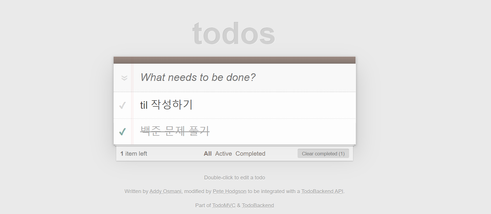
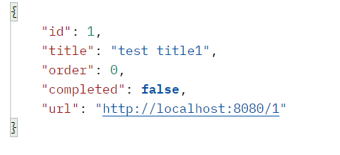
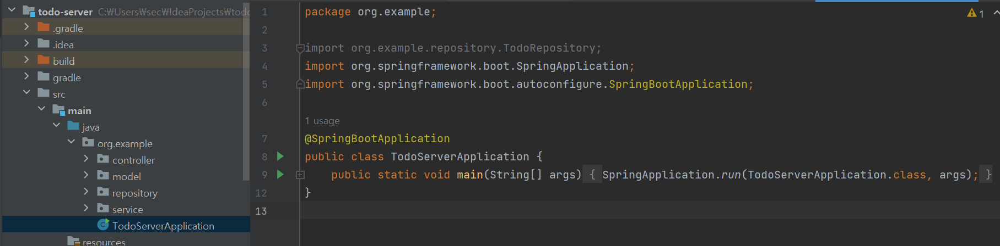

간단한 Todo List의 Model, Service, Controller, Repository를 작성해보자!

## Todo List



위와 같이 해야할 태스크 목록을 작성하고 수행 완료 여부를 체크할 수 있는 Todo List의 로직을 스프링으로 만들어보자.

## Model

Todo List를 만들기 위해 크게 세 가지의 모델이 필요하다.

- `TodoEntity` : 태스크 객체를 나타낸다.
- `TodoRequest` : 클라이언트로부터 받을 request를 나타낸다.
- `TodoResponse` : 클라이언트에게 돌려줄 response를 나타낸다.

### TodoEntity

```java
@Data
@Entity
@NoArgsConstructor
@AllArgsConstructor
public class TodoEntity {
    @Id
    @GeneratedValue(strategy = GenerationType.IDENTITY)
    private Long id;

    @Column(nullable = false)
    private String title;

    @Column(name = "todoOrder", nullable = false)
    private Long order;

    @Column(nullable = false)
    private Boolean completed;
}
```

- TodoEntity에 id, title, order, completed 필드를 추가한다.

> id : TodoEntity를 구별할 수 있는 식별자 <br/>
>
> title : TodoEntity의 제목 ex) til 작성하기, 백준 문제 풀기<br/>
>
> order : TodoEntity의 우선 순위<br/>
>
> completed : TodoEntity의 수행 완료 여부<br/>

- order의 db상에 이미 존재하는 이름이므로, db에 저장되는 이름을 todoOrder로 바꿔준다.

## TodoRequest

```java
@Data
@NoArgsConstructor
@AllArgsConstructor
public class TodoRequest {
    private String title;
    private Long order;
    private Boolean completed;
}
```

> TodoRequest와 TodoResponse는 db에 저장되는 객체가 아니므로 `@Entity`키워드를 붙이지 않는다. TodoEntity를 CRUD하기 위해서는 클라이언트로부터 title, order, completed 정보를 받아와야하므로 필요한 필드를 생성한다.

## TodoResponse

```java
@Data
@NoArgsConstructor
@AllArgsConstructor
public class TodoResponse {
    private Long id;
    private String title;
    private Long order;
    private Boolean completed;
    private String url;

    public TodoResponse(TodoEntity todoEntity){
        this.id = todoEntity.getId();
        this.title = todoEntity.getTitle();
        this.order = todoEntity.getOrder();
        this.completed = todoEntity.getCompleted();
        // 간단한 mvc패턴 예시학습을 위한 코드이므로 url을 하드코딩함
        this.url = "http://localhost:8080/" + id;
    }
}
```

- 로직을 처리하고 응답으로 보내줄 response이다.



- 편의를 위해 todoEntity를 인자로 받는 생성자를 만들어준다.

## repository

위에서 생성한 `TodoEntity` 클래스가 db의 객체와 연결이 될 수 있게 repository를 생성한다.

```java
// Database와 연결될 객체인 TodoEntity, TodoId(Long)
@Repository
public interface TodoRepository extends JpaRepository<TodoEntity, Long> {
}
```

- `JpaRepository`를 구현한 TodoRepository 인터페이스를 생성한다.
- <> 안에 연결할 객체와 아이디 타입을 적는다.

<br/>

구현한 인터페이스들에 이미 findAll, findById등 다양한 메서드들이 선언되어있다.

## service

`TodoService` 클래스를 생성해 crud로직을 수행하고 repository에 접근하는 코드를 짠다. entity를 생성하거나 수정하면 repository에 save() 해야함을 유의한다.

```java
@Service
@AllArgsConstructor
public class TodoService {
    private final TodoRepository todoRepository;

    public TodoEntity add(TodoRequest request){
        TodoEntity todoEntity = new TodoEntity();
        todoEntity.setTitle(request.getTitle());
        todoEntity.setCompleted(request.getCompleted());
        todoEntity.setOrder(request.getOrder());
         // return generic type
        return this.todoRepository.save(todoEntity);
    }

    public TodoEntity searchById(Long id){
        return this.todoRepository.findById(id).orElseThrow(() -> new ResponseStatusException(HttpStatus.NOT_FOUND));
    }

    public List<TodoEntity> searchAll(){
        return todoRepository.findAll();
    }

    public TodoEntity updateById(Long id, TodoRequest request){
        TodoEntity todoEntity = this.searchById(id);
        if (request.getTitle() != null){
            todoEntity.setTitle(request.getTitle());
        }
        if (request.getOrder() != null){
            todoEntity.setOrder(request.getOrder());
        }
        if (request.getCompleted() != null){
            todoEntity.setCompleted(request.getCompleted());
        }
        return this.todoRepository.save(todoEntity);
    }

    public void deleteById(Long id){
        this.todoRepository.deleteById(id);
    }

    public void deleteAll(){
        this.todoRepository.deleteAll();
    }
}
```

## controller

url을 받아 적절한 service로 로직을 수행하는 controller를 생성한다.

```java
@Slf4j
@CrossOrigin
@RestController
@AllArgsConstructor
@RequestMapping("/") //base url
public class TodoController {

    private final TodoService service;

    @PostMapping
    public ResponseEntity<TodoResponse> create(@RequestBody TodoRequest request) {
        log.info("CREATE");

        if(ObjectUtils.isEmpty(request.getTitle())){
            return ResponseEntity.badRequest().build();
        }

        if (ObjectUtils.isEmpty(request.getOrder())){
            request.setOrder(0L);
        }

        if(ObjectUtils.isEmpty(request.getCompleted())){
            request.setCompleted(false);
        }
        TodoEntity result = this.service.add(request);
        return ResponseEntity.ok(new TodoResponse(result));
    }

    @GetMapping("{id}")
    public ResponseEntity<TodoResponse> readOne(@PathVariable Long id){
        log.info("READ ONE");
        TodoEntity result = this.service.searchById(id);
        return ResponseEntity.ok(new TodoResponse(result));
    }

    @GetMapping
    public ResponseEntity<List<TodoResponse>> readAll(){
        log.info("READ ALL");
        List<TodoEntity> result = this.service.searchAll();
        List<TodoResponse> response = result.stream().map(TodoResponse::new).collect(Collectors.toList());
        return ResponseEntity.ok(response);
    }

    @PatchMapping("{id}")
    public ResponseEntity<TodoResponse> update(@PathVariable Long id, @RequestBody TodoRequest request){
        log.info("UPDATE");
        TodoEntity result = this.service.updateById(id, request);
        return ResponseEntity.ok(new TodoResponse(result));
    }

    @DeleteMapping("{id}")
    public ResponseEntity<TodoResponse> deleteOne(@PathVariable Long id){
        log.info("DELETE ONE");
        this.service.deleteById(id);
        return ResponseEntity.ok().build();
    }

    @DeleteMapping
    public ResponseEntity<TodoResponse> deleteAll(){
        log.info("DELETE ALL");
        this.service.deleteAll();
        return ResponseEntity.ok().build();
    }
}
```

## 서버 실행



서버를 실행하기 위해 클래스`TodoServerApplication`을 생성하고 실행하면 서버가 localhost:8080으로 실행되는 것을 볼 수 있다. <br/>

postman을 사용해서 테스트하면 TodoList의 로직이 전부 잘 수행하는 것을 볼 수 있다.

## 회고

모델을 생성한뒤, 유저로부터 request를 받아와 로직을 수행 후, response를 돌려주는 방식은 django에서 했던 로직과 동일해서 이해가 어렵지않았다. <br/>

모델을 생성하고, django의 views.py에서 로직을 선언하는 부분이 service이고, url과 로직을 연결하는 urls.py 부분이 controller로 작동한다고 이해했다. 조금 다른 점은 django보다 스프링이 layer가 더 뚜렷한 것 같다. 그리고... 스프링은 repository가 있다는 점? (django가 model을 다루는 방식은 getter, setter없이 클래스의 멤버 변수에 바로 접근하는 듯한 느낌이고, spring은 getter, setter를 사용하는 듯한 느낌? 이게 무슨소리지?) <br/>

---

- 헉 [Django와 DDD가 함께하기 어려운 이유](https://tech.junhabaek.net/django%EC%99%80-ddd%EB%8A%94-%ED%95%A8%EA%BB%98%ED%95%A0-%EC%88%98-%EC%97%86%EB%8A%94-%EC%A1%B4%EC%9E%AC%EC%9D%BC%EA%B9%8C-6602cf392c09) 포스팅과 [Controller, Service, Dao, Repository... 그게 다 뭔데](https://blog.hongo.app/controller-service/) 포스팅에 후디님이 남겨주신 댓글을 보니 뭔가 이해가 되는 것 같다. 아마도
- 장고는 모델로부터 바로 메서드를 사용할 수 있으며 모델 객체가 db의 table정의와 거의 매핑된다.

> 이 방식을 Active Record 패턴이라고 하는데, 모델 내부에 쿼리 메소드를 정의하므로 단순한 crud작업으로 이루어진, 규모가 작은 프로젝트에서 편리하게 사용할 수 있다는 장점이 있다. 그러나 프로젝트에서 사용되는 쿼리가 복잡해질수록 중복되는 쿼리가 늘어나고 관리하기 힘들어진다고 한다.

- 스프링은 모델에서 바로 메서드를 사용할 수 없고 repository를 통해 메서드를 사용할 수 있으며 table 스키마와 객체의 구조가 일치할 필요가 없다. 즉, 영속 계층보다 도메인에 더 가깝다.

> 이 방식을 Repository Pattern이라고 하는데, 객체가 db table의 스키마 구조와 일치할 필요가 없으므로 db 의존성이 낮아진다. 복잡한 쿼리가 사용되는 프로젝트에 적합하다.

---

<br/>

또, 조금 신기했던 부분은 django에서는 request클래스를 따로 정의해줄 필요없이 request를 받아올 수 있었는데 스프링에서는 request와 response도 클래스로 만들어줘야한다는 점이었다.(근데 이건 내가 완전 초보라서 잘모르는거고 나중엔 drf처럼 스프링도 생성한 모델을 토대로 알아서 request, response를 생성하는 방법이 있을 것 같다...) <br/>

또, 처음 보는 주석들이 너무 많다... 스프링은 정말 많은 주석들을 사용하는구나... 계속 코드를 작성하다보면 다 외우겠지?...
