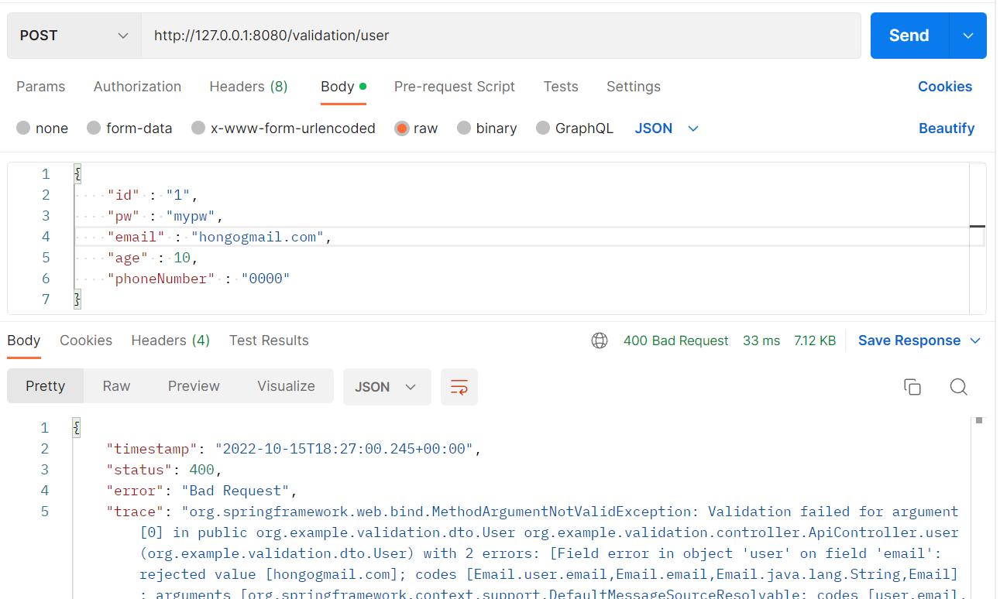
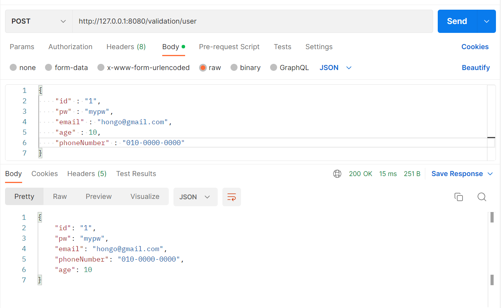
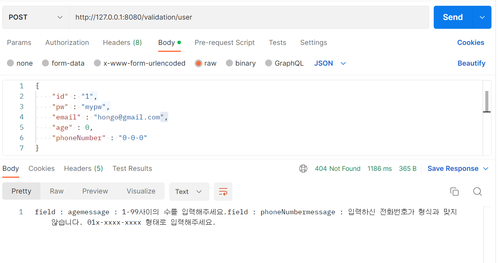

## Validation

의존성 추가 필요

* `implementation("org.springframework.boot:spring-boot-starter-validation")`


### 📌 Validation 예시

스프링에서는 여러 annotation을 사용해서 valid를 적용할 수 있다. 이메일과 전화번호에 대한 유효성 검사를 해보자!

```java
// ../dto/User

public class User {
    private String id;
    private String pw;
    
    @Email
    private String email;

    @Pattern(regexp = "^\\d{2,3}-\\d{3,4}-\\d{4}$")
    private String phoneNumber;
    
    private int age;
}
```

```java
// ../controller/ApiController

@RestController
@RequestMapping("/validation")
public class ApiController {

    @PostMapping("/user")
    public User user(@Valid @RequestBody User user){
        System.out.println(user);
        return user;
    }
}
```

* 위와 같이  입력받은 request에 `@Valid`가 붙여져있다면 해당 객체의 필드에 validation과 관련된 어노테이션들을 체크한다.

<br/>

// 실행 결과

* 형식에 맞지 않은 request



<br/>

* 형식에 맞는 request



<br/>

* **유효성 검사를 하고싶은 객체에는 반드시 `@Valid` 를 붙인다!**

```java
public class Car{
    @NotBlank
    private int carNumber;
    
    ...
}
```

```java
public class User{
    ...
    @Valid
    private List<Car> cars;
}
```

> 위와 같이 Car이라는 객체에 유효성 검사와 관련된 어노테이션이 붙여져 있더라도 유효성 검사를 하고싶은 객체에는 반드시 `@Valid` 어노테이션을 붙여줘야 유효성 검사가 작동한다. 
>
> * 타겟 객체에 `@Valid`를 붙이고, 타겟의 필드에 `@Size()`, `@NotBlank` 등의 어노테이션을 사용해 적용할 validator를 결정한다.


### 📌 BindingResult

`BindingResult`를 사용해서 `@Valid`를 적용한 객체의 결과를 받을 수 있다. 직접 예시를 작성해보자!<br/>

```java
// ../dto/User

public class User {
    @NotBlank
    private String id;

    @NotBlank
    private String pw;
    @Email
    private String email;

    // 인자로 넣은 message가 유효성 검사에 실패하면 BindingResult에 들어감
    @Pattern(regexp = "^\\d{2,3}-\\d{3,4}-\\d{4}$", message = "입력하신 전화번호가 형식과 맞지 않습니다. 01x-xxxx-xxxx 형태로 입력해주세요.")
    private String phoneNumber;

    @Max(value = 100, message = "1-99사이의 수를 입력해주세요.")
    @Min(value = 1, message = "1-99사이의 수를 입력해주세요.")
    private int age;
}
```

```java
// ../controller/ApiController

@RestController
@RequestMapping("/validation")
public class ApiController {

    @PostMapping("/user")
    public ResponseEntity user(@Valid @RequestBody User user, BindingResult bindingResult){
        if(bindingResult.hasErrors()){
            StringBuilder sb = new StringBuilder();
            bindingResult.getAllErrors().forEach(objectError -> {
                FieldError field = (FieldError) objectError;
                String message = objectError.getDefaultMessage();

                sb.append("field : "+field.getField());
                sb.append("message : "+message);
            });
            return ResponseEntity.status(404).body(sb.toString());
        }

        System.out.println(user);
        return ResponseEntity.ok(user);
    }
}
```



* `BindingResult`를 사용해서 유효성 검사에 실패한 field명과 미리 설정한 message등을 가져올 수 있다.


## Custom Validation

* `AssertTrue/False`와 같은 method 지정을 통해서 Custom Logic 적용 가능
* `ConstraintValidator`를 적용해서 재사용이 가능한 Custom Logic 적용 가능


### 📌 AssertTrue

```java
// ../dto/User


public class User{
    ...
        
    @Size(min = 6, max = 6) // YYYYMM
    private String reqYearMonth;
    
     @AssertTrue(message = "yyyyMM의 형식에 맞지 않습니다.")
    public boolean isReqYearMonthValidation(){
        try{
            LocalDate localDate = LocalDate.parse(this.reqYearMonth+"01", DateTimeFormatter.ofPattern("yyyyMMdd"));
        }catch (Exception e){
            return false;
        }
        return true;
    }
}
```

* `@AssertTrue`를 붙일 메소드의 이름은 반드시 `is`로 시작해야 한다. (is로 시작하지 않으면 메소드가 실행되지 않는다!)
* `@AssertTrue`가 붙여진 메소드가 true를 리턴하면 유효성 검사를 통과한 것이고, false를 리턴하면 유효성 검사에 실패한 것이다.


### 📌ConstraintValidator

`@AssertTrue/False`를 사용해서 유효성 검사 로직을 만들 수 있지만 이는 재사용이 불가능하다. 만약 year과 month가 들어가는 필드가 많다면 우리는 위 코드를 ctrl+c, v해서 중복으로 사용하게 될 것이다.<br/>

그럼 이 코드를 중복으로 붙여넣기 하지않으려면 어떻게 해야할까? 직접 Annotation을 만들어서 필요한 필드에 Annotation만 추가해주면 된다. `ConstraintValidator`를 사용해서 Custom Valid Annotation을 만들어보자!

```java
// ../annotation/YearMonth

@Target({ METHOD, FIELD, ANNOTATION_TYPE, CONSTRUCTOR, PARAMETER, TYPE_USE })
@Retention(RUNTIME)
@Constraint(validatedBy = {YearMonthValidator.class})
public @interface YearMonth {

    String message() default "yyyyMM의 형식으로 입력해주세요.";

    Class<?>[] groups() default { };

    Class<? extends Payload>[] payload() default { };

    String pattern() default "yyyyMMdd";
}
```

* Annotation을 생성했다! `@Target`, `@Retention`, `@Constraint` 은 다른 validation관련 어노테이션의 선언 파일로 들어가 복붙해왔다. 함수 message(), groups(), payload()도 복붙해왔다...ㅎㅎ
* `pattern()` 메서드를 만들고 `default`값으로 `"yyyyMMdd"`를 넣는다.

* `@Constraint`의 validatedBy에는 유효성 검사를 실행할 클래스를 넣는다.

<br/>

```java
// ../validator/YearMonthValidator

public class YearMonthValidator implements ConstraintValidator<YearMonth, String> { //어노테이션 이름, 검사할 필드의 타입

    private String pattern;

    @Override
    public void initialize(YearMonth constraintAnnotation) {
        // YearMonth에서 생성한 pattern()을 사용해서 pattern을 가져온다. 디폴트값(yyyyMMdd)
        this.pattern = constraintAnnotation.pattern();
    }

    @Override
    public boolean isValid(String value, ConstraintValidatorContext context) {
        try{
            LocalDate localDate = LocalDate.parse(value+"01", DateTimeFormatter.ofPattern(this.pattern));
        }catch (Exception e){
            return false;
        }
        return true;
    }
}
```


<br/>

생성한 어노테이션을 필요한 필드에 적용해주기만 하면 잘 작동한다.

```java
public class User{
    ...
    @YearMonth()
    private String reqYearMonth;
}
```

