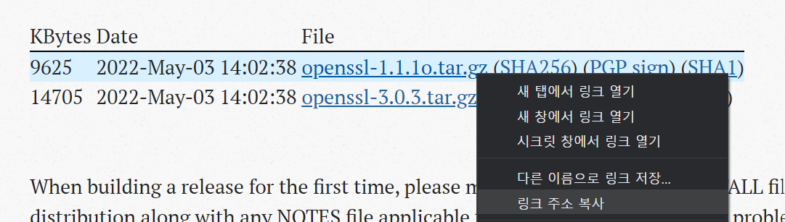

## openssl설치

> ssl 인증서를 발급받기 위해 필요
>
> ubuntu 환경에서 설치했습니다

* `sudo apt-get wget`
  * wget이 설치되지않은 사람은 wget설치

* `wget https://www.openssl.org/source/openssl-1.1.1o.tar.gz`

  * https://www.openssl.org/source/에 접속해서 openssl file에서 우클릭 누르고 링크 주소 복사한걸 wget으로 설치

    

* `tar xvfz openssl-1.1o.tar.gz`
  * 다운받아진 openssl-1.1o.tar.gz 파일 압축해제
  * tar xvfz는 .tar.gz 파일을 압축 해제하는 명령어
* `cd openssl1-1.1o`
* `./config`
  * default로 정적라이브러리로 컴파일되며 동적 라이브러리로 컴파일할 경우 	`./config shared`
* `apt-get install gcc make`
  * make가 없다면 make를 다운받는다
* `make`
  * 컴파일 수행
* `make test`
* `sudo make install`

이제 openssl을 사용할 수 있다!
