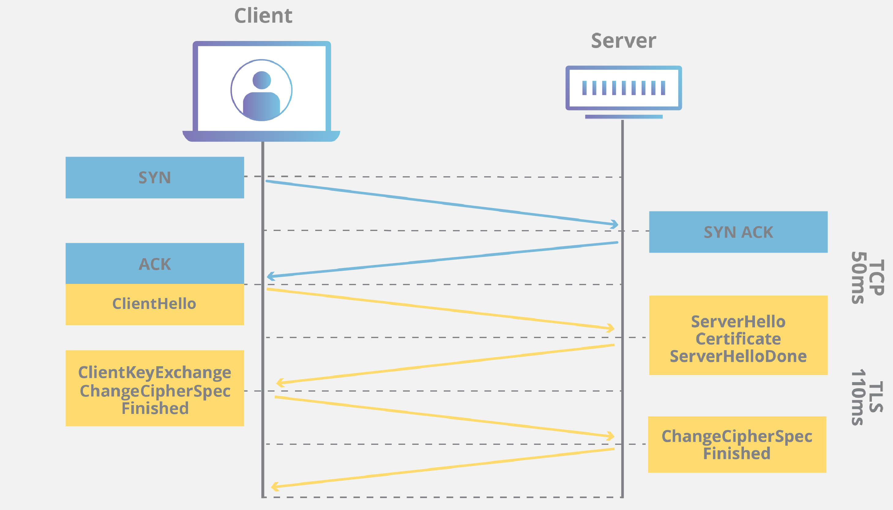

종합 설계 프로젝트 진행 중 팀원분에게 숙제를 받게 됨.

> "SSL 인증서 발급받아오세요~"

**네! 그런데 SSL 인증서가... 뭐죠...?**

응애개발자인 나는 SSL인증서가 뭔지 전혀 몰랐지만 4학년 주제에 그게 뭐죠? 하기에는 부끄러워 일단 "넵! 해오겠습니다 ㅎㅎ;!" 라고 대답을 하고 집에 돌아왔다... *(나쁜 습관)*

오늘도 일단 아는 척을 해버리고 나는 집에와서 구글링을 시작한다.

## SSL이란?

**(Secure Sockets Layer)**

* 암호화 기반 인터넷 보안 프로토콜이며 인터넷 통신의 개인정보 보호, 인증, 데이터 무결성을 보장한다
* SSL을 사용하는 웹사이트의 URL에는 "HTTP" 대신 "HTTPS"가 있다

### SSL/TLS란?

* 네스케이프에 의해서 SSL이 발명되었고 이후 표준화 기구인 IETF의 관리로 변경되면서 TLS라는 이름으로 바뀌었다. (즉, SSL의 이름이 TLS로 바뀐 것이다. TLS의 이전 버전이 SSL.)

* TLS 1.0은 SSL 3.0을 계승한다
* SSL은 SSL 3.0 이후 업데이트되지 않았으며 TLS가 최신 암호화 프로토콜이다
* 그러나 SSL이라는 이름이 유명해서 공식적으로는 TLS 인증서지만 SSL 인증서라고 부르는 사람들이 더 많다

### SSL 역할

위에서 SSL은 개인정보 보호, 인증, 데이터 무결성을 보장한다고 했는데 좀 더 자세히 살펴보자!

 

#### 🔑 암호화를 통해 사용자의 개인 정보 보호

> 원래 웹 상의 데이터는 메시지를 가로채면 누구나 읽을 수 있는 일반 텍스트 형태로 전송됐다 ( 쇼핑몰에서 결제를 하기위해 신용 카드 번호를 입력하면 그 번호를 누가 읽을 수도 있는 것!)
>
> SSL은 위를 해결하고 사용자 개인 정보를 보호하기 위해 제작되었다
>
> SSL은 클라이언트와 웹 서버 사이를 이동하는 모든 데이터를 암호화하여 누군가 데이터를 가로채더라도 암호화된 데이터를 보게된다.
>
> SSL은 공개키와 대칭키를 혼합해서 암호화를 수행한다

#### 🔑  핸드셰이크를 사용해 서버가 신뢰할 수 있는 서버인지 인증

> 클라이언트와 서버는 핸드셰이크 중에 메시지를 교환하여 서로를 인식하고, 검증하고, 암호화 알고리즘을 구성하고, 세션 키를 합의한다
>
> TLS 핸드셰이크는 TCP 핸드 셰이크를 통해 TCP 연결이 열린 후 발생한다

서버 통신 과정을 순서대로 살펴보자!

* 클라이언트가 서버에 접속 : Client Hello (이 단계에서 주고받는 정보는 아래와 같다)
  * 클라이언트 측에서 생성한 랜덤 데이터
  * 클라이언트가 지원하는 암호화 방식들
  * 세션 아이디
* 서버는 Client Hello에 대한 응답으로 Server Hello를 보낸다
  * 서버 측에서 생성한 랜덤 데이터
  * 서버가 선택한 클라이언트 암호화 방식
  * 인증서
* 클라이언트는 서버 인증서가 CA에 의해서 발급된 것인지를 확인하기위해 클라이언트에 내장된 CA리스트를 확인한다. 
  * 인증서가 CA에 의해서 발급된 것인지 확인하기위해 클라이언트에 내장된 CA의 공개키를 이용해서 인증서를 복호화한다.
  * 복호화가 성공했다면 인증서는 CA의 개인키로 암호화된 문서임이 보증되고 서버를 신뢰할 수 있다
* 서버는 클라이언트는 master secret값을 공유하고 master secret을 사용해 세션 키를 생성한다. 서버와 클라이언트는 이 세션 키 값을 사용해서 데이터를 대칭키 방식으로 암호화 한 후에 주고 받는다

* #### 디지털 서명을 사용해 데이터 무결성 제공

  > 학교에서 학점때문에 컴퓨터 보안 강의들으면서 이거 근데 나중에 써먹을 날이 올까?... 했는데 써먹을 날이 와서 행복해짐

SSL 인증서 발급받아오라는 말을 듣고 "그게 뭐지..." 하고 걱정했는데 https를 보고 아는거라 안심했다... 

https 는 http보다 보안이 강화됐다 정도로만 알고있었는데 이번 기회에 더 자세히 알게되었다  

다음 포스트에서는  SSL 인증서를 직접 받아보겠다

참고 사이트

https://www.cloudflare.com/ko-kr/learning/ssl/what-is-ssl/

https://www.cloudflare.com/ko-kr/learning/ssl/what-happens-in-a-tls-handshake/

https://opentutorials.org/course/228/4894

