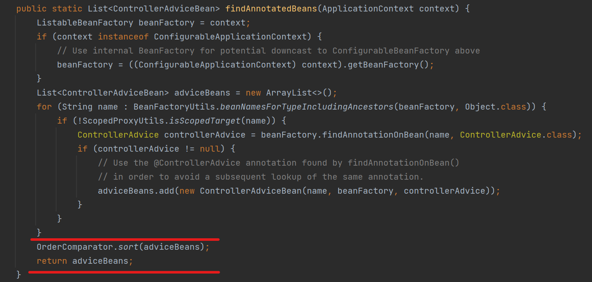

# @ControllerAdvice 정복하기

## @ExceptionHandler를 사용한 예외 처리

- `MyController`에서 발생한 예외를 `@ExceptionHandler`를 사용해 처리

```java
@RestController
@RequestMapping("/my")
public class MyController {

    @GetMapping("/plays")
    public void plays(){
        throw new IllegalArgumentException();
    }

    @ExceptionHandler(IllegalArgumentException.class)
    public ResponseEntity<String> handle() {
        return ResponseEntity.badRequest().body("IllegalArgumentException 발생!");
    }
}
```

`plays`메소드가 호출되면 어떻게 될까? `IllegalArgumentException`이 발생하고, 이 예외에 대한 처리를 `hanlde`메소드가 수행한다.

위 코드와 같이 클래스에 `@ExceptionHandler`가 붙여진 메소드를 사용해서 클래스내에서 발생한 예외를 처리할 수 있다.

<br/>

- 컨트롤러에서 발생한 예외를 전역 처리하고 싶다면?

```java
@RestController
@RequestMapping("/new")
public class NewController {

    @GetMapping("/plays")
    public void plays(){
        throw new IllegalArgumentException();
    }

    @ExceptionHandler(IllegalArgumentException.class)
    public ResponseEntity<String> handle() {
        return ResponseEntity.badRequest().body("IllegalArgumentException 발생!");
    }
}
```

여기 `NewController`가 새로 나타났다. `NewController`는 `MyController`와 동일하게 `IllegalArgumentException` 에 대한 예외 처리를 수행하고 있다.

<br/>

지금은 두 개의 컨트롤러에 로직이 반복되지만, 만약 더 많은 컨트롤러에서 `IllegalArgumentException`에 대한 동일한 예외 처리가 필요해진다면? 전역적으로 예외를 처리하면 더 깔끔하고 중복이 없는 코드를 작성할 수 있다.

## @ControllerAdvice 사용 방법

`@ControllerAdvice`를 사용하면 컨트롤러에서 발생한 예외를 전역적으로 처리할 수 있다.

```java
@ControllerAdvice
public class MyControllerAdvice {

    @ExceptionHandler(IllegalArgumentException.class)
    public ResponseEntity<String> handle(Exception exception) {
        return ResponseEntity.badRequest().body("IllegalArgumentException 발생!");
    }
}

```

- `@ControllerAdvice` 어노테이션이 있는 클래스를 생성한 뒤,
- 클래스 내부에 `@ExceptionHandler` 어노테이션이 붙여진 메소드를 생성한다.

위 과정을 통해 `MyControllerAdvice`는 `MyController`와 `NewController`에서 발생하는 `IllegalArgumentException`을 전부 처리할 수 있다.

<br/>

## 여러 개의 @ControllerAdvice를 생성할 수 있을까?

가능하다! 새로운 클래스인 `NewControllerAdvice`를 만들어보자.

이제 두 개의 `@ControllerAdvice` 클래스가 존재한다.

```java
@ControllerAdvice
public class MyControllerAdvice {

    @ExceptionHandler(IllegalArgumentException.class)
    public ResponseEntity<String> handle(Exception exception) {
        return ResponseEntity.badRequest().body("MyControllerAdvice에서 IllegalArgumentException 처리!");
    }
}
```

```java
@ControllerAdvice
public class NewControllerAdvice {

    @ExceptionHandler(IllegalArgumentException.class)
    public ResponseEntity<String> handle(Exception exception) {
        return ResponseEntity.badRequest().body("NewControllerAdvice에서 IllegalArgumentException 처리!");
    }
}
```

### 컨트롤러에서 IllegalArgumentException이 발생하면, 두@ControllerAdvice 중 어떤 것을 선택할까?

`MyControllerAdvice`와 `NewControllerAdvice`는 둘 다 `IllegalArgumentException`에 대한 예외를 처리하고 있다.

두 클래스 모두 전역적으로 예외를 처리하고 있다. 컨트롤러에서 `IllegalArgumentException`이 발생할 경우, 어떤 `@ControllerAdvice`에서 예외를 처리하게 될까?

<br/>


[Spring 공식문서 - ControllerAdvice](https://docs.spring.io/spring-framework/docs/current/javadoc-api/org/springframework/web/bind/annotation/ControllerAdvice.html)

> All such beans are sorted based on [`Ordered`](https://docs.spring.io/spring-framework/docs/current/javadoc-api/org/springframework/core/Ordered.html) semantics or [`@Order`](https://docs.spring.io/spring-framework/docs/current/javadoc-api/org/springframework/core/annotation/Order.html) / [`@Priority`](https://jakarta.ee/specifications/platform/9/apidocs/jakarta/annotation/Priority.html) declarations, with `Ordered` semantics taking precedence over `@Order` / `@Priority` declarations. `@ControllerAdvice` beans are then applied in that order at runtime.

공식 문서를 보면 `Ordered`, `@Order`, `@Priority`를 기준으로  `@ControllerAdvice`가 붙은 클래스를 정렬한다고 한다!

스프링은 `ControllerAdviceBean`이라는 클래스에서 `@(Rest)ControllerAdvice`가 붙여진 클래스들을 찾으며 빈으로 등록한다. 맨 마지막에 `OrderComparator`를 사용해 `Advice`들을 정렬하는 것을 볼 수 있다.




### OrderComparator

* 이름에서 알 수 있듯이 Comparator를 구현한 클래스이다.
* 객체에 적용된 `Ordered` 인터페이스, `@Order`, `@Priority`를 사용해 객체들의 우선 순위를 설정한다.
* 정렬이 적용되는 우선 순위는 `Ordered` ,  `@Order`, `@Priority` 순이다.


<br/>

`Ordered` ,  `@Order`, `@Priority` 는 객체의 우선 순위를 정의할 수 있다. 정의한 숫자가 낮을 수록 높은 우선 순위를 가진다.

#### Ordered 

```java
public interface Ordered {

	int HIGHEST_PRECEDENCE = Integer.MIN_VALUE;

	int LOWEST_PRECEDENCE = Integer.MAX_VALUE;

	int getOrder();
}
```

* `getOrder()` 를 구현해 우선 순위 정의


#### Order & Priority

```java
@Retention(RetentionPolicy.RUNTIME)
@Target({ElementType.TYPE, ElementType.METHOD, ElementType.FIELD})
@Documented
public @interface Order {

	int value() default Ordered.LOWEST_PRECEDENCE;
}
```

```java
@Target({TYPE,PARAMETER})
@Retention(RUNTIME)
@Documented
public @interface Priority {

    int value();
}
```

* `value` 값을 통해 우선 순위를 정의

<br/>

`Ordered`와 `Order`는 `Integer`의 최솟값, 최댓값까지 우선순위 값으로 설정이 가능하나, `Priority`는 음수가 아닌 수를 우선 순위값으로 지정하는 게 일반적이다. 음수값은 우선 순위 값이 지정되지 않았음을 의미한다.

[Spring 공식문서 - Priority](https://jakarta.ee/specifications/platform/9/apidocs/jakarta/annotation/priority) 

> Priority values should generally be non-negative, with negative values reserved for special meanings such as "undefined" or "not specified".


### 우선 순위가 정해져 있지 않다면?

`MyControllerAdvice`와 `NewControllerAdvice` 는 어떤 우선 순위도 설정되어 있지 않다. (`Ordered`, `@Order`, `@Priority` 그 어떤 것도 사용되지 않았다.)

우선 순위가 설정되지 않은 경우는 어떻게 정렬되는지 확인해보자.


`@ControllerAdvice`는 `@Component`를 상속받고 있어, 스프링 컨텍스트가 빈으로 등록한다.

빈으로 등록된 `@ControllerAdvice`는 `HandlerExceptionResolver`의 ` exceptionHandlerAdviceCache`에 저장된다.

<br/>


` exceptionHandlerAdviceCache`에 `@ControllerAdvice` 클래스가 들어간 순서를 보자.

`MyControllerAdvice` -> `NewControllerAdvice` 순으로 들어있다.

`@ControllerAdvice` 클래스에 특별한 정렬 기준을 정해주지 않는다면, 디폴트로 클래스 이름순 정렬이 수행된다.

`MyControllerAdvice`가 가장 앞에 있기 때문에, 어느 컨트롤러에서 `IllegalArgumentException`예외가 발생하든 `MyControllerAdvice`에서 예외 처리가 수행된다.

- `MyController`에서 예외 발생


<br/>

- `NewController`에서 예외 발생


## @ControllerAdvice가 적용될 클래스를 제한할 수 없을까?

가능하다! `@ControllerAdvice`에는 예외 처리를 적용할 클래스를 제한할 수 있는 여러 속성들이 존재한다.

### 📌 basePackages

`@ControllerAdvice`를 적용할 패키지를 지정한다. 지정한 패키지의 하위 패키지까지 예외 처리가 적용된다.

- 코드 예시

```java
@ControllerAdvice(basePackages = "racingcar.controller.myPackage")
public class MyControllerAdvice {

    @ExceptionHandler(IllegalArgumentException.class)
    public ResponseEntity<String> handle(Exception exception) {
        return ResponseEntity.badRequest().body("MyControllerAdvice에서 IllegalArgumentException 처리!");
    }
}
```

```java
@ControllerAdvice(basePackages = "racingcar.controller.newPackage")
public class NewControllerAdvice {

    @ExceptionHandler(IllegalArgumentException.class)
    public ResponseEntity<String> handle(Exception exception) {
        return ResponseEntity.badRequest().body("NewControllerAdvice에서 IllegalArgumentException 처리!");
    }
}
```

`racingcar.controller.myPackage` 패키지 아래에는 `MyController`가 존재하고,

`racingcar.controller.newPackage`패키지 아래에는 `NewController`가 존재한다.

- `MyController` 예외 처리 결과


<br/>

- `NewController` 예외 처리 결과


이전에 예외를 처리했을 때는, 가장 앞에 정렬되어있던 `MyControllerAdvice`가 `MyController`와 `NewController`에서 발생한 예외를 전부 처리했다. 정렬순으로 가장 앞에 있는 `Advice`를 고른 뒤, 해당 `Advice`가 클래스에서 발생한 예외를 처리할 수 있으면 `Advice`의 코드대로 예외를 처리한다.

이번 예시에는 각 `Advice`에 `basePackages`를 사용해서 예외 처리를 적용할 클래스의 범위를 제한했다. 그 결과 `NewController`에서 발생한 예외는 `NewControllerAdvice`에서 처리한 것을 볼 수 있다.

<br/>

추가로 `basePackages`는 `value`와 `@AliasFor`를 사용해 별칭을 사용하는 관계이기에, `@ControllerAdvice("racingcar.controller.newPackage")`과 같이 인자로 바로 넣어줘도 작동한다.


<br/>

### 📌 basePackageClasses

지정한 클래스가 속한 패키지를 `basePackage`로 등록한다. 즉, 지정한 클래스가 속한 패키지 하위에 존재하는 모든 컨트롤러를 예외 처리한다.

- 코드 예시

```java
@ControllerAdvice(basePackageClasses = NewController.class)
public class NewControllerAdvice {

    @ExceptionHandler(IllegalArgumentException.class)
    public ResponseEntity<String> handle(Exception exception) {
        return ResponseEntity.badRequest().body("NewControllerAdvice에서 IllegalArgumentException 처리!");
    }
}
```

`basePackageClasses`에 등록된 클래스의 패키지 이름을 추출해 `basePackages`에 등록한다. 동작 과정은 `basePackages`와 같다.

위 코드의 경우 `NewController`가 속한 패키지인 `racingcar.controller.newPackage`를 기준으로 예외 처리가 적용될 클래스를 제한한다.

`basePackages`와 하는 일이 같지만, `basePackageClasses`가 존재하는 이유는 패키지 이름이 노출되지 않기 때문에 안전하게 사용할 수 있다는 장점 때문인 것 같다.

### 📌 assignableTypes

특정 타입 또는 그 하위 타입인 컨트롤러 클래스를 대상으로 예외를 처리한다.

- 코드 예시

```java
@ControllerAdvice(assignableTypes = NewController.class)
public class NewControllerAdvice {

    @ExceptionHandler(IllegalArgumentException.class)
    public ResponseEntity<String> handle(Exception exception) {
        return ResponseEntity.badRequest().body("NewControllerAdvice에서 IllegalArgumentException 처리!");
    }
}
```

`NewController` 클래스와 그 하위 타입인 클래스를 예외 처리가 적용될 클래스로 제한한다.

### 📌 annotations

특정 어노테이션과 그 하위 타입 어노테이션이 적용된 컨트롤러를 대상으로 예외를 처리한다.

- 코드 예시

```java
@ControllerAdvice(annotations = RestController.class)
public class NewControllerAdvice {

    @ExceptionHandler(IllegalArgumentException.class)
    public ResponseEntity<String> handle(Exception exception) {
        return ResponseEntity.badRequest().body("NewControllerAdvice에서 IllegalArgumentException 처리!");
    }
}
```

`NewControllerAdvice` 클래스의 `annotations`에 `RestController.class`를 등록했다. 코드로 적진 않았지만 `MyControllerAdvice`에도 동일하게 `annotations`을 지정해주었다고 해보자.

현재 `MyController`와 `NewController`는 `@Controller`어노테이션 붙여져있다. `NewController`의 어노테이션만 `@RestController`로 바꾸었다.

두 컨트롤러의 예외 처리는 어떻게 될까?

- `NewController`의 예외 처리


`MyControllerAdvice`와 `NewController` 중 알파벳순으로 앞에 있는 `MyControllerAdvice`에서 예외를 처리했다.

<br/>

- `MyController`의 예외 처리


어떤 `Advice`에서도 예외를 처리하지 않았다.

<br/>

`@RestController`가 등록된 `NewController`는 `annotations`으로 `RestController.class`가 지정된 두 `Advice`중 가장 앞에 있는 `Advice`에서 예외가 처리되었다. 하지만 `@RestController`가 붙여있지 않은 `MyController`는 `Advice`의 어노테이션 제한에 걸려 예외가 처리되지 않은 걸 알 수 있다.

## @ControllerAdvice vs @RestControllerAdvice

`@ControllerAdvice`를 상속받은 `@RestControllerAdvice` 어노테이션도 존재한다.

두 어노테이션은 어떤 차이가 있을까?

이름만 봤을 때는 ,`@ControllerAdvice`는 `@Controller`가 붙여진 클래스의 예외 처리를 담당하고, `@RestControllerAdvice`는 `@RestController`가 붙여진 클래스의 예외 처리를 담당할 것 같다.

사실일까? `@RestControllerAdvice`의 구현 코드를 봐보자.

```java
@Target(ElementType.TYPE)
@Retention(RetentionPolicy.RUNTIME)
@Documented
@ControllerAdvice
@ResponseBody
public @interface RestControllerAdvice {

	@AliasFor(annotation = ControllerAdvice.class)
	String[] value() default {};

	@AliasFor(annotation = ControllerAdvice.class)
	String[] basePackages() default {};

	@AliasFor(annotation = ControllerAdvice.class)
	Class<?>[] basePackageClasses() default {};

	@AliasFor(annotation = ControllerAdvice.class)
	Class<?>[] assignableTypes() default {};

	@AliasFor(annotation = ControllerAdvice.class)
	Class<? extends Annotation>[] annotations() default {};

}

```

앞서 학습한 Advice의 속성외에는 별다른 필드와 메소드가 없는 것을 볼 수 있다.

`RestControllerAdvice`와 `ControllerAdvice`와 다른 점은 `@ResponseBody`가 있냐, 없냐의 차이뿐이다.

즉,`@RestControllerAdvice`는 `@ControllerAdvice`와 똑같이 작동하나, `@ResponseBody`가 붙여져 있어 자바 객체를 http 요청의 body 내용으로 매핑할 수 있게 해준다.

`@ControllerAdvice`는 `@Controller`가 붙여진 클래스의 예외 처리를 담당하고, `@RestControllerAdvice`는 `@RestController`가 붙여진 클래스의 예외 처리를 담당한다고 오해하면 안된다!

## @ControllerAdvice를 여러 개 만들면 좋을까?

앞서 `@ControllerAdvice`를 여러 개 만들어보았다. 각 `Advice`에 `basePackages`와 같은 속성을 사용해 예외를 처리할 클래스들을 제한할 수 있다.

그럼, `@ControllerAdvice`를 여러 개 만들어서 활용하면 좋을까?

내 생각엔 그렇지 않은 것 같다. 각 `Advice`에 적용 클래스를 제한할 수는 있지만, 사용자가 프로그램의 패키지 구조와 클래스간 상속 관계를 잘 알고 있어야 하는 단점이 있는 것 같다.

또한, 적용 클래스를 제한하더라도 의도치 않은 `Advice`에서 해당 클래스에 대한 예외 처리를 수행할 수도 있다. `Advice`간 정렬 기준을 잘 정의해놓지 않는다면, 어떤 `Advice`에서 예외를 처리할 지 예측하기가 어렵기 때문이다. 정렬 기준을 정의해놓는다고 해도, `@Order`나 `Ordered` 인터페이스를 사용한 클래스를 파악하는게 쉬울 것 같진 않다.

여러 개의 `@ControllerAdvice`를 생성하기 보단 하나의 `@ControllerAdvice` 생성해서 모든 예외에 대한 전역 처리를 수행하는 것이 프로그램의 예외 처리 로직을 이해하기 쉬울 것 같다.
